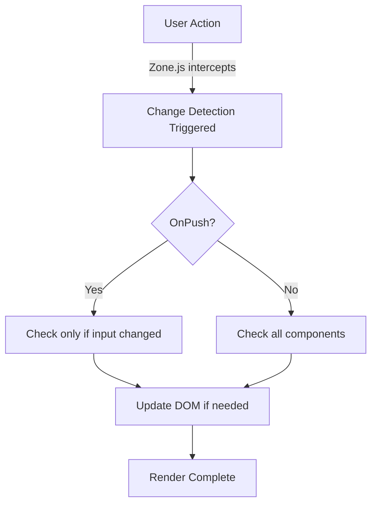

# Repository Improvement Roadmap

> 🎯 **Goal:** Make this the most comprehensive, accessible, and user-friendly frontend interview preparation repository on GitHub

## 📊 Current State vs Target State

### Current Strengths ✅
- Deep, production-grade content
- Modern coverage (Angular 16-18, Signals, etc.)
- Well-organized structure
- Cross-framework support
- Real-world examples with metrics

### Gaps to Address 🎯
1. ❌ No single-page quick reference
2. ❌ No visual diagrams/architecture images
3. ❌ Limited discoverability (GitHub search)
4. ❌ No interactive elements
5. ❌ No progression tracking
6. ❌ Limited community engagement features

---

## 🚀 Phase 1: Immediate Improvements (Week 1-2)

### 1.1 Enhance Main README

**File:** `README.md`

**Add:**
```markdown
## 🌟 Features

✨ **300+ Interview Questions** across Angular, React, JavaScript, and more
📚 **Deep-Dive Articles** with production-grade explanations
⚡ **Rapid-Fire Guides** for quick review
🎯 **Difficulty Levels** - Easy, Medium, Hard
💼 **Real-World Examples** with actual performance metrics
🧪 **Testing Strategies** for each concept
🎨 **Visual Diagrams** for complex concepts
📱 **Mobile-Friendly** documentation
🔍 **Searchable** - Ctrl+F friendly formats

## 📈 Repository Stats


## 🚦 Quick Start Paths

### 👶 Beginner Path
1. [JavaScript Fundamentals](./javascript/fundamentals.md)
2. [HTML & CSS Basics](./html-css/)
3. [Angular/React Basics](./angular/fundamentals.md)

### 🧑 Intermediate Path
1. [RxJS & Async Programming](./angular/rxjs-operators.md)
2. [State Management](./angular/ngrx-state-management.md)
3. [Testing Strategies](./angular/testing-strategy.md)

### 👨‍💻 Senior Path
1. [Change Detection Deep Dive](./angular/change-detection.md)
2. [Performance Optimization](./angular/performance-optimization.md)
3. [Memory Leak Debugging](./angular/debugging-memory-leaks.md)
4. [System Design](./system-design/questions.md)

### ⚡ Last-Minute Interview Prep
1. [Angular Rapid-Fire Questions](./angular/rapid-fire-questions.md)
2. [JavaScript Quick Reference](./javascript/quick-reference.md)
3. [React Cheat Sheet](./react/cheat-sheet.md)

## 📊 Study Progress Tracker

Track your progress:

- [ ] JavaScript Fundamentals (30 questions)
- [ ] Angular Fundamentals (50 questions)
- [ ] React Fundamentals (40 questions)
- [ ] RxJS & Observables (25 questions)
- [ ] State Management (20 questions)
- [ ] Performance Optimization (15 questions)
- [ ] Testing (20 questions)
- [ ] System Design (10 questions)

**Total Progress: 0/210 topics completed**
```

### 1.2 Add Visual Assets

**Create directory:** `assets/diagrams/`

**Add diagrams for:**
1. Angular Architecture
2. Change Detection Flow
3. DI Hierarchy
4. RxJS Operator Flow
5. NgRx Data Flow
6. Component Lifecycle
7. Routing Flow

**Tool recommendations:**
- **Excalidraw** (free, hand-drawn style)
- **Draw.io** (free, professional)
- **Mermaid** (code-based, GitHub native)

**Example Mermaid diagram:**


### 1.3 Create Framework-Specific Quick References

**Files to create:**
- `javascript/ALL_QUESTIONS.md` (150 questions)
- `react/ALL_QUESTIONS.md` (200 questions)
- `html-css/ALL_QUESTIONS.md` (100 questions)

**Format:** Same numbered structure as Angular quick reference

---

## 🎯 Phase 2: Enhanced Discoverability (Week 3-4)

### 2.1 Add Topic Tags and Metadata

**In each markdown file, add frontmatter:**

```markdown
---
title: "Angular Change Detection Deep Dive"
tags: ["angular", "performance", "change-detection", "zone.js", "onpush"]
difficulty: "hard"
readingTime: "15 min"
lastUpdated: "2025-01-09"
prerequis ites: ["Angular Fundamentals", "Components"]
relatedTopics: ["Signals", "Performance Optimization"]
---
```

### 2.2 Create Topic Index

**File:** `TOPIC_INDEX.md`

```markdown
# Topic Index

## By Technology
### Angular (120 topics)
- [Fundamentals](./angular/fundamentals.md) - 🟢 Easy - 20 topics
- [Change Detection](./angular/change-detection.md) - 🔴 Hard - 15 topics
- [RxJS](./angular/rxjs-operators.md) - 🔴 Hard - 12 topics

### JavaScript (80 topics)
### React (90 topics)
### HTML/CSS (60 topics)

## By Difficulty
### 🟢 Easy (120 topics)
### 🟡 Medium (180 topics)
### 🔴 Hard (100 topics)

## By Reading Time
### ⏱️ Quick (< 5 min) - 150 topics
### ⏱️ Medium (5-15 min) - 200 topics
### ⏱️ Deep (> 15 min) - 50 topics

## By Job Level
### Junior Developer - [See topics →](#junior)
### Mid-Level Developer - [See topics →](#mid)
### Senior Developer - [See topics →](#senior)
```

### 2.3 Add Search Enhancement

**Create:** `.github/ISSUE_TEMPLATE/question-request.md`

```markdown
---
name: Question Request
about: Suggest a new interview question
title: '[QUESTION] '
labels: 'question-request, help-wanted'
---

**Question:**
<!-- What interview question should we add? -->

**Topic/Category:**
<!-- e.g., Angular, React, JavaScript -->

**Difficulty:**
<!-- Easy, Medium, or Hard -->

**Why is this important?**
<!-- Why should this question be included? -->

**Source:**
<!-- Where did you encounter this? (Optional) -->
```

---

## 🎨 Phase 3: Interactive Elements (Week 5-6)

### 3.1 Add Code Playgrounds

**For each concept, add links to:**

```markdown
### Try it yourself:
- [](https://stackblitz.com/edit/angular-example)
- [](https://codesandbox.io/s/example)

### Live Demo:
<iframe src="https://stackblitz.com/edit/angular-example?embed=1" style="width:100%; height:500px; border:0;"></iframe>
```

### 3.2 Add Quiz Elements

**File:** `angular/QUIZ.md`

```markdown
# Angular Knowledge Quiz

## Question 1: Change Detection
What happens when you call `markForCheck()` on a component with OnPush strategy?

A) Immediately runs change detection
B) Schedules change detection for next cycle
C) Disables change detection
D) Throws an error

<details>
<summary>Click to reveal answer</summary>

**Answer: B**

`markForCheck()` marks the component and its ancestors as needing to be checked in the next change detection cycle. It doesn't immediately trigger CD.

**Read more:** [Change Detection Deep Dive](./change-detection.md#markforcheck)
</details>

---

## Question 2: RxJS Operators
<!-- ... -->
```

### 3.3 Add Code Challenges

**File:** `angular/CHALLENGES.md`

```markdown
# Angular Coding Challenges

## Challenge 1: Implement Auto-Complete

**Difficulty:** 🟡 Medium
**Time:** 30 minutes

**Requirements:**
- Create an auto-complete component
- Debounce user input (300ms)
- Cancel previous requests
- Handle loading state
- Display results
- Use OnPush change detection

**Starter Code:**
```typescript
@Component({
  selector: 'app-autocomplete',
  template: `
    <input [formControl]="search" placeholder="Search...">
    <!-- TODO: Add results display -->
  `
})
export class AutocompleteComponent {
  search = new FormControl('');
  // TODO: Implement
}
```

**Solution:** [View Solution →](./challenges/autocomplete-solution.md)

**Test Your Solution:**
[](https://stackblitz.com/edit/challenge-1)
```

---

## 🤝 Phase 4: Community Features (Week 7-8)

### 4.1 Add Discussion Templates

**Create:** `.github/DISCUSSION_TEMPLATES/`

1. **general.yml** - General discussions
2. **interview-experience.yml** - Share interview experiences
3. **question-help.yml** - Get help with questions
4. **best-practices.yml** - Discuss best practices

### 4.2 Add Contribution Incentives

**File:** `CONTRIBUTORS.md`

```markdown
# Contributors Hall of Fame

## 🏆 Top Contributors

### 🥇 Gold Contributors (50+ contributions)
- [@username1](https://github.com/username1) - 127 contributions

### 🥈 Silver Contributors (25-49 contributions)
- [@username2](https://github.com/username2) - 38 contributions

### 🥉 Bronze Contributors (10-24 contributions)
- [@username3](https://github.com/username3) - 15 contributions

## 🌟 Recent Contributors
<!-- Auto-updated via GitHub Actions -->

## 💎 Special Thanks
- **@user4** - Created all RxJS diagrams
- **@user5** - Added 20 testing examples
- **@user6** - Reviewed and improved 50+ answers

## 🎯 Contribution Tiers

### Tier 1: Question Contributor
- Add 1+ question with detailed answer
- Badge: 

### Tier 2: Topic Expert
- Add/maintain entire topic section
- Badge: 

### Tier 3: Code Reviewer
- Review 10+ PRs
- Badge: 

### Tier 4: Diagram Creator
- Create 5+ visual diagrams
- Badge: 
```

### 4.3 Add GitHub Actions

**File:** `.github/workflows/update-stats.yml`

```yaml
name: Update Repository Stats

on:
  schedule:
    - cron: '0 0 * * 0'  # Weekly
  workflow_dispatch:

jobs:
  update-stats:
    runs-on: ubuntu-latest
    steps:
      - uses: actions/checkout@v3
      
      - name: Count Questions
        run: |
          ANGULAR_COUNT=$(grep -r "^###" angular/*.md | wc -l)
          echo "Angular Questions: $ANGULAR_COUNT"
          
      - name: Update README
        run: |
          # Update stats in README.md
          
      - name: Commit changes
        run: |
          git config --local user.email "github-actions[bot]@users.noreply.github.com"
          git config --local user.name "github-actions[bot]"
          git commit -am "Update stats [skip ci]"
          git push
```

---

## 📱 Phase 5: Accessibility & Mobile (Week 9-10)

### 5.1 Mobile-Optimized Tables

**Replace wide tables with responsive cards:**

**Before:**
```markdown
| Feature | Angular | React | Vue |
|---------|---------|-------|-----|
| Learning Curve | Steep | Moderate | Easy |
| Bundle Size | Large | Medium | Small |
```

**After:**
```markdown
<div class="comparison-cards">

### Angular
- **Learning Curve:** Steep
- **Bundle Size:** Large
- **Best For:** Enterprise apps

### React
- **Learning Curve:** Moderate
- **Bundle Size:** Medium
- **Best For:** SPAs, flexibility

### Vue
- **Learning Curve:** Easy
- **Bundle Size:** Small
- **Best For:** Rapid development

</div>
```

### 5.2 Add Dark Mode Support

**Create:** `assets/styles/github-dark.css`

### 5.3 Add Print Styles

**For PDF generation:**
```css
@media print {
  /* Optimize for printing */
}
```

---

## 🎓 Phase 6: Learning Paths (Week 11-12)

### 6.1 Create Structured Courses

**File:** `LEARNING_PATHS.md`

```markdown
# Learning Paths

## 🎯 Path 1: Junior Angular Developer (4 weeks)

### Week 1: Fundamentals
- [ ] Day 1-2: [What is Angular?](./angular/fundamentals.md#what-is-angular)
- [ ] Day 3-4: [Components & Templates](./angular/fundamentals.md#components)
- [ ] Day 5-7: [Data Binding](./angular/fundamentals.md#data-binding)
- [ ] **Mini Project:** Todo App

### Week 2: Intermediate Concepts
- [ ] Day 1-3: [Services & DI](./angular/dependency-injection.md)
- [ ] Day 4-5: [Routing](./angular/routing.md)
- [ ] Day 6-7: [Forms](./angular/reactive-forms.md)
- [ ] **Mini Project:** Contact Manager

### Week 3: Advanced Topics
- [ ] Day 1-3: [RxJS Basics](./angular/rxjs-operators.md)
- [ ] Day 4-5: [Change Detection](./angular/change-detection.md)
- [ ] Day 6-7: [Testing](./angular/testing-strategy.md)
- [ ] **Mini Project:** Weather App with API

### Week 4: Modern Angular
- [ ] Day 1-2: [Standalone Components](./angular/modern-angular-features.md#standalone)
- [ ] Day 3-4: [Signals](./angular/modern-angular-features.md#signals)
- [ ] Day 5-7: **Final Project:** E-commerce App

**Estimated Time:** 2-3 hours/day
**Difficulty:** 🟢 Beginner
**Certificate:** [Generate Certificate](#) upon completion

---

## 🚀 Path 2: Mid-Level Developer (6 weeks)

### Prerequisites
- ✅ Junior path completed OR
- ✅ 1+ years Angular experience

### Week 1-2: Performance
- [ ] [OnPush Strategy](./angular/change-detection.md#onpush)
- [ ] [Virtual Scrolling](./angular/performance-optimization.md#virtual-scroll)
- [ ] [Lazy Loading](./angular/performance-optimization.md#lazy-loading)
- [ ] **Project:** Optimize existing app

<!-- Continue... -->
```

### 6.2 Add Certification System

**File:** `CERTIFICATION.md`

```markdown
# 🎓 Certification Program

## Available Certifications

### 📜 Angular Fundamentals
- **Requirements:** 80% on fundamentals quiz
- **Topics:** 50 core concepts
- **Time:** 60 minutes
- **Badge:** 

### 📜 Angular Professional
- **Requirements:** 85% on professional quiz
- **Topics:** Advanced concepts, best practices
- **Time:** 90 minutes

### 📜 Angular Expert
- **Requirements:** Complete expert challenges
- **Topics:** Architecture, performance, security
- **Format:** Code review + design questions
```

---

## 📊 Phase 7: Analytics & Metrics (Week 13-14)

### 7.1 Add View Counter

**Using GitHub API or shields.io:**
```markdown

```

### 7.2 Track Popular Topics

**File:** `METRICS.md`

```markdown
# Repository Metrics

## 📈 Most Viewed Topics (Last 30 days)
1. Change Detection - 1,234 views
2. RxJS Operators - 987 views
3. Testing Strategy - 756 views

## 🔥 Trending Topics
1. Signals (↑ 45%)
2. Standalone Components (↑ 38%)
3. Deferred Loading (↑ 28%)

## 💬 Most Discussed
1. NgRx vs Signals - 23 comments
2. OnPush Performance - 19 comments
3. Memory Leaks - 17 comments
```

---

## 🌐 Phase 8: Internationalization (Optional)

### 8.1 Add Multiple Languages

**Structure:**
```
/angular/
  /en/
    fundamentals.md
  /es/
    fundamentals.md
  /zh/
    fundamentals.md
```

### 8.2 Language Selector

**In README:**
```markdown
## 🌍 Languages
- 🇺🇸 [English](./README.md)
- 🇪🇸 [Español](./README.es.md)
- 🇨🇳 [中文](./README.zh.md)
- 🇮🇳 [हिंदी](./README.hi.md)
```

---

## 🎯 Success Metrics

### Target Metrics (6 months)

- ⭐ **Stars:** 5,000+
- 🍴 **Forks:** 1,500+
- 👥 **Contributors:** 50+
- 📖 **Questions:** 500+
- 💬 **Discussions:** 200+
- 🔍 **Weekly Active Users:** 10,000+

### Quality Metrics

- ✅ **Content Accuracy:** 100%
- ✅ **Code Examples Tested:** 100%
- ✅ **Links Working:** 100%
- ✅ **Mobile Friendly:** Yes
- ✅ **Accessible:** WCAG AA

---

## 🛠️ Tools & Resources

### Diagram Creation
- [Excalidraw](https://excalidraw.com/)
- [Draw.io](https://app.diagrams.net/)
- [Mermaid Live](https://mermaid.live/)

### Badges & Shields
- [Shields.io](https://shields.io/)
- [Badge Generator](https://badgen.net/)

### Interactive Code
- [StackBlitz](https://stackblitz.com/)
- [CodeSandbox](https://codesandbox.io/)
- [JSFiddle](https://jsfiddle.net/)

### Analytics
- [GitHub Insights](https://github.com/username/repo/pulse)
- [Star History](https://star-history.com/)

### Automation
- [GitHub Actions Marketplace](https://github.com/marketplace?type=actions)
- [Probot](https://probot.github.io/)

---

## 📅 Implementation Timeline

```
Week 1-2:   Phase 1 (Immediate Improvements)
Week 3-4:   Phase 2 (Enhanced Discoverability)
Week 5-6:   Phase 3 (Interactive Elements)
Week 7-8:   Phase 4 (Community Features)
Week 9-10:  Phase 5 (Accessibility & Mobile)
Week 11-12: Phase 6 (Learning Paths)
Week 13-14: Phase 7 (Analytics & Metrics)
```

**Total Time:** 14 weeks (~3.5 months)
**Effort:** 10-15 hours/week

---

## 🎉 Conclusion

By implementing these improvements, this repository will become:

✅ **More Accessible** - Single-page options, visual diagrams, mobile-friendly
✅ **More Discoverable** - Better tags, search, topic index
✅ **More Engaging** - Interactive elements, quizzes, challenges
✅ **More Community-Driven** - Discussion templates, contribution incentives
✅ **More Comprehensive** - Learning paths, certifications, structured courses

**Target:** Become the #1 frontend interview preparation resource on GitHub

---

**Questions? Open a discussion:** [Start Discussion](https://github.com/username/repo/discussions)


