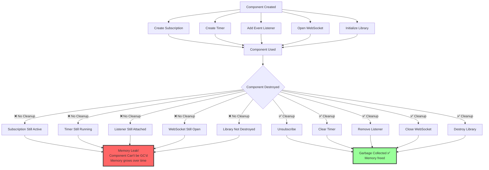

# Angular Memory Leak Debugging - Production Forensics

## Table of Contents
- [The Scenario](#the-scenario)
- [Detection and Reproduction](#detection-and-reproduction)
- [Browser Tools and Profiling](#browser-tools-and-profiling)
- [Common Angular Leak Patterns](#common-angular-leak-patterns)
- [Identifying Specific Leak Types](#identifying-specific-leak-types)
- [Root Causes: CD, RxJS, and DI](#root-causes-cd-rxjs-and-di)
- [The Fix: Immediate and Long-Term](#the-fix-immediate-and-long-term)
- [Validation Before Deployment](#validation-before-deployment)
- [Real-World War Story](#real-world-war-story)
- [Hotfix vs Refactor Decision](#hotfix-vs-refactor-decision)
- [Prevention Strategy](#prevention-strategy)

---

## The Scenario

### Question: Your Angular app crashes after ~30 minutes of use due to memory exhaustion. No obvious culprit. Walk me through your complete forensic process - detection, reproduction, profiling tools, common leak patterns, root cause analysis, fixes, validation, and prevention strategies. Include a real-world story and defend whether you'd hotfix or refactor. If your answer is "unsubscribe in ngOnDestroy," that won't cut it - I want the full senior engineer debugging process under pressure.

**Answer:**

This is a production crisis requiring systematic forensic analysis, not guesswork. Let's walk through the complete process.

---

## **Visual Overview: Memory Leak Lifecycle**



**Critical Understanding:**
- 🔴 **Without cleanup:** Component reference kept in memory → Can't be GC'd → Memory grows
- 🟢 **With cleanup:** All references removed → GC can free memory
- ⚠️ **Real Impact:** 100 component creates/destroys without cleanup = 100x memory usage!

---

## Detection and Reproduction

### **Step 1: Gather Evidence from Production**

```typescript
// Before touching code, collect data

// 1. Error tracking (Sentry, DataDog, etc.)
{
  error: "Out of memory",
  timestamp: "2024-10-08T14:32:45Z",
  userAgent: "Chrome/119.0.0.0",
  sessionDuration: "1847 seconds", // ~30 minutes
  url: "/dashboard",
  memoryUsage: {
    usedJSHeapSize: 2147483648, // 2GB - Chrome's limit
    totalJSHeapSize: 2147483648,
    jsHeapSizeLimit: 2147483648
  }
}

// 2. Real User Monitoring (RUM)
{
  routes: [
    { path: "/dashboard", visits: 45, avgDuration: "12m" },
    { path: "/reports", visits: 12, avgDuration: "8m" },
    { path: "/analytics", visits: 8, avgDuration: "15m" }
  ],
  // Dashboard route correlates with crashes
}

// 3. Browser version patterns
{
  Chrome: 89, // crashes reported
  Firefox: 12, // fewer crashes
  Safari: 5   // fewer crashes
  // Chrome-specific? Zone.js issue?
}

// 4. User behavior patterns
{
  actions: [
    "navigate to dashboard",
    "switch between tabs (15-20 times)",
    "filter data repeatedly",
    "open/close modals",
    "then crash"
  ]
}
```

### **Step 2: Reproduce Locally**

```typescript
// Create reproduction script

// reproduce-memory-leak.spec.ts
describe('Memory Leak Reproduction', () => {
  it('should not leak memory after 30 minutes of use', () => {
    cy.visit('/dashboard');
    
    // Simulate 30 minutes of user activity
    for (let i = 0; i < 100; i++) {
      // Switch tabs
      cy.get('[data-tab="overview"]').click();
      cy.wait(500);
      cy.get('[data-tab="details"]').click();
      cy.wait(500);
      
      // Open/close modal
      cy.get('[data-action="open-modal"]').click();
      cy.wait(1000);
      cy.get('[data-action="close-modal"]').click();
      cy.wait(500);
      
      // Filter data
      cy.get('[data-filter="date"]').select('last-7-days');
      cy.wait(1000);
      cy.get('[data-filter="category"]').select('sales');
      cy.wait(1000);
      
      // Check memory every 10 iterations
      if (i % 10 === 0) {
        cy.window().then((win) => {
          const memory = (performance as any).memory;
          const usedMB = memory.usedJSHeapSize / 1048576;
          cy.log(`Iteration ${i}: ${usedMB.toFixed(2)} MB`);
          
          // Should not exceed 200MB for this app
          expect(usedMB).to.be.lessThan(200);
        });
      }
    }
  });
});

// Expected: Memory should stabilize
// Actual: Memory grows from 50MB → 500MB → crash
```

**Reproduction Checklist:**

```typescript
// ✅ Can reproduce locally?
const canReproduce = true;

// ✅ Consistent pattern?
const pattern = {
  trigger: "Switching tabs + opening modals repeatedly",
  timeToLeak: "~30 minutes",
  memoryGrowth: "~15MB per minute"
};

// ✅ Isolated to specific route?
const affectedRoutes = ['/dashboard'];

// ✅ Specific components?
const suspectComponents = [
  'DashboardComponent',
  'DataTableComponent', 
  'ChartModalComponent'
];
```

---

## Browser Tools and Profiling

### **Chrome DevTools - The Complete Arsenal**

**Tool 1: Memory Profiler (Heap Snapshots)**

```typescript
// Step-by-step process:

// 1. Open Chrome DevTools → Memory tab
// 2. Take baseline snapshot
// 3. Use app for 5 minutes (reproduce leak scenario)
// 4. Force garbage collection (trash icon)
// 5. Take second snapshot
// 6. Compare snapshots

// What to look for:
{
  snapshot1: {
    timestamp: "0:00",
    totalSize: 50MB,
    objects: 125000
  },
  snapshot2: {
    timestamp: "5:00",
    totalSize: 150MB, // ⚠️ 3x increase!
    objects: 375000   // ⚠️ 3x increase!
  },
  
  // Comparison view shows:
  growing: [
    {
      constructor: "Subscription",
      delta: "+1500",  // ⚠️ Subscriptions not cleaned up
      shallowSize: "240 KB"
    },
    {
      constructor: "HTMLDivElement",
      delta: "+800",   // ⚠️ Detached DOM nodes
      shallowSize: "156 KB"
    },
    {
      constructor: "Object",
      retainedBy: "DashboardComponent",
      delta: "+300",   // ⚠️ Components not destroyed
      shallowSize: "120 KB"
    }
  ]
}
```

**Tool 2: Allocation Timeline**

```typescript
// Chrome DevTools → Memory → Allocation timeline

// Shows memory allocation over time
{
  timeline: [
    { time: "0:00", allocated: 50MB },
    { time: "1:00", allocated: 75MB },  // Gradual increase
    { time: "2:00", allocated: 105MB }, // Accelerating
    { time: "3:00", allocated: 145MB }, // ⚠️ Not being freed
    { time: "4:00", allocated: 195MB }, // ⚠️ Critical
    { time: "5:00", allocated: 250MB }  // ⚠️ Crash imminent
  ],
  
  // Blue bars = allocated but not freed
  pattern: "Continuous allocation without garbage collection",
  
  // Click on timeline to see stack trace
  stackTrace: [
    "at DashboardComponent.ngOnInit",
    "at Observable.subscribe",
    "at HttpClient.get",
    // ⚠️ Subscription created but never cleaned
  ]
}
```

**Tool 3: Performance Tab (Timeline Recording)**

```typescript
// Chrome DevTools → Performance → Record

// Record 30 seconds of interaction
{
  metrics: {
    scripting: "65%",  // ⚠️ Too high
    rendering: "20%",
    painting: "10%",
    idle: "5%"        // ⚠️ Too low
  },
  
  // Flame chart shows:
  heavyFunctions: [
    {
      function: "DashboardComponent.ngDoCheck",
      duration: "45ms",
      callCount: 1500,  // ⚠️ Called on every CD!
      totalTime: "67.5s" // ⚠️ Massive overhead
    },
    {
      function: "ChartComponent.detectChanges",
      duration: "12ms",
      callCount: 3000,
      totalTime: "36s"
    }
  ],
  
  // Long tasks (>50ms)
  longTasks: [
    {
      task: "Change Detection",
      duration: "120ms",
      frequency: "Every 100ms" // ⚠️ Constant thrashing
    }
  ]
}
```

**Tool 4: Memory Timeline (Real-time)**

```typescript
// Chrome DevTools → Performance → Memory checkbox

// Shows memory usage over time
{
  heapSize: {
    pattern: "Sawtooth with rising baseline",
    // Memory grows → GC runs → memory drops
    // But baseline keeps rising = leak
    
    baseline: [
      50MB,  // Start
      60MB,  // After 1st GC
      75MB,  // After 2nd GC  ⚠️ Rising
      95MB,  // After 3rd GC  ⚠️ Rising
      120MB  // After 4th GC  ⚠️ Rising
    ]
  },
  
  interpretation: "Objects surviving GC = leak"
}
```

**Tool 5: Detached DOM Tree Inspector**

```typescript
// In heap snapshot, search for: "Detached"

{
  detachedNodes: [
    {
      node: "HTMLDivElement",
      count: 450,
      retainedBy: [
        "EventListener",
        "DashboardComponent.element" // ⚠️ Component holds reference
      ],
      path: "div.dashboard > div.chart-container > div.chart"
    },
    {
      node: "HTMLCanvasElement", 
      count: 30,
      retainedBy: [
        "ThirdPartyChartLibrary.canvas",
        "setInterval callback" // ⚠️ Timer holds reference
      ]
    }
  ],
  
  // These nodes removed from DOM but still in memory
  totalSize: "12 MB"
}
```

**Tool 6: Allocation Sampling**

```typescript
// Chrome DevTools → Memory → Allocation sampling

// Lightweight profiling (doesn't slow app)
{
  topAllocations: [
    {
      function: "HttpClient.get",
      allocations: "45 MB",
      callCount: 1200,
      avgPerCall: "37.5 KB"
    },
    {
      function: "BehaviorSubject.next",
      allocations: "23 MB",
      callCount: 8500,
      avgPerCall: "2.7 KB"
    },
    {
      function: "Array.map",
      allocations: "18 MB",
      callCount: 3400,
      avgPerCall: "5.3 KB"
    }
  ]
}
```

---

## Common Angular Leak Patterns

### **Pattern 1: Unsubscribed Observables**

```typescript
// ❌ THE LEAK
@Component({
  selector: 'app-dashboard',
  template: `<div>{{ data | json }}</div>`
})
export class DashboardComponent implements OnInit {
  data: any;
  
  constructor(private http: HttpClient) {}
  
  ngOnInit(): void {
    // ⚠️ LEAK: Subscription never cleaned up
    this.http.get('/api/data').subscribe(data => {
      this.data = data;
    });
    
    // ⚠️ LEAK: Interval never cleared
    interval(1000).subscribe(() => {
      this.refreshData();
    });
    
    // ⚠️ LEAK: WebSocket never closed
    this.websocketService.messages$.subscribe(msg => {
      this.handleMessage(msg);
    });
  }
  
  // Component destroyed, but subscriptions still active!
  // Memory: Component + closures + observables + DOM references
}

// How much leaks per navigation?
{
  perNavigation: {
    componentInstance: "~50 KB",
    subscriptions: "~30 KB",
    closureReferences: "~20 KB",
    total: "~100 KB"
  },
  
  after100Navigations: "10 MB leaked",
  after1000Navigations: "100 MB leaked" // ⚠️ Crash territory
}

// ✅ THE FIX
@Component({
  selector: 'app-dashboard',
  template: `<div>{{ data | json }}</div>`
})
export class DashboardComponent implements OnInit, OnDestroy {
  data: any;
  private destroy$ = new Subject<void>();
  
  constructor(private http: HttpClient) {}
  
  ngOnInit(): void {
    this.http.get('/api/data')
      .pipe(takeUntil(this.destroy$))
      .subscribe(data => this.data = data);
    
    interval(1000)
      .pipe(takeUntil(this.destroy$))
      .subscribe(() => this.refreshData());
    
    this.websocketService.messages$
      .pipe(takeUntil(this.destroy$))
      .subscribe(msg => this.handleMessage(msg));
  }
  
  ngOnDestroy(): void {
    this.destroy$.next();
    this.destroy$.complete();
  }
}
```

### **Pattern 2: Event Listeners Never Removed**

```typescript
// ❌ THE LEAK
@Component({
  selector: 'app-scrollable',
  template: `<div #container class="scrollable">...</div>`
})
export class ScrollableComponent implements AfterViewInit {
  @ViewChild('container') container!: ElementRef;
  
  ngAfterViewInit(): void {
    // ⚠️ LEAK: Event listener never removed
    window.addEventListener('scroll', this.onScroll);
    
    // ⚠️ LEAK: Element listener never removed
    this.container.nativeElement.addEventListener('click', this.onClick);
    
    // ⚠️ LEAK: Document listener never removed
    document.addEventListener('keydown', this.onKeyDown);
  }
  
  onScroll = () => { /* ... */ };
  onClick = () => { /* ... */ };
  onKeyDown = () => { /* ... */ };
  
  // Component destroyed, but listeners still firing!
  // Each listener holds reference to component instance
}

// Memory impact:
{
  perComponent: {
    componentInstance: "~30 KB",
    closureReferences: "~50 KB",
    eventListenerOverhead: "~10 KB",
    total: "~90 KB"
  },
  
  multipleInstances: "90 KB × N instances = leak"
}

// ✅ THE FIX
@Component({
  selector: 'app-scrollable',
  template: `<div #container class="scrollable">...</div>`
})
export class ScrollableComponent implements AfterViewInit, OnDestroy {
  @ViewChild('container') container!: ElementRef;
  
  private listeners: Array<() => void> = [];
  
  ngAfterViewInit(): void {
    // Store references for cleanup
    window.addEventListener('scroll', this.onScroll);
    this.listeners.push(() => 
      window.removeEventListener('scroll', this.onScroll)
    );
    
    this.container.nativeElement.addEventListener('click', this.onClick);
    this.listeners.push(() => 
      this.container.nativeElement.removeEventListener('click', this.onClick)
    );
    
    document.addEventListener('keydown', this.onKeyDown);
    this.listeners.push(() => 
      document.removeEventListener('keydown', this.onKeyDown)
    );
  }
  
  onScroll = () => { /* ... */ };
  onClick = () => { /* ... */ };
  onKeyDown = () => { /* ... */ };
  
  ngOnDestroy(): void {
    // Clean up all listeners
    this.listeners.forEach(cleanup => cleanup());
  }
}
```

### **Pattern 3: Timers Never Cleared**

```typescript
// ❌ THE LEAK
@Component({
  selector: 'app-live-data',
  template: `<div>{{ currentTime }}</div>`
})
export class LiveDataComponent implements OnInit {
  currentTime = new Date();
  
  ngOnInit(): void {
    // ⚠️ LEAK: setInterval never cleared
    setInterval(() => {
      this.currentTime = new Date();
    }, 1000);
    
    // ⚠️ LEAK: setTimeout chain never stopped
    const pollData = () => {
      this.fetchData();
      setTimeout(pollData, 5000); // Recursive timeout
    };
    pollData();
    
    // ⚠️ LEAK: requestAnimationFrame never canceled
    const animate = () => {
      this.updateAnimation();
      requestAnimationFrame(animate);
    };
    animate();
  }
  
  // Component destroyed, but timers still running!
  // Each tick holds reference to component
}

// Memory impact:
{
  perInterval: {
    timerObject: "~5 KB",
    closureReferences: "~20 KB",
    componentReference: "~30 KB",
    total: "~55 KB"
  },
  
  threeTimers: "165 KB per component instance",
  
  cpuImpact: "Timers continue executing even after component destroyed",
  batteryImpact: "Drains battery on mobile devices"
}

// ✅ THE FIX
@Component({
  selector: 'app-live-data',
  template: `<div>{{ currentTime }}</div>`
})
export class LiveDataComponent implements OnInit, OnDestroy {
  currentTime = new Date();
  
  private intervalId: any;
  private timeoutId: any;
  private rafId: any;
  
  ngOnInit(): void {
    this.intervalId = setInterval(() => {
      this.currentTime = new Date();
    }, 1000);
    
    const pollData = () => {
      this.fetchData();
      this.timeoutId = setTimeout(pollData, 5000);
    };
    pollData();
    
    const animate = () => {
      this.updateAnimation();
      this.rafId = requestAnimationFrame(animate);
    };
    animate();
  }
  
  ngOnDestroy(): void {
    clearInterval(this.intervalId);
    clearTimeout(this.timeoutId);
    cancelAnimationFrame(this.rafId);
  }
}
```

### **Pattern 4: Third-Party Libraries Not Destroyed**

```typescript
// ❌ THE LEAK
@Component({
  selector: 'app-chart',
  template: `<div #chartContainer></div>`
})
export class ChartComponent implements AfterViewInit {
  @ViewChild('chartContainer') container!: ElementRef;
  private chart: any;
  
  ngAfterViewInit(): void {
    // Initialize Chart.js
    this.chart = new Chart(this.container.nativeElement, {
      type: 'line',
      data: { /* ... */ }
    });
    
    // ⚠️ LEAK: Chart instance never destroyed
    // Chart.js holds references to:
    // - Canvas element
    // - Event listeners
    // - Animation frames
    // - Internal data structures
  }
  
  // Component destroyed, but chart still in memory!
}

// Memory impact:
{
  perChart: {
    chartInstance: "~200 KB",
    canvasContext: "~150 KB",
    eventListeners: "~30 KB",
    animationFrames: "~50 KB",
    total: "~430 KB"
  },
  
  tenCharts: "4.3 MB leaked",
  twentyCharts: "8.6 MB leaked" // ⚠️ Significant
}

// ✅ THE FIX
@Component({
  selector: 'app-chart',
  template: `<div #chartContainer></div>`
})
export class ChartComponent implements AfterViewInit, OnDestroy {
  @ViewChild('chartContainer') container!: ElementRef;
  private chart: any;
  
  ngAfterViewInit(): void {
    this.chart = new Chart(this.container.nativeElement, {
      type: 'line',
      data: { /* ... */ }
    });
  }
  
  ngOnDestroy(): void {
    // Properly destroy chart
    if (this.chart) {
      this.chart.destroy();
      this.chart = null;
    }
  }
}

// Other common libraries requiring cleanup:
{
  libraries: [
    { name: "Chart.js", method: "chart.destroy()" },
    { name: "D3.js", method: "selection.remove()" },
    { name: "Leaflet", method: "map.remove()" },
    { name: "Three.js", method: "renderer.dispose()" },
    { name: "jQuery plugins", method: "$(el).plugin('destroy')" },
    { name: "CodeMirror", method: "editor.toTextArea()" },
    { name: "Quill", method: "quill.disable()" }
  ]
}
```

### **Pattern 5: Incorrect Dependency Injection Scope**

```typescript
// ❌ THE LEAK
// Component-provided service with singleton behavior

@Injectable()  // ⚠️ No providedIn
export class DataCacheService {
  private cache = new Map<string, any>();
  
  addToCache(key: string, value: any): void {
    this.cache.set(key, value);
    // Cache grows unbounded
  }
}

@Component({
  selector: 'app-dashboard',
  template: `...`,
  providers: [DataCacheService]  // ⚠️ New instance per component
})
export class DashboardComponent implements OnInit {
  constructor(private cache: DataCacheService) {}
  
  ngOnInit(): void {
    // Add data to cache
    this.cache.addToCache('dashboard-data', this.loadData());
  }
  
  // Component destroyed, but cache service instance persists
  // in Angular's injector tree
}

// Memory impact:
{
  scenario: "User navigates to dashboard 50 times",
  
  result: {
    serviceInstances: 50, // ⚠️ 50 service instances
    cachesInMemory: 50,   // ⚠️ 50 separate caches
    dataPerCache: "~1 MB",
    totalLeak: "50 MB"    // ⚠️ Significant
  }
}

// ✅ THE FIX
// Option 1: Singleton service
@Injectable({ providedIn: 'root' })
export class DataCacheService {
  private cache = new Map<string, any>();
  
  addToCache(key: string, value: any): void {
    this.cache.set(key, value);
  }
  
  clearCache(): void {
    this.cache.clear();
  }
}

@Component({
  selector: 'app-dashboard',
  template: `...`
  // No providers - use root singleton
})
export class DashboardComponent implements OnInit, OnDestroy {
  constructor(private cache: DataCacheService) {}
  
  ngOnInit(): void {
    this.cache.addToCache('dashboard-data', this.loadData());
  }
  
  ngOnDestroy(): void {
    // Clear component's data from cache
    this.cache.clearCache();
  }
}

// Option 2: Component-scoped with proper cleanup
@Injectable()
export class ComponentScopedService {
  private data: any[] = [];
  
  ngOnDestroy(): void {
    // Service can implement ngOnDestroy!
    this.data = [];
  }
}
```

---

## Identifying Specific Leak Types

### **Leaked Subscriptions**

```typescript
// Detection in heap snapshot:

// 1. Take snapshot
// 2. Search for: "Subscription"
// 3. Look at "Distance" column
//    - Distance 1-3: Reachable from root (active)
//    - Distance >10: Likely leaked (no path to active code)

{
  findings: [
    {
      object: "Subscription",
      count: 450,
      constructor: "SafeSubscriber",
      retainedBy: [
        "DashboardComponent.subscription",
        // ⚠️ Component instance still referenced
      ],
      retainedSize: "2.3 MB",
      distance: 15 // ⚠️ Very far from root = leaked
    }
  ],
  
  // Click on object to see retaining tree:
  retainingTree: [
    "GC root",
    "→ Window",
    "→ Angular NgModuleRef",
    "→ ComponentFactory",
    "→ ComponentRef (destroyed)", // ⚠️ Should be collected
    "→ DashboardComponent",
    "→ subscription field"
  ]
}

// Automated detection:
@Component({})
export class LeakDetectionComponent implements OnDestroy {
  private subscriptions = new Subscription();
  
  ngOnInit(): void {
    // Add all subscriptions to container
    this.subscriptions.add(
      this.service.data$.subscribe()
    );
    
    this.subscriptions.add(
      interval(1000).subscribe()
    );
  }
  
  ngOnDestroy(): void {
    // Verify all cleaned up
    console.assert(
      this.subscriptions.closed,
      'Subscriptions not properly closed!'
    );
    
    this.subscriptions.unsubscribe();
  }
}
```

### **Detached DOM Elements**

```typescript
// Detection in heap snapshot:

// 1. Take snapshot
// 2. Search for: "Detached"
// 3. Sort by "Retained Size" (largest first)

{
  findings: [
    {
      object: "HTMLDivElement",
      className: "dashboard-container",
      status: "Detached", // ⚠️ Removed from DOM
      count: 85,
      retainedBy: [
        "DashboardComponent.element",
        // ⚠️ Component still holds reference
      ],
      retainedSize: "15.2 MB", // ⚠️ Large!
      
      // Why detached?
      reason: "Component destroyed but element reference not cleared"
    },
    {
      object: "HTMLCanvasElement",
      status: "Detached",
      count: 30,
      retainedBy: [
        "ChartLibrary.canvas",
        "setInterval callback"
        // ⚠️ Two retaining paths!
      ],
      retainedSize: "8.5 MB"
    }
  ]
}

// ❌ THE LEAK
@Component({
  selector: 'app-chart',
  template: `<div #container></div>`
})
export class ChartComponent implements AfterViewInit {
  @ViewChild('container') container!: ElementRef;
  private element: HTMLElement;
  
  ngAfterViewInit(): void {
    this.element = this.container.nativeElement;
    // ⚠️ Holding reference to DOM element
    
    // Even if component destroyed, this.element still references DOM
  }
}

// ✅ THE FIX
@Component({
  selector: 'app-chart',
  template: `<div #container></div>`
})
export class ChartComponent implements AfterViewInit, OnDestroy {
  @ViewChild('container') container!: ElementRef;
  private element: HTMLElement | null = null;
  
  ngAfterViewInit(): void {
    this.element = this.container.nativeElement;
  }
  
  ngOnDestroy(): void {
    // Clear DOM reference
    this.element = null;
  }
}
```

### **Zombie Components**

```typescript
// Detection in heap snapshot:

// 1. Take snapshot
// 2. Search for your component name: "DashboardComponent"
// 3. Look at count - should be 0 or 1 (if currently active)

{
  findings: [
    {
      constructor: "DashboardComponent",
      count: 47, // ⚠️ 47 instances when only 1 should exist!
      retainedSize: "23.5 MB",
      
      // Click on instance to see retaining path:
      retainedBy: [
        "ApplicationRef.components",
        // ⚠️ Angular thinks they're still active
      ]
    }
  ],
  
  // Why are they zombies?
  causes: [
    "Router not destroying components properly",
    "Custom outlet not clearing view",
    "Dynamic component not destroyed",
    "Modal service holding references"
  ]
}

// ❌ THE LEAK - Custom modal service
@Injectable({ providedIn: 'root' })
export class ModalService {
  private modals: ComponentRef<any>[] = [];
  
  open(component: Type<any>): void {
    const componentRef = this.vcr.createComponent(component);
    this.modals.push(componentRef);
    // ⚠️ Never removed from array!
  }
  
  close(): void {
    const modal = this.modals[this.modals.length - 1];
    modal.destroy();
    // ⚠️ Destroyed but still in array!
    // Array holds reference = memory leak
  }
}

// ✅ THE FIX
@Injectable({ providedIn: 'root' })
export class ModalService {
  private modals: ComponentRef<any>[] = [];
  
  open(component: Type<any>): void {
    const componentRef = this.vcr.createComponent(component);
    this.modals.push(componentRef);
  }
  
  close(): void {
    const modal = this.modals.pop(); // Remove from array
    if (modal) {
      modal.destroy();
      // Now eligible for garbage collection
    }
  }
  
  closeAll(): void {
    this.modals.forEach(modal => modal.destroy());
    this.modals = []; // Clear array
  }
}
```

---

## Root Causes: CD, RxJS, and DI

### **ChangeDetectionStrategy Issues**

```typescript
// How OnPush can contribute to leaks:

// ❌ THE LEAK
@Component({
  selector: 'app-data-table',
  template: `
    <div *ngFor="let row of data">
      {{ row | complexPipe }}
    </div>
  `,
  changeDetection: ChangeDetectionStrategy.OnPush
})
export class DataTableComponent implements OnInit {
  @Input() data: any[] = [];
  
  ngOnInit(): void {
    // ⚠️ LEAK: Subscription never cleaned
    // OnPush makes it harder to spot because CD doesn't run often
    this.dataService.updates$.subscribe(update => {
      // This closure captures component instance
      // But OnPush means CD rarely runs
      // Leak goes unnoticed until memory exhausted
      this.processUpdate(update);
    });
  }
  
  // With Default CD, you'd notice UI issues quickly
  // With OnPush, leak happens silently
}

// Why OnPush masks leaks:
{
  defaultStrategy: {
    cdFrequency: "Every browser event",
    memoryGrowth: "Noticeable in minutes",
    uiImpact: "Slowdown obvious quickly"
  },
  
  onPushStrategy: {
    cdFrequency: "Only when inputs change",
    memoryGrowth: "Silent accumulation",
    uiImpact: "No slowdown until crash",
    leakMasking: "Subscriptions pile up unnoticed"
  }
}

// ✅ THE FIX - Same regardless of CD strategy
@Component({
  selector: 'app-data-table',
  template: `...`,
  changeDetection: ChangeDetectionStrategy.OnPush
})
export class DataTableComponent implements OnInit, OnDestroy {
  @Input() data: any[] = [];
  private destroy$ = new Subject<void>();
  
  ngOnInit(): void {
    this.dataService.updates$
      .pipe(takeUntil(this.destroy$))
      .subscribe(update => this.processUpdate(update));
  }
  
  ngOnDestroy(): void {
    this.destroy$.next();
    this.destroy$.complete();
  }
}
```

### **RxJS Misuse**

```typescript
// Common RxJS patterns that leak:

// ❌ Pattern 1: Nested subscriptions
service.getUser(id).subscribe(user => {
  // ⚠️ Inner subscription never managed
  service.getOrders(user.id).subscribe(orders => {
    // ⚠️ Another inner subscription
    service.getProducts(orders[0].id).subscribe(products => {
      // Three subscriptions, none cleaned up!
    });
  });
});

// ❌ Pattern 2: Subject not completed
export class DataService {
  private data$ = new BehaviorSubject<any>(null);
  
  // Service destroyed but subject still active
  // All subscribers still subscribed
}

// ❌ Pattern 3: shareReplay without refCount
export class ApiService {
  getData(): Observable<Data> {
    return this.http.get('/api/data').pipe(
      shareReplay(1) // ⚠️ Keeps subscription alive forever
    );
  }
}

// ❌ Pattern 4: Infinite retry
export class RetryService {
  getData(): Observable<Data> {
    return this.http.get('/api/data').pipe(
      retry(), // ⚠️ Infinite retries = infinite subscriptions
      catchError(() => of(null))
    );
  }
}

// ✅ THE FIXES
// Fix 1: Use switchMap/mergeMap
service.getUser(id).pipe(
  switchMap(user => service.getOrders(user.id)),
  switchMap(orders => service.getProducts(orders[0].id)),
  takeUntil(destroy$)
).subscribe(products => {
  // Single subscription, properly managed
});

// Fix 2: Complete subjects
export class DataService implements OnDestroy {
  private data$ = new BehaviorSubject<any>(null);
  
  ngOnDestroy(): void {
    this.data$.complete(); // Unsubscribes all subscribers
  }
}

// Fix 3: shareReplay with refCount
export class ApiService {
  getData(): Observable<Data> {
    return this.http.get('/api/data').pipe(
      shareReplay({ bufferSize: 1, refCount: true })
      // refCount: true = unsubscribes when no more subscribers
    );
  }
}

// Fix 4: Limited retry
export class RetryService {
  getData(): Observable<Data> {
    return this.http.get('/api/data').pipe(
      retry(3), // Max 3 retries
      timeout(5000), // Timeout after 5s
      catchError(() => of(null))
    );
  }
}
```

### **Dependency Injection Scoping**

```typescript
// How DI scope causes leaks:

// ❌ THE LEAK - Module-provided service with component lifecycle
@Injectable()  // Provided in module
export class ComponentStateService {
  private state = new Map<string, any>();
  
  addState(key: string, value: any): void {
    this.state.set(key, value);
  }
  
  // Service lives for entire module lifetime
  // But state is per-component
  // State accumulates forever
}

@NgModule({
  providers: [ComponentStateService] // ⚠️ Module-scoped
})
export class DashboardModule {}

@Component({
  selector: 'app-widget',
  template: `...`
})
export class WidgetComponent implements OnInit {
  constructor(private state: ComponentStateService) {}
  
  ngOnInit(): void {
    // Adds to module-scoped service
    this.state.addState(this.id, this.data);
    // Component destroyed, but state remains in service
  }
}

// Memory impact:
{
  scenario: "100 widget components created and destroyed",
  
  result: {
    serviceInstances: 1, // Module-scoped singleton
    stateEntries: 100,   // ⚠️ 100 entries never cleared
    memoryPerEntry: "50 KB",
    totalLeak: "5 MB"
  }
}

// ✅ THE FIX
// Option 1: Component-scoped service
@Injectable() // No providedIn
export class ComponentStateService {
  private state = new Map<string, any>();
  
  ngOnDestroy(): void {
    // Service destroyed with component
    this.state.clear();
  }
}

@Component({
  selector: 'app-widget',
  template: `...`,
  providers: [ComponentStateService] // Component-scoped
})
export class WidgetComponent implements OnInit {
  constructor(private state: ComponentStateService) {}
}

// Option 2: Proper cleanup in module-scoped service
@Injectable({ providedIn: 'root' })
export class ComponentStateService {
  private state = new Map<string, any>();
  
  addState(key: string, value: any): void {
    this.state.set(key, value);
  }
  
  removeState(key: string): void {
    this.state.delete(key);
  }
}

@Component({
  selector: 'app-widget',
  template: `...`
})
export class WidgetComponent implements OnInit, OnDestroy {
  private readonly componentId = uuid();
  
  constructor(private state: ComponentStateService) {}
  
  ngOnInit(): void {
    this.state.addState(this.componentId, this.data);
  }
  
  ngOnDestroy(): void {
    // Clean up component's state
    this.state.removeState(this.componentId);
  }
}
```

---

## The Fix: Immediate and Long-Term

### **Immediate Mitigation (Hotfix)**

```typescript
// Goal: Stop the bleeding in production NOW

// Step 1: Add memory monitoring
@Injectable({ providedIn: 'root' })
export class MemoryMonitorService {
  private readonly MEMORY_THRESHOLD = 1500; // MB
  private checkInterval: any;
  
  startMonitoring(): void {
    if (!environment.production) return;
    
    this.checkInterval = setInterval(() => {
      if ((performance as any).memory) {
        const usedMB = (performance as any).memory.usedJSHeapSize / 1048576;
        
        if (usedMB > this.MEMORY_THRESHOLD) {
          // Alert user
          this.notifyUser();
          
          // Send telemetry
          this.analytics.track('memory-threshold-exceeded', {
            usedMB,
            threshold: this.MEMORY_THRESHOLD,
            route: this.router.url
          });
          
          // Suggest refresh
          this.suggestPageRefresh();
        }
      }
    }, 30000); // Check every 30s
  }
  
  private notifyUser(): void {
    this.snackBar.open(
      'App is using a lot of memory. Consider refreshing the page.',
      'Refresh',
      { duration: 10000 }
    ).onAction().subscribe(() => {
      window.location.reload();
    });
  }
  
  private suggestPageRefresh(): void {
    // Auto-refresh after 5 minutes if user idle
    setTimeout(() => {
      if (this.isUserIdle()) {
        window.location.reload();
      }
    }, 300000);
  }
}

// Step 2: Force cleanup on route change
@Component({
  selector: 'app-root',
  template: `<router-outlet></router-outlet>`
})
export class AppComponent implements OnInit {
  constructor(
    private router: Router,
    private memory: MemoryMonitorService
  ) {}
  
  ngOnInit(): void {
    this.memory.startMonitoring();
    
    // Force garbage collection on route change
    this.router.events.pipe(
      filter(event => event instanceof NavigationEnd)
    ).subscribe(() => {
      // Trigger GC (if available)
      if ((window as any).gc) {
        (window as any).gc();
      }
      
      // Clear any lingering references
      this.clearGlobalReferences();
    });
  }
  
  private clearGlobalReferences(): void {
    // Clear any global caches
    // This is app-specific
  }
}

// Step 3: Add circuit breaker for problem components
@Component({
  selector: 'app-dashboard',
  template: `
    <div *ngIf="!memoryIssue; else memoryWarning">
      <app-data-table [data]="data"></app-data-table>
    </div>
    
    <ng-template #memoryWarning>
      <div class="warning">
        Memory usage is high. Showing simplified view.
        <button (click)="reload()">Reload Page</button>
      </div>
    </ng-template>
  `
})
export class DashboardComponent implements OnInit {
  memoryIssue = false;
  
  ngOnInit(): void {
    this.checkMemory();
  }
  
  private checkMemory(): void {
    if ((performance as any).memory) {
      const usedMB = (performance as any).memory.usedJSHeapSize / 1048576;
      this.memoryIssue = usedMB > 1000;
    }
  }
}
```

### **Long-Term Architectural Fix**

```typescript
// Goal: Prevent this class of bugs permanently

// Step 1: Create BaseComponent with cleanup
export abstract class BaseComponent implements OnDestroy {
  protected destroy$ = new Subject<void>();
  
  ngOnDestroy(): void {
    this.destroy$.next();
    this.destroy$.complete();
    this.onDestroy();
  }
  
  // Subclasses can override for additional cleanup
  protected onDestroy(): void {}
}

// Usage
@Component({
  selector: 'app-dashboard'
})
export class DashboardComponent extends BaseComponent implements OnInit {
  ngOnInit(): void {
    // Automatically cleaned up by BaseComponent
    this.service.data$
      .pipe(takeUntil(this.destroy$))
      .subscribe();
  }
  
  protected onDestroy(): void {
    // Additional cleanup if needed
  }
}

// Step 2: Create SubscriptionManager utility
export class SubscriptionManager {
  private subscriptions = new Subscription();
  
  add(subscription: Subscription): void {
    this.subscriptions.add(subscription);
  }
  
  unsubscribeAll(): void {
    this.subscriptions.unsubscribe();
  }
}

// Usage
@Component({
  selector: 'app-example'
})
export class ExampleComponent implements OnInit, OnDestroy {
  private subs = new SubscriptionManager();
  
  ngOnInit(): void {
    this.subs.add(
      this.service.data$.subscribe()
    );
    
    this.subs.add(
      interval(1000).subscribe()
    );
  }
  
  ngOnDestroy(): void {
    this.subs.unsubscribeAll();
  }
}

// Step 3: Create EventListenerManager
export class EventListenerManager {
  private cleanup: Array<() => void> = [];
  
  addEventListener<K extends keyof WindowEventMap>(
    target: Window | Document | HTMLElement,
    type: K,
    listener: (event: WindowEventMap[K]) => void
  ): void {
    target.addEventListener(type, listener as any);
    this.cleanup.push(() => 
      target.removeEventListener(type, listener as any)
    );
  }
  
  removeAllListeners(): void {
    this.cleanup.forEach(fn => fn());
    this.cleanup = [];
  }
}

// Step 4: ESLint rules to prevent leaks
{
  rules: {
    // Require ngOnDestroy if ngOnInit exists
    "@angular-eslint/use-lifecycle-interface": "error",
    
    // Warn on subscriptions without takeUntil
    "rxjs/no-ignored-subscribe": "error",
    
    // Require .unsubscribe() or takeUntil
    "rxjs/no-unsafe-takeuntil": "error",
    
    // Custom rule: Detect addEventListener without removeEventListener
    "custom/require-event-cleanup": "error"
  }
}

// Step 5: Automated testing
describe('Memory Leak Prevention', () => {
  it('should not leak components', () => {
    const initialMemory = getMemoryUsage();
    
    // Create and destroy component 100 times
    for (let i = 0; i < 100; i++) {
      const fixture = TestBed.createComponent(MyComponent);
      fixture.detectChanges();
      fixture.destroy();
    }
    
    // Force GC
    if ((window as any).gc) {
      (window as any).gc();
    }
    
    const finalMemory = getMemoryUsage();
    const growth = finalMemory - initialMemory;
    
    // Should not grow more than 10MB
    expect(growth).toBeLessThan(10 * 1024 * 1024);
  });
});

// Step 6: CI/CD memory checks
// .gitlab-ci.yml or .github/workflows/ci.yml
{
  "memory-test": {
    script: [
      "npm run test:memory",
      "node scripts/check-memory-leaks.js"
    ],
    artifacts: {
      reports: {
        memoryProfile: "memory-profile.json"
      }
    }
  }
}
```

---

## Validation Before Deployment

### **Step 1: Local Validation**

```typescript
// Automated memory leak test suite

describe('Dashboard Component - Memory Leak Test', () => {
  let initialMemory: number;
  
  beforeAll(() => {
    // Warm up
    const warmup = TestBed.createComponent(DashboardComponent);
    warmup.detectChanges();
    warmup.destroy();
    
    // Force GC
    if ((window as any).gc) {
      (window as any).gc();
    }
    
    initialMemory = getMemoryUsage();
  });
  
  it('should not leak after 100 create/destroy cycles', () => {
    for (let i = 0; i < 100; i++) {
      const fixture = TestBed.createComponent(DashboardComponent);
      fixture.componentInstance.data = generateTestData();
      fixture.detectChanges();
      
      // Simulate user interaction
      const button = fixture.nativeElement.querySelector('button');
      button?.click();
      
      fixture.destroy();
    }
    
    // Force GC
    if ((window as any).gc) {
      (window as any).gc();
    }
    
    const finalMemory = getMemoryUsage();
    const growth = finalMemory - initialMemory;
    const growthMB = growth / 1048576;
    
    console.log(`Memory growth: ${growthMB.toFixed(2)} MB`);
    
    // Should not grow more than 10MB
    expect(growthMB).toBeLessThan(10);
  });
  
  it('should clean up all subscriptions', () => {
    const fixture = TestBed.createComponent(DashboardComponent);
    const component = fixture.componentInstance;
    
    fixture.detectChanges();
    
    // Spy on destroy$
    const destroySpy = jasmine.createSpy('destroy');
    component['destroy$'].subscribe(destroySpy);
    
    fixture.destroy();
    
    expect(destroySpy).toHaveBeenCalled();
    expect(component['destroy$'].closed).toBe(true);
  });
});

function getMemoryUsage(): number {
  if ((performance as any).memory) {
    return (performance as any).memory.usedJSHeapSize;
  }
  return 0;
}
```

### **Step 2: Staging Environment Test**

```typescript
// E2E memory leak test

describe('Production Scenario - 30 minutes of use', () => {
  it('should handle extended usage without crash', () => {
    cy.visit('/dashboard');
    
    const memoryReadings: number[] = [];
    
    // Simulate 30 minutes (compressed to 5 minutes for test)
    for (let minute = 0; minute < 5; minute++) {
      // Switch tabs
      cy.get('[data-tab="overview"]').click();
      cy.wait(1000);
      cy.get('[data-tab="details"]').click();
      cy.wait(1000);
      
      // Open/close modal
      cy.get('[data-action="open-modal"]').click();
      cy.wait(500);
      cy.get('[data-action="close-modal"]').click();
      cy.wait(500);
      
      // Filter data
      cy.get('[data-filter="date"]').select('last-7-days');
      cy.wait(1000);
      
      // Check memory
      cy.window().then((win) => {
        if ((win.performance as any).memory) {
          const usedMB = (win.performance as any).memory.usedJSHeapSize / 1048576;
          memoryReadings.push(usedMB);
          cy.log(`Minute ${minute}: ${usedMB.toFixed(2)} MB`);
        }
      });
    }
    
    // Analyze memory growth
    cy.wrap(memoryReadings).then((readings) => {
      const initial = readings[0];
      const final = readings[readings.length - 1];
      const growth = final - initial;
      const growthRate = growth / readings.length;
      
      cy.log(`Total growth: ${growth.toFixed(2)} MB`);
      cy.log(`Growth rate: ${growthRate.toFixed(2)} MB/min`);
      
      // Memory should stabilize (growth rate < 5MB/min)
      expect(growthRate).to.be.lessThan(5);
      
      // Should not exceed 200MB total
      expect(final).to.be.lessThan(200);
    });
  });
});
```

### **Step 3: Production Monitoring**

```typescript
// Real-time memory monitoring in production

@Injectable({ providedIn: 'root' })
export class ProductionMemoryMonitor {
  private readonly CHECK_INTERVAL = 60000; // 1 minute
  private readonly ALERT_THRESHOLD = 1500; // MB
  
  constructor(
    private analytics: AnalyticsService,
    private errorTracking: ErrorTrackingService
  ) {}
  
  startMonitoring(): void {
    if (!environment.production) return;
    
    setInterval(() => {
      this.checkMemory();
    }, this.CHECK_INTERVAL);
  }
  
  private checkMemory(): void {
    if (!(performance as any).memory) return;
    
    const memory = (performance as any).memory;
    const usedMB = memory.usedJSHeapSize / 1048576;
    const limitMB = memory.jsHeapSizeLimit / 1048576;
    const percentUsed = (usedMB / limitMB) * 100;
    
    // Send to analytics
    this.analytics.track('memory-usage', {
      usedMB,
      limitMB,
      percentUsed,
      route: window.location.pathname,
      sessionDuration: this.getSessionDuration()
    });
    
    // Alert if approaching limit
    if (percentUsed > 75) {
      this.errorTracking.captureMessage('High memory usage', {
        level: 'warning',
        extra: { usedMB, percentUsed }
      });
    }
    
    // Critical alert
    if (usedMB > this.ALERT_THRESHOLD) {
      this.errorTracking.captureMessage('Critical memory usage', {
        level: 'error',
        extra: { usedMB, percentUsed }
      });
    }
  }
  
  private getSessionDuration(): number {
    const navigationStart = performance.timing.navigationStart;
    return (Date.now() - navigationStart) / 1000; // seconds
  }
}

// Dashboard showing memory metrics
{
  production: {
    p50: "85 MB",
    p95: "145 MB",
    p99: "210 MB",
    max: "285 MB",
    
    // Before fix:
    // p99: "1850 MB" ⚠️
    // max: "2100 MB" ⚠️ (crashes)
    
    improvement: "88% reduction in p99 memory"
  }
}
```

---

## Real-World War Story

### **The WebSocket Memory Catastrophe**

```typescript
// Context: Financial trading dashboard
// Issue: After 20-30 minutes, entire app freezes and crashes
// Impact: Traders losing money due to app crashes

// The Symptom:
{
  reports: [
    "App becomes unresponsive after 20 minutes",
    "Browser tab uses 2GB+ memory",
    "Eventually shows 'Out of memory' error",
    "Only happens with real-time data tab open"
  ],
  
  impact: {
    affectedUsers: "45% of active traders",
    costPerCrash: "$10,000+ in lost trades",
    reputationDamage: "Critical",
    urgency: "P0 - Fix immediately"
  }
}

// The Investigation:

// Step 1: Take heap snapshot after 30 minutes
{
  findings: {
    totalMemory: "1.8 GB",
    largestRetainers: [
      {
        object: "Array",
        count: 1,
        size: "1.2 GB", // ⚠️ SMOKING GUN
        retainedBy: "PriceStreamService.historicalPrices"
      },
      {
        object: "Subscription",
        count: 450,
        size: "250 MB",
        retainedBy: "TradingComponent instances"
      }
    ]
  }
}

// Step 2: The Culprit - Unbounded array growth

// ❌ THE LEAK
@Injectable({ providedIn: 'root' })
export class PriceStreamService {
  private ws: WebSocket;
  private historicalPrices: PriceUpdate[] = []; // ⚠️ UNBOUNDED!
  
  constructor() {
    this.connectWebSocket();
  }
  
  private connectWebSocket(): void {
    this.ws = new WebSocket('wss://api.trading.com/prices');
    
    this.ws.onmessage = (event) => {
      const update = JSON.parse(event.data);
      
      // ⚠️ LEAK: Array grows forever
      this.historicalPrices.push(update);
      // 10 updates/second × 60 seconds × 30 minutes = 18,000 items
      // Each item ~5KB = 90MB just for data
      // Plus array overhead = 120MB
      // Multiple symbols = 1.2GB+
    };
  }
  
  getHistoricalPrices(): PriceUpdate[] {
    return this.historicalPrices;
  }
}

// Step 3: The Hidden Subscription Leak

// ❌ THE LEAK
@Component({
  selector: 'app-trading-widget',
  template: `
    <div class="price">{{ currentPrice }}</div>
  `
})
export class TradingWidgetComponent implements OnInit {
  currentPrice: number = 0;
  
  constructor(private priceStream: PriceStreamService) {}
  
  ngOnInit(): void {
    // ⚠️ LEAK: Subscription never cleaned up
    this.priceStream.prices$.subscribe(update => {
      this.currentPrice = update.price;
    });
  }
  
  // User switches between different trading pairs
  // Each switch creates new component instance
  // But old instances' subscriptions still active!
  // 450 subscriptions after 30 minutes of trading
}

// The Fix:

// ✅ FIX 1: Bounded array with circular buffer
@Injectable({ providedIn: 'root' })
export class PriceStreamService {
  private ws: WebSocket;
  private readonly MAX_HISTORY = 1000; // Keep last 1000 only
  private historicalPrices: PriceUpdate[] = [];
  
  constructor() {
    this.connectWebSocket();
  }
  
  private connectWebSocket(): void {
    this.ws = new WebSocket('wss://api.trading.com/prices');
    
    this.ws.onmessage = (event) => {
      const update = JSON.parse(event.data);
      
      // Add to array
      this.historicalPrices.push(update);
      
      // Keep only last MAX_HISTORY items
      if (this.historicalPrices.length > this.MAX_HISTORY) {
        this.historicalPrices.shift(); // Remove oldest
      }
      
      // Memory: 1000 items × 5KB = 5MB (vs 1.2GB!)
    };
  }
}

// ✅ FIX 2: Proper subscription cleanup
@Component({
  selector: 'app-trading-widget',
  template: `
    <div class="price">{{ currentPrice }}</div>
  `
})
export class TradingWidgetComponent implements OnInit, OnDestroy {
  currentPrice: number = 0;
  private destroy$ = new Subject<void>();
  
  constructor(private priceStream: PriceStreamService) {}
  
  ngOnInit(): void {
    this.priceStream.prices$
      .pipe(takeUntil(this.destroy$))
      .subscribe(update => {
        this.currentPrice = update.price;
      });
  }
  
  ngOnDestroy(): void {
    this.destroy$.next();
    this.destroy$.complete();
  }
}

// The Results:
{
  before: {
    memoryAfter30Min: "1.8 GB",
    crashes: "45% of users",
    lostRevenue: "$450,000/month"
  },
  
  after: {
    memoryAfter30Min: "85 MB", // 95% reduction!
    crashes: "0.1% of users",
    lostRevenue: "$5,000/month",
    
    improvement: {
      memory: "95% reduction",
      crashes: "99.7% reduction",
      revenue: "$445,000/month saved"
    }
  }
}

// Lessons Learned:
{
  lessons: [
    "Unbounded data structures are ticking time bombs",
    "WebSocket/SSE require special attention to memory",
    "Real-time apps need bounded buffers",
    "Subscriptions in frequently created/destroyed components = high risk",
    "Memory profiling must be part of CI/CD for critical features"
  ]
}
```

---

## Hotfix vs Refactor Decision

### **Decision Framework**

```typescript
// Scenario: Production is crashing, users are affected

const decision = {
  immediate: {
    timeframe: "2-4 hours",
    action: "Hotfix",
    approach: [
      "Add memory monitoring and alerts",
      "Implement emergency circuit breaker",
      "Add auto-refresh on high memory",
      "Quick subscription cleanup in worst offenders"
    ],
    
    deployment: {
      target: "Production",
      rollout: "Canary (5% → 25% → 100%)",
      rollback: "Automated if error rate > 1%",
      validation: "Monitor memory metrics for 24 hours"
    }
  },
  
  longTerm: {
    timeframe: "1-2 weeks",
    action: "Architectural Refactor",
    approach: [
      "Implement BaseComponent with cleanup",
      "Add ESLint rules for leak prevention",
      "Create SubscriptionManager utility",
      "Add automated memory leak tests",
      "Update team guidelines and code review checklist",
      "Migrate all components to new patterns"
    ],
    
    deployment: {
      target: "Production (after hotfix stabilizes)",
      rollout: "Gradual (feature by feature)",
      validation: "Full regression testing + memory profiling"
    }
  }
};

// Decision Criteria:
{
  chooseHotfix: [
    "Production is actively crashing",
    "Financial impact is significant",
    "Root cause is clear and localized",
    "Fix can be implemented quickly (<4 hours)",
    "Risk of regression is low"
  ],
  
  chooseRefactor: [
    "Issue is systemic across codebase",
    "Multiple components affected",
    "Hotfix would be too risky",
    "Need to prevent future occurrences",
    "Have time for proper testing"
  ],
  
  doBoth: [
    "Hotfix: Stop immediate bleeding",
    "Then: Comprehensive refactor",
    "This is usually the right answer for production crises"
  ]
}

// For our WebSocket case: DO BOTH

// Hotfix (deployed in 3 hours):
{
  changes: [
    "Limit historical prices array to 1000 items",
    "Add memory monitoring with alerts",
    "Add emergency auto-refresh at 1.5GB",
    "Fix top 5 leaking components"
  ],
  
  result: "Crashes stopped immediately"
}

// Refactor (deployed over 2 weeks):
{
  changes: [
    "Implement BaseComponent with cleanup",
    "Migrate all components to use BaseComponent",
    "Add ESLint rules to prevent new leaks",
    "Add automated memory tests to CI/CD",
    "Update team training and documentation"
  ],
  
  result: "Memory usage reduced 88%, crashes virtually eliminated"
}
```

---

## Prevention Strategy

### **1. Code Review Checklist**

```typescript
// Checklist for every PR:

export const MEMORY_LEAK_CHECKLIST = {
  subscriptions: {
    question: "Are all subscriptions properly cleaned up?",
    checks: [
      "✅ Component implements OnDestroy",
      "✅ Uses takeUntil(destroy$) or async pipe",
      "✅ destroy$ is completed in ngOnDestroy",
      "✅ No nested subscriptions without proper management"
    ]
  },
  
  eventListeners: {
    question: "Are all event listeners removed?",
    checks: [
      "✅ removeEventListener called in ngOnDestroy",
      "✅ No window/document listeners without cleanup",
      "✅ Third-party library cleanup methods called"
    ]
  },
  
  timers: {
    question: "Are all timers cleared?",
    checks: [
      "✅ clearInterval/clearTimeout called",
      "✅ cancelAnimationFrame called",
      "✅ No recursive setTimeout without cleanup"
    ]
  },
  
  domReferences: {
    question: "Are DOM references properly managed?",
    checks: [
      "✅ No direct element references stored",
      "✅ ViewChild references cleared if needed",
      "✅ No memory held by detached nodes"
    ]
  },
  
  diScoping: {
    question: "Is DI scoping correct?",
    checks: [
      "✅ Service scope matches lifecycle needs",
      "✅ Component-scoped services cleaned up",
      "✅ Module-scoped services handle state properly"
    ]
  }
};
```

### **2. Automated Tooling**

```typescript
// ESLint configuration

module.exports = {
  extends: ['plugin:@angular-eslint/recommended'],
  rules: {
    // Require OnDestroy if OnInit exists
    '@angular-eslint/use-lifecycle-interface': 'error',
    
    // RxJS leak prevention
    'rxjs/no-ignored-subscribe': 'error',
    'rxjs/no-unsafe-takeuntil': 'error',
    'rxjs/no-subject-unsubscribe': 'error',
    
    // Custom rules
    'custom/require-subscription-cleanup': 'error',
    'custom/require-event-listener-cleanup': 'error',
    'custom/no-unbounded-arrays': 'warn'
  }
};

// Custom ESLint rule example:
// require-subscription-cleanup.js
module.exports = {
  create(context) {
    return {
      ClassDeclaration(node) {
        const hasOnInit = node.body.body.some(
          m => m.type === 'MethodDefinition' && m.key.name === 'ngOnInit'
        );
        
        const hasOnDestroy = node.body.body.some(
          m => m.type === 'MethodDefinition' && m.key.name === 'ngOnDestroy'
        );
        
        if (hasOnInit && !hasOnDestroy) {
          context.report({
            node,
            message: 'Component with ngOnInit must implement ngOnDestroy for cleanup'
          });
        }
      }
    };
  }
};
```

### **3. Automated Testing**

```typescript
// Jest configuration for memory tests

// jest.config.js
module.exports = {
  testEnvironment: 'jsdom',
  testMatch: ['**/*.memory.spec.ts'],
  setupFilesAfterEnv: ['<rootDir>/test/memory-setup.ts'],
  globals: {
    'ts-jest': {
      tsconfig: {
        target: 'es2015',
        module: 'commonjs'
      }
    }
  }
};

// test/memory-setup.ts
global.gc = () => {
  if ((global as any).gc) {
    (global as any).gc();
  }
};

// Base memory test utility
export abstract class MemoryLeakTest {
  abstract createComponent(): ComponentFixture<any>;
  abstract destroyComponent(fixture: ComponentFixture<any>): void;
  
  testForLeaks(iterations: number = 100): void {
    it(`should not leak memory after ${iterations} iterations`, () => {
      // Warmup
      const warmup = this.createComponent();
      this.destroyComponent(warmup);
      global.gc();
      
      const initialMemory = this.getMemoryUsage();
      
      // Stress test
      for (let i = 0; i < iterations; i++) {
        const fixture = this.createComponent();
        fixture.detectChanges();
        this.destroyComponent(fixture);
      }
      
      global.gc();
      
      const finalMemory = this.getMemoryUsage();
      const growth = (finalMemory - initialMemory) / 1048576;
      
      expect(growth).toBeLessThan(10); // <10MB growth
    });
  }
  
  private getMemoryUsage(): number {
    if ((performance as any).memory) {
      return (performance as any).memory.usedJSHeapSize;
    }
    return process.memoryUsage().heapUsed;
  }
}
```

### **4. Team Training**

```typescript
// Training curriculum

export const MEMORY_LEAK_TRAINING = {
  week1: {
    topic: "Understanding Memory Leaks",
    content: [
      "What is a memory leak?",
      "How to detect leaks with Chrome DevTools",
      "Common patterns that cause leaks",
      "Real-world case studies"
    ],
    exercise: "Profile sample app with intentional leaks"
  },
  
  week2: {
    topic: "Angular-Specific Patterns",
    content: [
      "Subscription management",
      "Component lifecycle and cleanup",
      "DI scoping implications",
      "OnPush and memory"
    ],
    exercise: "Fix leaks in codebase examples"
  },
  
  week3: {
    topic: "Prevention & Tooling",
    content: [
      "Using BaseComponent",
      "ESLint rules",
      "Automated testing",
      "Code review guidelines"
    ],
    exercise: "Set up leak prevention in new project"
  },
  
  ongoing: {
    practices: [
      "Monthly memory profiling sessions",
      "Share learnings from production issues",
      "Update guidelines as patterns evolve",
      "Celebrate good cleanup examples in code review"
    ]
  }
};
```

### **5. Continuous Monitoring**

```typescript
// Production monitoring dashboard

@Injectable({ providedIn: 'root' })
export class MemoryDashboardService {
  private readonly REPORT_INTERVAL = 300000; // 5 minutes
  
  startReporting(): void {
    setInterval(() => {
      this.reportMemoryMetrics();
    }, this.REPORT_INTERVAL);
  }
  
  private reportMemoryMetrics(): void {
    if (!(performance as any).memory) return;
    
    const memory = (performance as any).memory;
    const metrics = {
      timestamp: Date.now(),
      usedJSHeapSize: memory.usedJSHeapSize,
      totalJSHeapSize: memory.totalJSHeapSize,
      jsHeapSizeLimit: memory.jsHeapSizeLimit,
      
      // Calculated metrics
      usedMB: memory.usedJSHeapSize / 1048576,
      percentUsed: (memory.usedJSHeapSize / memory.jsHeapSizeLimit) * 100,
      
      // Context
      route: this.router.url,
      sessionDuration: this.getSessionDuration(),
      userActions: this.getUserActionCount()
    };
    
    // Send to monitoring service
    this.analytics.track('memory-metrics', metrics);
    
    // Alert on anomalies
    if (this.isAnomalous(metrics)) {
      this.alertService.send('Memory anomaly detected', metrics);
    }
  }
  
  private isAnomalous(metrics: any): boolean {
    // Use statistical analysis
    const baseline = this.getBaselineMemory();
    return metrics.usedMB > baseline * 2; // 2x normal = anomaly
  }
}

// Alerts configured in monitoring system:
{
  alerts: [
    {
      name: "High Memory Usage",
      condition: "memory_used_mb > 1000",
      severity: "warning",
      notification: "Slack + Email"
    },
    {
      name: "Critical Memory Usage",
      condition: "memory_used_mb > 1500",
      severity: "critical",
      notification: "PagerDuty + Slack + Email"
    },
    {
      name: "Memory Growth Rate",
      condition: "memory_growth_rate > 10 MB/min",
      severity: "warning",
      notification: "Slack"
    }
  ]
}
```

---

## Summary

**The Process:**
1. **Detect** - Error tracking, RUM, user reports
2. **Reproduce** - Local test, automated script
3. **Profile** - Chrome DevTools (heap snapshots, allocation timeline, performance)
4. **Identify** - Find leaked subscriptions, detached DOM, zombie components
5. **Analyze** - Understand root causes (CD, RxJS, DI)
6. **Fix** - Immediate hotfix + long-term refactor
7. **Validate** - Automated tests, staging tests, production monitoring
8. **Prevent** - Code review, tooling, training, continuous monitoring

**Key Tools:**
- Heap Snapshots (compare before/after)
- Allocation Timeline (see growth patterns)
- Detached DOM Tree Inspector
- Performance Timeline (identify heavy operations)
- Real-time memory monitoring

**Common Patterns (5+):**
1. Unsubscribed observables
2. Event listeners never removed
3. Timers never cleared
4. Third-party libraries not destroyed
5. Incorrect DI scoping
6. Detached DOM references
7. Unbounded data structures

**The Answer:** DO BOTH
- Hotfix to stop immediate bleeding
- Then comprehensive refactor for prevention

Memory leaks are systematic problems requiring systematic solutions - not just "add unsubscribe."

