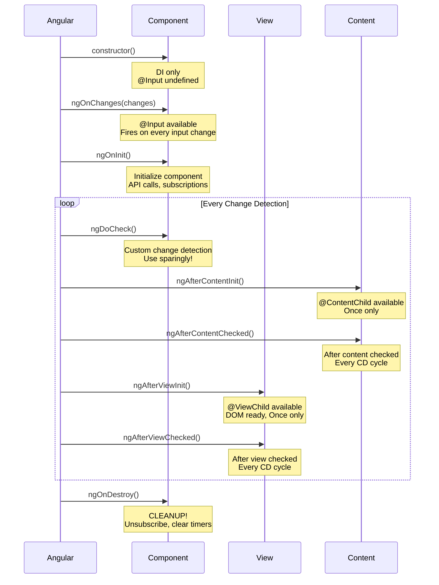

# Angular Component Lifecycle Hooks - Deep Dive

## Table of Contents
- [Complete Lifecycle Overview](#complete-lifecycle-overview)
- [Individual Hook Deep Dives](#individual-hook-deep-dives)
- [Lifecycle Sequence](#lifecycle-sequence)
- [Common Mistakes](#common-mistakes)
- [Best Practices](#best-practices)

---

## Complete Lifecycle Overview

### Question: Explain the complete lifecycle of an Angular component from initialization to destruction. Don't just list the hooks - explain WHEN and WHY each fires, and give me a real scenario where you'd use each one.

**Answer:**

Angular's component lifecycle consists of **8 main lifecycle hooks** that fire in a specific sequence. Understanding not just what they do, but WHEN and WHY they fire is critical for building production-grade applications.

---

## **Visual Overview: Component Lifecycle Sequence**



**Critical Sequence Facts:**
1. ✅ **constructor** → **ngOnChanges** → **ngOnInit** (initialization)
2. ⚠️ **ngDoCheck** runs on EVERY change detection (use carefully!)
3. 🔄 **Content hooks** fire before **View hooks**
4. 🧹 **ngOnDestroy** is your last chance to cleanup (memory leaks happen here!)

---

## Individual Hook Deep Dives

### **1. ngOnChanges()**

**WHEN:** 
- Fires **before** `ngOnInit()` on component initialization (if there are input properties)
- Fires **every time** any `@Input()` property changes
- Receives a `SimpleChanges` object containing previous and current values

**WHY:** 
Angular needs to notify your component that data passed from a parent has changed. This is the ONLY hook that gives you access to previous values, making it crucial for comparing old vs new states.

**REAL SCENARIO - Price Drop Detection:**
```typescript
@Component({
  selector: 'app-product-card',
  template: `
    <div [class.highlight]="priceDropped">
      {{ product.name }}: ${{ product.price }}
      <span *ngIf="priceDropped" class="badge">Price Drop! 🎉</span>
    </div>
  `,
  styles: [`
    .highlight { 
      background: #fff3cd; 
      border: 2px solid #ffc107;
      animation: pulse 2s ease-in-out;
    }
    .badge {
      background: #28a745;
      color: white;
      padding: 4px 8px;
      border-radius: 4px;
      font-size: 12px;
    }
  `]
})
export class ProductCardComponent implements OnChanges {
  @Input() product!: Product;
  priceDropped = false;
  
  ngOnChanges(changes: SimpleChanges): void {
    // Real scenario: Show animation when price drops
    if (changes['product'] && !changes['product'].firstChange) {
      const oldPrice = changes['product'].previousValue?.price;
      const newPrice = changes['product'].currentValue?.price;
      
      if (oldPrice && newPrice && newPrice < oldPrice) {
        this.priceDropped = true;
        // Show notification
        this.showPriceDropNotification(oldPrice, newPrice);
        // Remove highlight after 2 seconds
        setTimeout(() => this.priceDropped = false, 2000);
      }
    }
  }
  
  private showPriceDropNotification(oldPrice: number, newPrice: number): void {
    const discount = ((oldPrice - newPrice) / oldPrice * 100).toFixed(0);
    console.log(`Price dropped by ${discount}%!`);
  }
}

interface Product {
  id: number;
  name: string;
  price: number;
  image: string;
}
```

**CRITICAL GOTCHA:** This only fires when the **reference** changes (for objects/arrays), not when you mutate properties.

```typescript
// Parent Component Examples:

// ❌ WRONG - Won't trigger ngOnChanges
updateProduct(): void {
  this.product.price = 10; // Mutation - same reference
}

// ✅ CORRECT - Triggers ngOnChanges
updateProduct(): void {
  this.product = { ...this.product, price: 10 }; // New reference
}

// ✅ CORRECT - For arrays
addItem(item: string): void {
  this.items = [...this.items, item]; // New array reference
}

// ❌ WRONG - Won't trigger ngOnChanges
addItem(item: string): void {
  this.items.push(item); // Mutation - same reference
}
```

**Advanced: Detecting Specific Input Changes:**
```typescript
ngOnChanges(changes: SimpleChanges): void {
  // Check if specific input changed
  if (changes['userId']) {
    const userId = changes['userId'].currentValue;
    const previousUserId = changes['userId'].previousValue;
    
    console.log('User changed from', previousUserId, 'to', userId);
    
    // Only fetch data if user actually changed
    if (!changes['userId'].firstChange) {
      this.loadUserData(userId);
    }
  }
  
  // Check multiple inputs
  if (changes['filter'] || changes['sortOrder']) {
    this.refreshData();
  }
}
```

---

### **2. ngOnInit()**

**WHEN:**
- Fires **once** after the first `ngOnChanges()`
- Fires after Angular has initialized all `@Input()` properties
- Component's constructor has already run, but inputs weren't available there

**WHY:**
This is Angular's way of saying "your component is ready with all its initial data." Constructor is too early (inputs not set), ngOnInit is the perfect time to initialize.

**REAL SCENARIO - User Dashboard Initialization:**
```typescript
@Component({
  selector: 'app-user-dashboard',
  template: `
    <div class="dashboard" *ngIf="userData$ | async as user">
      <div class="header">
        
        <div class="info">
          <h1>Welcome, {{ user.name }}</h1>
          <p class="email">{{ user.email }}</p>
          <span class="badge" [class]="user.role">{{ user.role }}</span>
        </div>
      </div>
      
      <div class="stats">
        <app-stat-card 
          *ngFor="let stat of stats$ | async"
          [icon]="stat.icon"
          [value]="stat.value"
          [label]="stat.label"
        ></app-stat-card>
      </div>
      
      <app-activity-feed [userId]="userId"></app-activity-feed>
      
      <app-quick-actions [userId]="userId"></app-quick-actions>
    </div>
  `,
  styles: [`
    .dashboard { padding: 24px; }
    .header { display: flex; gap: 16px; margin-bottom: 32px; }
    .avatar { width: 80px; height: 80px; border-radius: 50%; }
    .stats { display: grid; grid-template-columns: repeat(4, 1fr); gap: 16px; }
  `]
})
export class UserDashboardComponent implements OnInit, OnDestroy {
  @Input() userId!: string;
  
  userData$ = new Subject<User>();
  stats$ = new Subject<Stat[]>();
  private destroy$ = new Subject<void>();
  
  constructor(
    private userService: UserService,
    private analytics: AnalyticsService,
    private websocketService: WebSocketService,
    private notificationService: NotificationService
  ) {
    // ❌ DON'T fetch data here - userId input isn't set yet!
    // console.log(this.userId); // undefined!
    
    // ✅ Only initialize services, no data fetching
    console.log('Constructor: Services injected');
  }
  
  ngOnInit(): void {
    console.log('ngOnInit: userId is now available:', this.userId);
    
    // ✅ Perfect place for initialization tasks:
    
    // 1. Fetch initial data based on inputs
    this.loadUserData();
    this.loadUserStats();
    
    // 2. Set up subscriptions
    this.setupRealtimeUpdates();
    
    // 3. Track analytics
    this.trackPageView();
    
    // 4. Initialize forms
    this.initializeForms();
    
    // 5. Set up intervals/timers
    this.setupAutoRefresh();
  }
  
  private loadUserData(): void {
    this.userService.getUser(this.userId)
      .pipe(
        takeUntil(this.destroy$),
        catchError(error => {
          this.notificationService.error('Failed to load user data');
          return of(null);
        })
      )
      .subscribe(user => {
        if (user) {
          this.userData$.next(user);
        }
      });
  }
  
  private loadUserStats(): void {
    this.userService.getUserStats(this.userId)
      .pipe(takeUntil(this.destroy$))
      .subscribe(stats => this.stats$.next(stats));
  }
  
  private setupRealtimeUpdates(): void {
    this.websocketService.connect(`user/${this.userId}`)
      .pipe(takeUntil(this.destroy$))
      .subscribe(message => {
        console.log('Real-time update:', message);
        this.handleRealtimeUpdate(message);
      });
  }
  
  private trackPageView(): void {
    this.analytics.trackPageView('user-dashboard', {
      userId: this.userId,
      timestamp: Date.now()
    });
  }
  
  private initializeForms(): void {
    // Form initialization logic
  }
  
  private setupAutoRefresh(): void {
    // Refresh stats every 30 seconds
    interval(30000)
      .pipe(takeUntil(this.destroy$))
      .subscribe(() => {
        this.loadUserStats();
      });
  }
  
  private handleRealtimeUpdate(message: any): void {
    // Handle WebSocket messages
  }
  
  ngOnDestroy(): void {
    // Cleanup all subscriptions
    this.destroy$.next();
    this.destroy$.complete();
    
    // Track time spent
    this.analytics.trackEvent('dashboard-closed', {
      userId: this.userId,
      timeSpent: Date.now() - this.startTime
    });
  }
  
  private startTime = Date.now();
}

interface User {
  id: string;
  name: string;
  email: string;
  avatar: string;
  role: 'admin' | 'user' | 'guest';
}

interface Stat {
  icon: string;
  value: number;
  label: string;
}
```

**WHY NOT CONSTRUCTOR?**

```typescript
// Constructor vs ngOnInit comparison

constructor(private userService: UserService) {
  // ❌ WRONG: @Input properties are NOT available
  console.log(this.userId); // undefined
  
  // ❌ WRONG: DOM is NOT ready
  console.log(this.viewChild); // undefined
  
  // ❌ WRONG: Can't make API calls based on inputs
  // this.userService.getUser(this.userId); // Error!
  
  // ✅ CORRECT: Only use constructor for DI
  console.log('Services injected');
}

ngOnInit(): void {
  // ✅ CORRECT: @Input properties ARE available
  console.log(this.userId); // '123'
  
  // ✅ CORRECT: Can make API calls
  this.userService.getUser(this.userId).subscribe();
  
  // ⚠️ Note: DOM still NOT ready (@ViewChild undefined)
  // Wait for ngAfterViewInit for DOM access
}
```

---

### **3. ngDoCheck()**

**WHEN:**
- Fires **immediately after** every `ngOnChanges()` and `ngOnInit()`
- Fires on **EVERY** change detection cycle (hundreds of times per second in complex apps)
- Runs even when nothing changed

**WHY:**
Angular's default change detection can't catch mutations inside objects/arrays. ngDoCheck lets you implement custom change detection logic.

**REAL SCENARIO - Shopping Cart with Mutations:**
```typescript
@Component({
  selector: 'app-shopping-cart',
  template: `
    <div class="cart">
      <div class="cart-header">
        <h2>Shopping Cart</h2>
        <span class="item-count">{{ totalItems }} items</span>
      </div>
      
      <div class="cart-items">
        <div *ngFor="let item of items; trackBy: trackById" class="cart-item">
          
          <div class="item-info">
            <h3>{{ item.name }}</h3>
            <p class="price">{{ item.price | currency }}</p>
          </div>
          <div class="quantity">
            <button (click)="decreaseQuantity(item)">-</button>
            <span>{{ item.quantity }}</span>
            <button (click)="increaseQuantity(item)">+</button>
          </div>
          <p class="subtotal">{{ item.price * item.quantity | currency }}</p>
        </div>
      </div>
      
      <div class="cart-footer">
        <p class="total">Total: {{ total | currency }}</p>
        <button class="checkout-btn">Checkout</button>
      </div>
    </div>
  `,
  styles: [`
    .cart { border: 1px solid #ddd; border-radius: 8px; padding: 16px; }
    .cart-header { display: flex; justify-content: space-between; }
    .item-count { background: #007bff; color: white; padding: 4px 12px; border-radius: 16px; }
    .cart-items { margin: 16px 0; }
    .cart-item { display: flex; gap: 16px; padding: 12px; border-bottom: 1px solid #eee; }
  `]
})
export class ShoppingCartComponent implements DoCheck {
  @Input() items: CartItem[] = [];
  
  totalItems = 0;
  total = 0;
  private previousItemsHash = '';
  
  ngDoCheck(): void {
    // Real scenario: Parent mutates the items array instead of replacing it
    // items.push(newItem) or item.quantity++ won't trigger ngOnChanges
    // but we need to detect these changes
    
    // Create a hash of the current state
    const currentHash = this.createItemsHash();
    
    if (this.previousItemsHash !== currentHash) {
      console.log('Items array was mutated! Recalculating...');
      this.recalculate();
      this.previousItemsHash = currentHash;
    }
  }
  
  private createItemsHash(): string {
    // Create a lightweight hash instead of JSON.stringify for better performance
    return this.items
      .map(item => `${item.id}:${item.quantity}`)
      .join(',');
  }
  
  private recalculate(): void {
    this.totalItems = this.items.reduce((sum, item) => sum + item.quantity, 0);
    this.total = this.items.reduce((sum, item) => sum + (item.price * item.quantity), 0);
  }
  
  decreaseQuantity(item: CartItem): void {
    if (item.quantity > 1) {
      item.quantity--; // Mutation - ngDoCheck will catch this
    }
  }
  
  increaseQuantity(item: CartItem): void {
    item.quantity++; // Mutation - ngDoCheck will catch this
  }
  
  trackById(index: number, item: CartItem): number {
    return item.id;
  }
}

interface CartItem {
  id: number;
  name: string;
  price: number;
  quantity: number;
  image: string;
}
```

**MASSIVE WARNING:** ⚠️ This fires on EVERY change detection cycle!

```typescript
// Performance comparison

// ❌ BAD: Expensive operation in ngDoCheck
ngDoCheck(): void {
  // This runs hundreds of times per second!
  const currentHash = JSON.stringify(this.items); // EXPENSIVE!
  if (this.previousHash !== currentHash) {
    this.recalculate();
    this.previousHash = currentHash;
  }
}

// ✅ GOOD: Lightweight check
ngDoCheck(): void {
  // Quick hash - only includes what matters
  const currentHash = this.items.map(i => i.id + i.quantity).join();
  if (this.previousHash !== currentHash) {
    this.recalculate();
    this.previousHash = currentHash;
  }
}

// ✅ BEST: Avoid ngDoCheck entirely with immutable patterns
// Parent component
addItem(item: CartItem): void {
  this.items = [...this.items, item]; // New reference - triggers ngOnChanges
}
```

**BETTER ALTERNATIVE:** Use `OnPush` change detection and force parent to use immutable updates:

```typescript
// Child Component with OnPush
@Component({
  selector: 'app-shopping-cart',
  changeDetection: ChangeDetectionStrategy.OnPush, // ✅ Optimized
  template: `...`
})
export class ShoppingCartComponent implements OnChanges {
  @Input() items: CartItem[] = [];
  
  // No ngDoCheck needed - ngOnChanges is sufficient
  ngOnChanges(changes: SimpleChanges): void {
    if (changes['items']) {
      this.recalculate();
    }
  }
}

// Parent component - CORRECT way
@Component({
  selector: 'app-parent',
  template: `<app-shopping-cart [items]="cartItems"></app-shopping-cart>`
})
export class ParentComponent {
  cartItems: CartItem[] = [];
  
  // ✅ Create new array reference
  addItem(item: CartItem): void {
    this.cartItems = [...this.cartItems, item];
  }
  
  // ✅ Create new array reference
  updateQuantity(itemId: number, quantity: number): void {
    this.cartItems = this.cartItems.map(item =>
      item.id === itemId ? { ...item, quantity } : item
    );
  }
  
  // ✅ Create new array reference
  removeItem(itemId: number): void {
    this.cartItems = this.cartItems.filter(item => item.id !== itemId);
  }
}
```

---

### **4. ngAfterContentInit()**

**WHEN:**
- Fires **once** after Angular projects external content into the component via `<ng-content>`
- Fires after the first `ngDoCheck()`
- `@ContentChild` and `@ContentChildren` queries are now available

**WHY:**
Angular needs to let you know that content projected from parent has been initialized and is ready to access.

**REAL SCENARIO - Tab Container with Content Projection:**
```typescript
// Tab container that projects tab content
@Component({
  selector: 'app-tabs',
  template: `
    <div class="tabs-container">
      <div class="tab-headers">
        <button 
          *ngFor="let tab of tabs; let i = index" 
          (click)="selectTab(tab)"
          [class.active]="tab.active"
          [attr.aria-selected]="tab.active"
          [attr.aria-controls]="'tab-panel-' + i">
          <span class="tab-icon" *ngIf="tab.icon">{{ tab.icon }}</span>
          {{ tab.title }}
          <span class="tab-badge" *ngIf="tab.badge">{{ tab.badge }}</span>
        </button>
      </div>
      
      <div class="tab-content">
        <ng-content></ng-content>
      </div>
      
      <div class="tab-footer" *ngIf="showFooter">
        <p>Showing tab {{ activeTabIndex + 1 }} of {{ tabs.length }}</p>
      </div>
    </div>
  `,
  styles: [`
    .tabs-container { border: 1px solid #ddd; border-radius: 8px; }
    .tab-headers { 
      display: flex; 
      border-bottom: 2px solid #eee; 
      background: #f8f9fa;
    }
    .tab-headers button { 
      padding: 12px 24px; 
      border: none; 
      background: transparent;
      cursor: pointer; 
      border-bottom: 3px solid transparent;
      transition: all 0.3s;
    }
    .tab-headers button.active { 
      background: white; 
      border-bottom-color: #007bff;
      color: #007bff;
      font-weight: 600;
    }
    .tab-icon { margin-right: 8px; }
    .tab-badge {
      background: #dc3545;
      color: white;
      padding: 2px 8px;
      border-radius: 12px;
      font-size: 11px;
      margin-left: 8px;
    }
    .tab-content { padding: 24px; }
  `]
})
export class TabsComponent implements AfterContentInit, OnDestroy {
  @ContentChildren(TabComponent) tabs!: QueryList<TabComponent>;
  @Input() showFooter = false;
  @Output() tabChanged = new EventEmitter<TabComponent>();
  
  activeTabIndex = 0;
  private destroy$ = new Subject<void>();
  
  ngAfterContentInit(): void {
    console.log('ngAfterContentInit: Projected tabs are now available');
    console.log('Number of tabs:', this.tabs.length);
    
    // Real scenario 1: Access projected tabs and activate first one
    if (this.tabs.length > 0) {
      this.tabs.first.active = true;
      this.activeTabIndex = 0;
    }
    
    // Real scenario 2: Listen for dynamically added/removed tabs
    this.tabs.changes
      .pipe(takeUntil(this.destroy$))
      .subscribe((tabs: QueryList<TabComponent>) => {
        console.log('Tab count changed:', tabs.length);
        
        // If all tabs were removed and new ones added
        if (tabs.length > 0 && !tabs.some(t => t.active)) {
          tabs.first.active = true;
          this.activeTabIndex = 0;
        }
        
        // If active tab was removed
        if (tabs.length > 0 && this.activeTabIndex >= tabs.length) {
          this.activeTabIndex = tabs.length - 1;
          tabs.toArray()[this.activeTabIndex].active = true;
        }
      });
    
    // Real scenario 3: Validate tabs
    this.validateTabs();
    
    // Real scenario 4: Set up keyboard navigation
    this.setupKeyboardNavigation();
  }
  
  selectTab(selectedTab: TabComponent): void {
    this.tabs.forEach((tab, index) => {
      tab.active = false;
      if (tab === selectedTab) {
        this.activeTabIndex = index;
      }
    });
    selectedTab.active = true;
    this.tabChanged.emit(selectedTab);
  }
  
  private validateTabs(): void {
    const titlesSet = new Set(this.tabs.map(t => t.title));
    if (titlesSet.size !== this.tabs.length) {
      console.warn('Warning: Duplicate tab titles detected');
    }
  }
  
  private setupKeyboardNavigation(): void {
    // Arrow key navigation between tabs
    fromEvent<KeyboardEvent>(document, 'keydown')
      .pipe(
        takeUntil(this.destroy$),
        filter(e => ['ArrowLeft', 'ArrowRight'].includes(e.key))
      )
      .subscribe(event => {
        if (event.key === 'ArrowRight') {
          this.nextTab();
        } else if (event.key === 'ArrowLeft') {
          this.previousTab();
        }
      });
  }
  
  nextTab(): void {
    const nextIndex = (this.activeTabIndex + 1) % this.tabs.length;
    const tabs = this.tabs.toArray();
    this.selectTab(tabs[nextIndex]);
  }
  
  previousTab(): void {
    const prevIndex = this.activeTabIndex === 0 
      ? this.tabs.length - 1 
      : this.activeTabIndex - 1;
    const tabs = this.tabs.toArray();
    this.selectTab(tabs[prevIndex]);
  }
  
  ngOnDestroy(): void {
    this.destroy$.next();
    this.destroy$.complete();
  }
}

@Component({
  selector: 'app-tab',
  template: `
    <div class="tab-panel" 
         *ngIf="active" 
         [@fadeIn]
         role="tabpanel">
      <ng-content></ng-content>
    </div>
  `,
  animations: [
    trigger('fadeIn', [
      transition(':enter', [
        style({ opacity: 0, transform: 'translateY(10px)' }),
        animate('300ms ease-out', style({ opacity: 1, transform: 'translateY(0)' }))
      ])
    ])
  ]
})
export class TabComponent {
  @Input() title = '';
  @Input() icon?: string;
  @Input() badge?: string | number;
  active = false;
}

// Usage Example:
/*
<app-tabs (tabChanged)="onTabChanged($event)">
  <app-tab title="Overview" icon="📊">
    <h2>Dashboard Overview</h2>
    <p>Welcome to your dashboard!</p>
  </app-tab>
  
  <app-tab title="Analytics" icon="📈" badge="3">
    <app-analytics-panel></app-analytics-panel>
  </app-tab>
  
  <app-tab title="Settings" icon="⚙️">
    <app-settings-form></app-settings-form>
  </app-tab>
</app-tabs>
*/
```

**KEY POINTS:**

```typescript
// Timeline of @ContentChild availability

constructor() {
  console.log(this.tabs); // ❌ undefined
}

ngOnChanges() {
  console.log(this.tabs); // ❌ undefined
}

ngOnInit() {
  console.log(this.tabs); // ❌ undefined
}

ngDoCheck() {
  console.log(this.tabs); // ❌ undefined (on first call)
}

ngAfterContentInit() {
  console.log(this.tabs); // ✅ Available! QueryList with projected tabs
  console.log(this.tabs.length); // ✅ Works!
  console.log(this.tabs.first); // ✅ Works!
}
```

---

### **5. ngAfterContentChecked()**

**WHEN:**
- Fires after every check of projected content
- Fires after `ngAfterContentInit()` and after every subsequent `ngDoCheck()`
- Runs on EVERY change detection cycle

**WHY:**
Angular lets you react after it has checked projected content for changes.

**REAL SCENARIO - Accordion Panel Counter:**
```typescript
@Component({
  selector: 'app-accordion',
  template: `
    <div class="accordion">
      <div class="accordion-header">
        <h2>{{ title }}</h2>
        <div class="summary">
          <span class="badge">{{ openPanelCount }} / {{ totalPanels }}</span>
          <button (click)="expandAll()" [disabled]="allExpanded">
            Expand All
          </button>
          <button (click)="collapseAll()" [disabled]="allCollapsed">
            Collapse All
          </button>
        </div>
      </div>
      
      <div class="accordion-content">
        <ng-content></ng-content>
      </div>
    </div>
  `,
  styles: [`
    .accordion { border: 1px solid #ddd; border-radius: 8px; }
    .accordion-header { 
      display: flex; 
      justify-content: space-between; 
      padding: 16px;
      background: #f8f9fa;
      border-bottom: 1px solid #ddd;
    }
    .summary { display: flex; gap: 8px; align-items: center; }
    .badge { 
      background: #007bff; 
      color: white; 
      padding: 4px 12px; 
      border-radius: 16px;
      font-size: 14px;
    }
    button {
      padding: 6px 12px;
      border: 1px solid #007bff;
      background: white;
      color: #007bff;
      border-radius: 4px;
      cursor: pointer;
    }
    button:hover:not(:disabled) { background: #007bff; color: white; }
    button:disabled { opacity: 0.5; cursor: not-allowed; }
  `]
})
export class AccordionComponent implements AfterContentChecked {
  @ContentChildren(AccordionPanelComponent) panels!: QueryList<AccordionPanelComponent>;
  @Input() title = 'Accordion';
  
  openPanelCount = 0;
  totalPanels = 0;
  allExpanded = false;
  allCollapsed = true;
  
  ngAfterContentChecked(): void {
    // Real scenario: Update counter based on projected panels' state
    // This needs to run after every check because panels can open/close
    
    const openCount = this.panels.filter(p => p.isOpen).length;
    const total = this.panels.length;
    
    // Only update if values actually changed (avoid unnecessary renders)
    if (this.openPanelCount !== openCount || this.totalPanels !== total) {
      this.openPanelCount = openCount;
      this.totalPanels = total;
      this.allExpanded = openCount === total && total > 0;
      this.allCollapsed = openCount === 0;
    }
  }
  
  expandAll(): void {
    this.panels.forEach(panel => panel.isOpen = true);
  }
  
  collapseAll(): void {
    this.panels.forEach(panel => panel.isOpen = false);
  }
}

@Component({
  selector: 'app-accordion-panel',
  template: `
    <div class="panel">
      <div class="panel-header" (click)="toggle()">
        <span class="icon">{{ isOpen ? '▼' : '▶' }}</span>
        <h3>{{ title }}</h3>
        <span class="badge" *ngIf="badge">{{ badge }}</span>
      </div>
      <div class="panel-content" *ngIf="isOpen" [@slideDown]>
        <ng-content></ng-content>
      </div>
    </div>
  `,
  styles: [`
    .panel { border-bottom: 1px solid #eee; }
    .panel-header { 
      display: flex;
      align-items: center;
      gap: 12px;
      padding: 16px; 
      cursor: pointer;
      transition: background 0.2s;
    }
    .panel-header:hover { background: #f8f9fa; }
    .icon { color: #666; font-size: 12px; }
    .panel-content { padding: 16px; background: #fafafa; }
  `],
  animations: [
    trigger('slideDown', [
      transition(':enter', [
        style({ height: '0', opacity: 0 }),
        animate('300ms ease-out', style({ height: '*', opacity: 1 }))
      ]),
      transition(':leave', [
        animate('200ms ease-in', style({ height: '0', opacity: 0 }))
      ])
    ])
  ]
})
export class AccordionPanelComponent {
  @Input() title = '';
  @Input() badge?: string | number;
  isOpen = false;
  
  toggle(): void {
    this.isOpen = !this.isOpen;
  }
}

// Usage:
/*
<app-accordion title="FAQ">
  <app-accordion-panel title="What is Angular?" badge="Popular">
    <p>Angular is a TypeScript-based web framework...</p>
  </app-accordion-panel>
  
  <app-accordion-panel title="How does change detection work?">
    <p>Change detection is the mechanism...</p>
  </app-accordion-panel>
  
  <app-accordion-panel title="What are lifecycle hooks?" badge="New">
    <p>Lifecycle hooks are methods that get called...</p>
  </app-accordion-panel>
</app-accordion>
*/
```

**WARNING:** ⚠️ Like ngDoCheck, this runs frequently!

```typescript
// Performance considerations

ngAfterContentChecked(): void {
  // ❌ BAD: Expensive operation every time
  this.panels.forEach(panel => {
    panel.calculateSomethingExpensive(); // Called 60+ times/second!
  });
  
  // ✅ GOOD: Only update when actually changed
  const newCount = this.panels.filter(p => p.isOpen).length;
  if (this.previousCount !== newCount) {
    this.previousCount = newCount;
    this.doSomething();
  }
  
  // ⚠️ WARNING: Don't modify state that triggers CD
  // this.someProperty = newValue; // Causes ExpressionChangedAfterItHasBeenCheckedError
}
```

---

### **6. ngAfterViewInit()**

**WHEN:**
- Fires **once** after Angular initializes the component's view (and child views)
- Fires after the first `ngAfterContentChecked()`
- `@ViewChild` and `@ViewChildren` queries are now available

**WHY:**
Angular is telling you the DOM is ready. This is THE hook for DOM manipulation, third-party library initialization, and accessing view children.

**REAL SCENARIO - Code Editor Integration:**
```typescript
@Component({
  selector: 'app-code-editor',
  template: `
    <div class="editor-container">
      <div class="editor-toolbar">
        <button (click)="formatCode()" [disabled]="!editor">
          <span class="icon">✨</span> Format
        </button>
        <button (click)="copyCode()" [disabled]="!editor">
          <span class="icon">📋</span> Copy
        </button>
        <button (click)="downloadCode()" [disabled]="!editor">
          <span class="icon">💾</span> Download
        </button>
        <select [(ngModel)]="language" (change)="changeLanguage()">
          <option value="javascript">JavaScript</option>
          <option value="typescript">TypeScript</option>
          <option value="html">HTML</option>
          <option value="css">CSS</option>
        </select>
        <select [(ngModel)]="theme" (change)="changeTheme()">
          <option value="vs-dark">Dark</option>
          <option value="vs-light">Light</option>
        </select>
      </div>
      
      <div #editorElement class="editor"></div>
      
      <div class="editor-footer">
        <span>Line {{ currentLine }}, Column {{ currentColumn }}</span>
        <span>{{ charCount }} characters</span>
      </div>
    </div>
  `,
  styles: [`
    .editor-container { 
      border: 1px solid #ddd; 
      border-radius: 8px;
      overflow: hidden;
    }
    .editor-toolbar { 
      display: flex; 
      gap: 8px; 
      padding: 8px;
      background: #2d2d2d;
      border-bottom: 1px solid #444;
    }
    .editor-toolbar button {
      display: flex;
      align-items: center;
      gap: 4px;
      padding: 6px 12px;
      background: #3c3c3c;
      color: #fff;
      border: none;
      border-radius: 4px;
      cursor: pointer;
    }
    .editor-toolbar button:hover:not(:disabled) { background: #4c4c4c; }
    .editor-toolbar button:disabled { opacity: 0.5; cursor: not-allowed; }
    .editor { height: 400px; width: 100%; }
    .editor-footer {
      display: flex;
      justify-content: space-between;
      padding: 8px 16px;
      background: #f8f9fa;
      border-top: 1px solid #ddd;
      font-size: 12px;
      color: #666;
    }
  `]
})
export class CodeEditorComponent implements AfterViewInit, OnDestroy {
  @ViewChild('editorElement') editorElement!: ElementRef;
  @Input() initialCode = 'console.log("Hello World");';
  @Input() language = 'javascript';
  @Input() readonly = false;
  @Output() codeChange = new EventEmitter<string>();
  
  editor: any;
  theme = 'vs-dark';
  currentLine = 1;
  currentColumn = 1;
  charCount = 0;
  
  private intersectionObserver?: IntersectionObserver;
  private resizeObserver?: ResizeObserver;
  
  constructor(
    private ngZone: NgZone,
    private notificationService: NotificationService
  ) {
    console.log('Constructor: editorElement is', this.editorElement); // undefined
  }
  
  ngAfterViewInit(): void {
    console.log('ngAfterViewInit: editorElement is now available!');
    
    // ✅ Real scenario 1: Initialize Monaco Editor (like VS Code)
    this.initializeEditor();
    
    // ✅ Real scenario 2: Measure element dimensions after render
    this.measureEditorDimensions();
    
    // ✅ Real scenario 3: Set up IntersectionObserver for lazy loading
    this.setupIntersectionObserver();
    
    // ✅ Real scenario 4: Set up ResizeObserver
    this.setupResizeObserver();
    
    // ✅ Real scenario 5: Focus element after view renders
    setTimeout(() => {
      if (this.editor && !this.readonly) {
        this.editor.focus();
      }
    }, 0);
  }
  
  private initializeEditor(): void {
    // Run outside Angular zone for better performance
    this.ngZone.runOutsideAngular(() => {
      this.editor = monaco.editor.create(this.editorElement.nativeElement, {
        value: this.initialCode,
        language: this.language,
        theme: this.theme,
        minimap: { enabled: true },
        automaticLayout: true,
        fontSize: 14,
        lineNumbers: 'on',
        scrollBeyondLastLine: false,
        readOnly: this.readonly,
        wordWrap: 'on'
      });
      
      // Listen to content changes
      this.editor.onDidChangeModelContent(() => {
        this.ngZone.run(() => {
          const value = this.editor.getValue();
          this.charCount = value.length;
          this.codeChange.emit(value);
        });
      });
      
      // Listen to cursor position changes
      this.editor.onDidChangeCursorPosition((e: any) => {
        this.ngZone.run(() => {
          this.currentLine = e.position.lineNumber;
          this.currentColumn = e.position.column;
        });
      });
    });
  }
  
  private measureEditorDimensions(): void {
    const element = this.editorElement.nativeElement;
    const width = element.offsetWidth;
    const height = element.offsetHeight;
    console.log('Editor dimensions:', { width, height });
  }
  
  private setupIntersectionObserver(): void {
    // Load heavy syntax highlighting only when visible
    this.intersectionObserver = new IntersectionObserver((entries) => {
      if (entries[0].isIntersecting) {
        console.log('Editor is visible, loading full features...');
        this.loadAdvancedFeatures();
      }
    }, { threshold: 0.1 });
    
    this.intersectionObserver.observe(this.editorElement.nativeElement);
  }
  
  private setupResizeObserver(): void {
    this.resizeObserver = new ResizeObserver((entries) => {
      console.log('Editor container resized');
      if (this.editor) {
        this.editor.layout();
      }
    });
    
    this.resizeObserver.observe(this.editorElement.nativeElement.parentElement!);
  }
  
  private loadAdvancedFeatures(): void {
    // Load IntelliSense, autocomplete, etc.
    console.log('Loading advanced editor features...');
  }
  
  formatCode(): void {
    if (this.editor) {
      this.editor.getAction('editor.action.formatDocument').run();
      this.notificationService.success('Code formatted');
    }
  }
  
  copyCode(): void {
    if (this.editor) {
      const code = this.editor.getValue();
      navigator.clipboard.writeText(code).then(() => {
        this.notificationService.success('Code copied to clipboard');
      });
    }
  }
  
  downloadCode(): void {
    if (this.editor) {
      const code = this.editor.getValue();
      const blob = new Blob([code], { type: 'text/plain' });
      const url = URL.createObjectURL(blob);
      const a = document.createElement('a');
      a.href = url;
      a.download = `code.${this.language}`;
      a.click();
      URL.revokeObjectURL(url);
      this.notificationService.success('Code downloaded');
    }
  }
  
  changeLanguage(): void {
    if (this.editor) {
      const model = this.editor.getModel();
      monaco.editor.setModelLanguage(model, this.language);
    }
  }
  
  changeTheme(): void {
    if (this.editor) {
      monaco.editor.setTheme(this.theme);
    }
  }
  
  ngOnDestroy(): void {
    // CRITICAL: Dispose third-party library to prevent memory leaks
    if (this.editor) {
      this.editor.dispose();
    }
    
    if (this.intersectionObserver) {
      this.intersectionObserver.disconnect();
    }
    
    if (this.resizeObserver) {
      this.resizeObserver.disconnect();
    }
  }
}
```

**CRITICAL TIMING:**

```typescript
// @ViewChild availability timeline

constructor() {
  console.log(this.viewChild); // ❌ undefined
}

ngOnChanges() {
  console.log(this.viewChild); // ❌ undefined
}

ngOnInit() {
  console.log(this.viewChild); // ❌ undefined - COMMON MISTAKE!
}

ngDoCheck() {
  console.log(this.viewChild); // ❌ undefined
}

ngAfterContentInit() {
  console.log(this.viewChild); // ❌ undefined
}

ngAfterContentChecked() {
  console.log(this.viewChild); // ❌ undefined
}

ngAfterViewInit() {
  console.log(this.viewChild); // ✅ Available!
  this.viewChild.nativeElement.focus(); // ✅ Works!
}
```

**Common Third-Party Integrations:**
- **Charts**: Chart.js, D3.js, Highcharts, ECharts
- **Maps**: Google Maps, Leaflet, Mapbox
- **Rich Text Editors**: Quill, TinyMCE, CKEditor, Froala
- **Code Editors**: Monaco, CodeMirror, Ace Editor
- **Data Grids**: AG-Grid, Handsontable, Kendo Grid
- **Media Players**: Video.js, Plyr, JW Player
- **3D Graphics**: Three.js, Babylon.js

---

### **7. ngAfterViewChecked()**

**WHEN:**
- Fires after every check of the component's view and child views
- Fires after `ngAfterViewInit()` and after every subsequent `ngAfterContentChecked()`
- Runs on EVERY change detection cycle

**WHY:**
Angular notifies you after checking the view for changes.

**REAL SCENARIO - Chat Window Auto-Scroll:**
```typescript
@Component({
  selector: 'app-chat-window',
  template: `
    <div class="chat-window">
      <div class="chat-header">
        <div class="user-info">
          
          <div>
            <h3>{{ chatTitle }}</h3>
            <span class="status" [class.online]="isOnline">
              {{ isOnline ? 'Online' : 'Offline' }}
            </span>
          </div>
        </div>
        <span class="message-count">{{ messages.length }} messages</span>
      </div>
      
      <div #messageContainer class="messages" (scroll)="onScroll($event)">
        <div 
          *ngFor="let msg of messages; trackBy: trackById" 
          class="message" 
          [class.own]="msg.isOwn"
          [class.unread]="!msg.read">
          
          <div class="message-content">
            <div class="message-header">
              <span class="author">{{ msg.author }}</span>
              <span class="time">{{ msg.timestamp | date:'short' }}</span>
            </div>
            <p class="text">{{ msg.text }}</p>
            <div class="message-status" *ngIf="msg.isOwn">
              <span *ngIf="msg.delivered">✓</span>
              <span *ngIf="msg.read">✓✓</span>
            </div>
          </div>
        </div>
        
        <div *ngIf="isTyping" class="typing-indicator">
          <span></span><span></span><span></span>
        </div>
      </div>
      
      <div class="chat-input">
        <button class="emoji-btn" (click)="openEmojiPicker()">😊</button>
        <input 
          #messageInput 
          [(ngModel)]="newMessage" 
          (keyup.enter)="sendMessage()"
          (input)="onTyping()"
          placeholder="Type a message..."
          [disabled]="!isOnline" />
        <button 
          (click)="sendMessage()" 
          [disabled]="!newMessage.trim() || !isOnline"
          class="send-btn">
          Send
        </button>
      </div>
    </div>
  `,
  styles: [`
    .chat-window { 
      display: flex; 
      flex-direction: column; 
      height: 600px;
      border: 1px solid #ddd;
      border-radius: 8px;
      overflow: hidden;
    }
    .chat-header { 
      display: flex; 
      justify-content: space-between;
      padding: 16px;
      background: #007bff;
      color: white;
    }
    .user-info { display: flex; gap: 12px; align-items: center; }
    .avatar { width: 40px; height: 40px; border-radius: 50%; }
    .status { font-size: 12px; opacity: 0.9; }
    .status.online::before { content: '🟢 '; }
    .messages { 
      flex: 1; 
      overflow-y: auto; 
      padding: 20px;
      background: #f8f9fa;
    }
    .message { 
      display: flex;
      gap: 12px;
      margin: 12px 0;
      max-width: 70%;
    }
    .message.own { 
      margin-left: auto; 
      flex-direction: row-reverse;
    }
    .message-avatar { width: 32px; height: 32px; border-radius: 50%; }
    .message-content {
      background: white;
      padding: 12px;
      border-radius: 8px;
      box-shadow: 0 1px 2px rgba(0,0,0,0.1);
    }
    .message.own .message-content { background: #007bff; color: white; }
    .message-header { 
      display: flex; 
      justify-content: space-between;
      margin-bottom: 4px;
      font-size: 12px;
    }
    .author { font-weight: 600; }
    .time { opacity: 0.7; }
    .message-status { 
      text-align: right; 
      font-size: 12px; 
      margin-top: 4px;
      color: #90ee90;
    }
    .typing-indicator {
      display: flex;
      gap: 4px;
      padding: 12px;
    }
    .typing-indicator span {
      width: 8px;
      height: 8px;
      background: #666;
      border-radius: 50%;
      animation: typing 1.4s infinite;
    }
    .typing-indicator span:nth-child(2) { animation-delay: 0.2s; }
    .typing-indicator span:nth-child(3) { animation-delay: 0.4s; }
    @keyframes typing {
      0%, 60%, 100% { transform: translateY(0); }
      30% { transform: translateY(-10px); }
    }
    .chat-input { 
      display: flex; 
      gap: 8px;
      padding: 16px;
      border-top: 1px solid #ddd;
      background: white;
    }
    .chat-input input {
      flex: 1;
      padding: 12px;
      border: 1px solid #ddd;
      border-radius: 20px;
      font-size: 14px;
    }
    .emoji-btn, .send-btn {
      padding: 8px 16px;
      border: none;
      border-radius: 20px;
      cursor: pointer;
    }
    .emoji-btn { background: #f0f0f0; }
    .send-btn { 
      background: #007bff; 
      color: white;
    }
    .send-btn:disabled { opacity: 0.5; cursor: not-allowed; }
  `]
})
export class ChatWindowComponent implements AfterViewInit, AfterViewChecked, OnDestroy {
  @ViewChild('messageContainer') messageContainer!: ElementRef;
  @ViewChild('messageInput') messageInput!: ElementRef;
  @Input() chatTitle = 'Chat';
  @Input() chatAvatar = 'assets/avatar.png';
  @Input() isOnline = true;
  
  messages: Message[] = [];
  newMessage = '';
  isTyping = false;
  
  private lastMessageCount = 0;
  private shouldScrollToBottom = false;
  private userHasScrolled = false;
  private autoScrollThreshold = 100; // px from bottom
  private typingTimeout?: number;
  
  ngAfterViewInit(): void {
    // Initial scroll to bottom
    this.scrollToBottom();
  }
  
  ngAfterViewChecked(): void {
    // Real scenario: Auto-scroll to bottom when new messages arrive
    // We track message count to avoid scrolling on every change detection
    
    if (this.messages.length > this.lastMessageCount) {
      // New message arrived
      this.shouldScrollToBottom = !this.userHasScrolled;
      this.lastMessageCount = this.messages.length;
    }
    
    // Only scroll if user hasn't manually scrolled up
    if (this.shouldScrollToBottom) {
      // Use setTimeout to avoid ExpressionChangedAfterItHasBeenCheckedError
      setTimeout(() => {
        this.scrollToBottom();
        this.shouldScrollToBottom = false;
      }, 0);
    }
  }
  
  sendMessage(): void {
    if (this.newMessage.trim() && this.isOnline) {
      const message: Message = {
        id: Date.now(),
        text: this.newMessage,
        author: 'You',
        avatar: 'assets/your-avatar.png',
        timestamp: Date.now(),
        isOwn: true,
        delivered: false,
        read: false
      };
      
      this.messages = [...this.messages, message];
      this.newMessage = '';
      this.userHasScrolled = false; // Reset scroll flag
      
      // Simulate message delivery
      setTimeout(() => {
        message.delivered = true;
      }, 1000);
      
      // Simulate message read
      setTimeout(() => {
        message.read = true;
      }, 2000);
      
      // ngAfterViewChecked will handle auto-scroll
    }
  }
  
  onScroll(event: Event): void {
    const element = event.target as HTMLElement;
    const scrollTop = element.scrollTop;
    const scrollHeight = element.scrollHeight;
    const clientHeight = element.clientHeight;
    
    // Check if user has scrolled away from bottom
    const distanceFromBottom = scrollHeight - scrollTop - clientHeight;
    this.userHasScrolled = distanceFromBottom > this.autoScrollThreshold;
  }
  
  onTyping(): void {
    // Emit typing indicator to other users
    if (this.typingTimeout) {
      clearTimeout(this.typingTimeout);
    }
    
    // Stop typing indicator after 2 seconds of inactivity
    this.typingTimeout = window.setTimeout(() => {
      // Stop typing indicator
    }, 2000);
  }
  
  private scrollToBottom(): void {
    try {
      const element = this.messageContainer.nativeElement;
      element.scrollTop = element.scrollHeight;
    } catch (err) {
      console.error('Scroll failed:', err);
    }
  }
  
  openEmojiPicker(): void {
    // Open emoji picker
  }
  
  trackById(index: number, message: Message): number {
    return message.id;
  }
  
  ngOnDestroy(): void {
    if (this.typingTimeout) {
      clearTimeout(this.typingTimeout);
    }
  }
}

interface Message {
  id: number;
  text: string;
  author: string;
  avatar: string;
  timestamp: number;
  isOwn: boolean;
  delivered: boolean;
  read: boolean;
}
```

**DANGER ZONE:** ⚠️⚠️⚠️ **Do NOT modify component state here!**

```typescript
// ❌ WRONG - Causes ExpressionChangedAfterItHasBeenCheckedError
ngAfterViewChecked(): void {
  this.someProperty = newValue; // DON'T DO THIS!
  // This triggers another change detection cycle
  // Which calls ngAfterViewChecked again
  // Which sets someProperty again
  // Infinite loop or error!
}

// ✅ CORRECT - Defer to next cycle
ngAfterViewChecked(): void {
  if (someCondition) {
    setTimeout(() => {
      this.someProperty = newValue; // Safe - runs in next cycle
    }, 0);
  }
}

// ✅ CORRECT - Use ChangeDetectorRef
ngAfterViewChecked(): void {
  if (someCondition && !this.alreadyUpdated) {
    Promise.resolve().then(() => {
      this.someProperty = newValue;
      this.cdr.detectChanges();
      this.alreadyUpdated = true;
    });
  }
}

// ✅ BEST - Track state to avoid unnecessary updates
ngAfterViewChecked(): void {
  const newValue = this.calculateValue();
  if (this.previousValue !== newValue) {
    setTimeout(() => {
      this.previousValue = newValue;
      this.updateUI();
    }, 0);
  }
}
```

---

### **8. ngOnDestroy()**

**WHEN:**
- Fires **once**, just before Angular destroys the component
- Last chance to cleanup before component is removed from DOM
- Happens when you navigate away, `*ngIf` becomes false, or parent destroys it

**WHY:**
Memory leaks. If you don't cleanup subscriptions, event listeners, timers, they continue running even after component is gone, consuming memory and CPU.

**REAL SCENARIO - Live Dashboard with Multiple Resources:**
```typescript
@Component({
  selector: 'app-live-dashboard',
  template: `
    <div class="dashboard">
      <div class="dashboard-header">
        <h1>Live Stock Dashboard</h1>
        <div class="controls">
          <button (click)="toggleAutoRefresh()">
            {{ autoRefresh ? 'Pause' : 'Resume' }} Auto-Refresh
          </button>
          <button (click)="refresh()">Refresh Now</button>
        </div>
      </div>
      
      <div class="stocks-grid">
        <div *ngFor="let stock of stocks$ | async" class="stock-card">
          <h3>{{ stock.symbol }}</h3>
          <p class="price" [class.up]="stock.change > 0" [class.down]="stock.change < 0">
            ${{ stock.price }}
            <span class="change">{{ stock.change > 0 ? '+' : '' }}{{ stock.change }}%</span>
          </p>
          <app-mini-chart [data]="stock.history"></app-mini-chart>
        </div>
      </div>
      
      <div class="chart-container">
        <canvas #chartCanvas></canvas>
      </div>
      
      <div class="alerts">
        <div *ngFor="let alert of alerts" class="alert" [class]="alert.type">
          {{ alert.message }}
        </div>
      </div>
    </div>
  `,
  styles: [`
    .dashboard { padding: 24px; }
    .dashboard-header { 
      display: flex; 
      justify-content: space-between;
      margin-bottom: 24px;
    }
    .controls { display: flex; gap: 12px; }
    .stocks-grid { 
      display: grid; 
      grid-template-columns: repeat(auto-fill, minmax(250px, 1fr));
      gap: 16px;
      margin-bottom: 24px;
    }
    .stock-card { 
      padding: 16px; 
      border: 1px solid #ddd;
      border-radius: 8px;
      background: white;
    }
    .price { font-size: 24px; font-weight: bold; margin: 8px 0; }
    .price.up { color: #28a745; }
    .price.down { color: #dc3545; }
    .change { font-size: 14px; margin-left: 8px; }
    .chart-container { 
      height: 400px; 
      margin-bottom: 24px;
      border: 1px solid #ddd;
      border-radius: 8px;
      padding: 16px;
    }
  `]
})
export class LiveDashboardComponent implements OnInit, AfterViewInit, OnDestroy {
  @ViewChild('chartCanvas') chartCanvas!: ElementRef;
  
  stocks$ = new Subject<Stock[]>();
  alerts: Alert[] = [];
  autoRefresh = true;
  
  private destroy$ = new Subject<void>();
  private pollingSubscription?: Subscription;
  private intervalId?: number;
  private animationFrameId?: number;
  private websocket?: WebSocket;
  private chart: any;
  private resizeHandler?: () => void;
  private visibilityHandler?: () => void;
  private beforeUnloadHandler?: (e: BeforeUnloadEvent) => void;
  
  constructor(
    private stockService: StockService,
    private notificationService: NotificationService,
    private analytics: AnalyticsService,
    private ngZone: NgZone,
    private cdr: ChangeDetectorRef
  ) {
    console.log('Dashboard created at:', new Date().toISOString());
  }
  
  ngOnInit(): void {
    this.startTime = Date.now();
    
    // 1. ✅ Observable subscription
    this.stockService.getLiveStocks()
      .pipe(
        takeUntil(this.destroy$),
        catchError(error => {
          this.handleError('Failed to load stocks', error);
          return of([]);
        })
      )
      .subscribe(stocks => {
        this.stocks$.next(stocks);
        this.updateChart(stocks);
      });
    
    // 2. ✅ Interval polling (fallback if WebSocket fails)
    this.setupPolling();
    
    // 3. ✅ setTimeout/setInterval for periodic tasks
    this.intervalId = window.setInterval(() => {
      this.analytics.trackEngagement('dashboard-active');
      this.checkAlerts();
    }, 30000); // Track every 30 seconds
    
    // 4. ✅ WebSocket connection
    this.setupWebSocket();
    
    // 5. ✅ DOM event listeners
    this.setupEventListeners();
    
    // 6. ✅ Store subscription (NgRx example)
    // this.store.select(selectUser)
    //   .pipe(takeUntil(this.destroy$))
    //   .subscribe(user => this.currentUser = user);
    
    // 7. ✅ Route param subscription
    // this.route.params
    //   .pipe(takeUntil(this.destroy$))
    //   .subscribe(params => this.loadData(params['id']));
  }
  
  ngAfterViewInit(): void {
    // Initialize chart library
    this.initializeChart();
  }
  
  private setupPolling(): void {
    this.pollingSubscription = interval(5000)
      .pipe(
        takeUntil(this.destroy$),
        filter(() => this.autoRefresh)
      )
      .subscribe(() => {
        this.checkForUpdates();
      });
  }
  
  private setupWebSocket(): void {
    this.ngZone.runOutsideAngular(() => {
      this.websocket = new WebSocket('wss://api.stocks.com/live');
      
      this.websocket.onopen = () => {
        console.log('WebSocket connected');
        this.ngZone.run(() => {
          this.notificationService.success('Connected to live feed');
        });
      };
      
      this.websocket.onmessage = (event) => {
        const update = JSON.parse(event.data);
        this.ngZone.run(() => {
          this.handleRealtimeUpdate(update);
        });
      };
      
      this.websocket.onerror = (error) => {
        console.error('WebSocket error:', error);
        this.ngZone.run(() => {
          this.notificationService.error('Connection lost. Falling back to polling.');
        });
      };
      
      this.websocket.onclose = () => {
        console.log('WebSocket closed');
      };
    });
  }
  
  private setupEventListeners(): void {
    // Window resize
    this.resizeHandler = () => {
      this.handleResize();
    };
    window.addEventListener('resize', this.resizeHandler);
    
    // Page visibility (pause updates when tab is hidden)
    this.visibilityHandler = () => {
      if (document.hidden) {
        console.log('Page hidden - pausing updates');
        this.autoRefresh = false;
      } else {
        console.log('Page visible - resuming updates');
        this.autoRefresh = true;
        this.refresh();
      }
    };
    document.addEventListener('visibilitychange', this.visibilityHandler);
    
    // Before unload (warn if there are unsaved changes)
    this.beforeUnloadHandler = (e: BeforeUnloadEvent) => {
      if (this.hasUnsavedChanges()) {
        e.preventDefault();
        e.returnValue = 'You have unsaved changes. Are you sure you want to leave?';
        return e.returnValue;
      }
      return undefined;
    };
    window.addEventListener('beforeunload', this.beforeUnloadHandler);
  }
  
  private initializeChart(): void {
    this.ngZone.runOutsideAngular(() => {
      this.chart = new Chart(this.chartCanvas.nativeElement, {
        type: 'line',
        data: {
          labels: [],
          datasets: []
        },
        options: {
          responsive: true,
          maintainAspectRatio: false,
          animation: {
            duration: 0 // Disable animation for real-time data
          }
        }
      });
    });
  }
  
  private updateChart(stocks: Stock[]): void {
    if (this.chart) {
      this.ngZone.runOutsideAngular(() => {
        // Update chart data
        this.chart.data.labels = stocks.map(s => s.symbol);
        this.chart.data.datasets = [{
          label: 'Stock Prices',
          data: stocks.map(s => s.price)
        }];
        this.chart.update();
      });
    }
  }
  
  private handleResize(): void {
    if (this.chart) {
      this.chart.resize();
    }
  }
  
  private handleRealtimeUpdate(update: any): void {
    console.log('Real-time update:', update);
    // Process update
  }
  
  private checkForUpdates(): void {
    console.log('Polling for updates...');
  }
  
  private checkAlerts(): void {
    // Check for price alerts
  }
  
  private hasUnsavedChanges(): boolean {
    return false; // Implement your logic
  }
  
  private handleError(message: string, error: any): void {
    console.error(message, error);
    this.alerts.push({
      type: 'error',
      message: message
    });
  }
  
  toggleAutoRefresh(): void {
    this.autoRefresh = !this.autoRefresh;
  }
  
  refresh(): void {
    // Manually refresh data
  }
  
  ngOnDestroy(): void {
    // ✅ CRITICAL CLEANUP - Do ALL of these!
    console.log('Dashboard destroyed. Total time:', Date.now() - this.startTime, 'ms');
    
    // 1. Unsubscribe all observables using Subject pattern
    this.destroy$.next();
    this.destroy$.complete();
    
    // 2. Unsubscribe manual subscriptions (if not using takeUntil)
    this.pollingSubscription?.unsubscribe();
    
    // 3. Clear timers
    if (this.intervalId) {
      clearInterval(this.intervalId);
    }
    
    if (this.animationFrameId) {
      cancelAnimationFrame(this.animationFrameId);
    }
    
    // 4. Close WebSocket connection
    if (this.websocket) {
      if (this.websocket.readyState === WebSocket.OPEN || 
          this.websocket.readyState === WebSocket.CONNECTING) {
        this.websocket.close(1000, 'Component destroyed');
      }
    }
    
    // 5. Remove event listeners
    if (this.resizeHandler) {
      window.removeEventListener('resize', this.resizeHandler);
    }
    
    if (this.visibilityHandler) {
      document.removeEventListener('visibilitychange', this.visibilityHandler);
    }
    
    if (this.beforeUnloadHandler) {
      window.removeEventListener('beforeunload', this.beforeUnloadHandler);
    }
    
    // 6. Dispose third-party libraries
    if (this.chart) {
      this.chart.destroy();
    }
    
    // 7. Analytics cleanup
    this.analytics.trackEvent('dashboard-closed', {
      timeSpent: Date.now() - this.startTime,
      stocksViewed: this.stocksViewed,
      refreshCount: this.refreshCount
    });
    
    // 8. Clear any cached data
    this.stocks$.complete();
    this.alerts = [];
    
    console.log('Dashboard cleanup completed');
  }
  
  private startTime = 0;
  private stocksViewed = 0;
  private refreshCount = 0;
}

interface Stock {
  symbol: string;
  price: number;
  change: number;
  history: number[];
}

interface Alert {
  type: 'error' | 'warning' | 'info';
  message: string;
}
```

**THE #1 MEMORY LEAK MISTAKE - HTTP Subscriptions:**

```typescript
// ❌ WRONG - Memory leak!
ngOnInit(): void {
  this.userService.getUsers().subscribe(users => {
    this.users = users;
  });
  // When component destroys, this subscription stays in memory!
  // Even though HTTP completes, the subscription object isn't garbage collected
}

// ✅ CORRECT - Pattern 1: takeUntil (Best for multiple subscriptions)
private destroy$ = new Subject<void>();

ngOnInit(): void {
  this.userService.getUsers()
    .pipe(takeUntil(this.destroy$))
    .subscribe(users => this.users = users);
  
  this.productService.getProducts()
    .pipe(takeUntil(this.destroy$))
    .subscribe(products => this.products = products);
}

ngOnDestroy(): void {
  this.destroy$.next();
  this.destroy$.complete();
}

// ✅ CORRECT - Pattern 2: async pipe (Best for templates)
users$ = this.userService.getUsers();
// Template: <div *ngFor="let user of users$ | async">
// No need to unsubscribe, async pipe handles it automatically!

// ✅ CORRECT - Pattern 3: Manual unsubscribe (For single subscription)
private subscription?: Subscription;

ngOnInit(): void {
  this.subscription = this.userService.getUsers()
    .subscribe(users => this.users = users);
}

ngOnDestroy(): void {
  this.subscription?.unsubscribe();
}

// ✅ CORRECT - Pattern 4: Subscription array (Multiple subscriptions)
private subscriptions: Subscription[] = [];

ngOnInit(): void {
  this.subscriptions.push(
    this.userService.getUsers().subscribe(users => this.users = users)
  );
  
  this.subscriptions.push(
    this.productService.getProducts().subscribe(products => this.products = products)
  );
}

ngOnDestroy(): void {
  this.subscriptions.forEach(sub => sub.unsubscribe());
}
```

**Common Memory Leak Sources (All Need Cleanup!):**

```typescript
ngOnInit(): void {
  // 1. ❌ RxJS subscriptions
  this.observable$.subscribe();
  
  // 2. ❌ Event listeners
  window.addEventListener('resize', this.handler);
  document.addEventListener('click', this.handler);
  element.addEventListener('scroll', this.handler);
  
  // 3. ❌ Timers
  setTimeout(() => {}, 1000);
  setInterval(() => {}, 1000);
  requestAnimationFrame(() => {});
  
  // 4. ❌ WebSocket/SSE connections
  this.websocket = new WebSocket('ws://...');
  this.eventSource = new EventSource('http://...');
  
  // 5. ❌ Third-party libraries
  this.chart = new Chart();
  this.map = new google.maps.Map();
  this.editor = monaco.editor.create();
  
  // 6. ❌ Store subscriptions
  this.store.select(selector).subscribe();
  
  // 7. ❌ Route subscriptions
  this.route.params.subscribe();
  this.route.queryParams.subscribe();
  
  // 8. ❌ Form subscriptions
  this.form.valueChanges.subscribe();
  this.form.statusChanges.subscribe();
}

ngOnDestroy(): void {
  // ✅ Clean up ALL of the above!
}
```

---

## Lifecycle Sequence

### **The Complete Sequence in Action**

Here's what happens from creation to destruction:

```typescript
@Component({
  selector: 'app-lifecycle-complete',
  template: `
    <h1>{{ title }}</h1>
    <ng-content></ng-content>
    <div #output>Output: {{ data }}</div>
  `
})
export class LifecycleCompleteComponent implements 
  OnChanges, OnInit, DoCheck, AfterContentInit, AfterContentChecked,
  AfterViewInit, AfterViewChecked, OnDestroy {
  
  @Input() title = '';
  @Input() data: any;
  @ViewChild('output') output!: ElementRef;
  @ContentChild(SomeComponent) content!: SomeComponent;
  
  constructor() {
    console.log('0. Constructor - DI only');
    // ❌ this.title is undefined here!
    // ❌ this.output is undefined here!
    // ❌ this.content is undefined here!
  }
  
  ngOnChanges(changes: SimpleChanges): void {
    console.log('1. ngOnChanges - Input properties changed');
    // ✅ this.title is NOW available
    // ❌ this.output is STILL undefined
    // ❌ this.content is STILL undefined
  }
  
  ngOnInit(): void {
    console.log('2. ngOnInit - Component initialized');
    // ✅ this.title is available
    // ✅ this.data is available
    // ❌ this.output is STILL undefined
    // ❌ this.content is STILL undefined
    // ✅✅✅ Make API calls here
    // ✅✅✅ Set up subscriptions here
  }
  
  ngDoCheck(): void {
    console.log('3. ngDoCheck - Change detection ran');
    // ⚠️ Runs VERY frequently - be careful!
    // Use for custom change detection only
  }
  
  ngAfterContentInit(): void {
    console.log('4. ngAfterContentInit - Projected content ready');
    // ✅ this.content is NOW available
    // ❌ this.output is STILL undefined
    // ✅ Access @ContentChild here
  }
  
  ngAfterContentChecked(): void {
    console.log('5. ngAfterContentChecked - Content checked');
    // ⚠️ Runs after every check
    // Avoid expensive operations
  }
  
  ngAfterViewInit(): void {
    console.log('6. ngAfterViewInit - View ready');
    // ✅ this.output is NOW available!
    // ✅✅✅ Initialize third-party libraries here
    // ✅✅✅ Access DOM elements here
    // ✅✅✅ Measure element dimensions here
    console.log('Output element:', this.output.nativeElement.textContent);
  }
  
  ngAfterViewChecked(): void {
    console.log('7. ngAfterViewChecked - View checked');
    // ⚠️ Runs after every check
    // ⚠️⚠️⚠️ DON'T modify state here!
  }
  
  ngOnDestroy(): void {
    console.log('8. ngOnDestroy - Component destroyed');
    // ✅✅✅ Cleanup EVERYTHING here
    // ✅ Unsubscribe from observables
    // ✅ Clear timers
    // ✅ Remove event listeners
    // ✅ Close WebSocket connections
    // ✅ Dispose third-party libraries
  }
}
```

### **Execution Flow with Parent-Child:**

```
CREATION PHASE:
Parent: constructor → ngOnChanges → ngOnInit → ngDoCheck → ngAfterContentInit → ngAfterContentChecked
  ↓
Child: constructor → ngOnChanges → ngOnInit → ngDoCheck → ngAfterContentInit → ngAfterContentChecked → ngAfterViewInit → ngAfterViewChecked
  ↓
Parent: ngAfterViewInit → ngAfterViewChecked

CHANGE DETECTION PHASE (repeated many times):
Parent: ngDoCheck → ngAfterContentChecked
  ↓
Child: ngDoCheck → ngAfterContentChecked → ngAfterViewChecked
  ↓
Parent: ngAfterViewChecked

INPUT CHANGE:
Parent detects input change
  ↓
Child: ngOnChanges → ngDoCheck → ngAfterContentChecked → ngAfterViewChecked
  ↓
Parent: ngAfterViewChecked

DESTRUCTION PHASE:
Child: ngOnDestroy
  ↓
Parent: ngOnDestroy
```

---

## Common Mistakes

### **Mistake 1: Accessing @ViewChild in ngOnInit**

```typescript
@Component({
  selector: 'app-example',
  template: `<div #myDiv>Content</div>`
})
export class ExampleComponent {
  @ViewChild('myDiv') myDiv!: ElementRef;
  
  // ❌ WRONG
  ngOnInit(): void {
    console.log(this.myDiv.nativeElement); // ERROR: Cannot read property 'nativeElement' of undefined
    this.myDiv.nativeElement.style.color = 'red'; // CRASH!
  }
  
  // ✅ CORRECT
  ngAfterViewInit(): void {
    console.log(this.myDiv.nativeElement); // Works!
    this.myDiv.nativeElement.style.color = 'red'; // Works!
  }
}
```

### **Mistake 2: Forgetting to Unsubscribe**

```typescript
@Component({
  selector: 'app-example',
  template: `...`
})
export class ExampleComponent implements OnInit {
  // ❌ WRONG - Memory leak
  ngOnInit(): void {
    this.dataService.getData().subscribe(data => {
      this.data = data;
    });
    // When component is destroyed, subscription keeps running!
    // Multiple instances = multiple leaks
  }
  
  // ✅ CORRECT
  private destroy$ = new Subject<void>();
  
  ngOnInit(): void {
    this.dataService.getData()
      .pipe(takeUntil(this.destroy$))
      .subscribe(data => this.data = data);
  }
  
  ngOnDestroy(): void {
    this.destroy$.next();
    this.destroy$.complete();
  }
}
```

### **Mistake 3: Modifying State in ngAfterViewChecked**

```typescript
@Component({
  selector: 'app-example',
  template: `<p>{{ message }}</p>`
})
export class ExampleComponent {
  message = 'Hello';
  
  // ❌ WRONG - Causes ExpressionChangedAfterItHasBeenCheckedError
  ngAfterViewChecked(): void {
    this.message = 'World'; // DON'T DO THIS!
    // This triggers another change detection
    // Which calls ngAfterViewChecked again
    // Which changes message again
    // ERROR: Expression has changed after it was checked
  }
  
  // ✅ CORRECT - Defer to next cycle
  ngAfterViewChecked(): void {
    setTimeout(() => {
      this.message = 'World';
    }, 0);
  }
  
  // ✅ BETTER - Use proper hook
  ngAfterViewInit(): void {
    // If you only need to set once
    setTimeout(() => {
      this.message = 'World';
    }, 0);
  }
}
```

### **Mistake 4: Heavy Operations in ngDoCheck**

```typescript
@Component({
  selector: 'app-example',
  template: `...`
})
export class ExampleComponent {
  @Input() items: Item[] = [];
  
  // ❌ WRONG - Runs hundreds of times per second
  ngDoCheck(): void {
    // This is VERY expensive and runs on EVERY change detection!
    this.sortedItems = this.items
      .map(item => this.transform(item)) // Expensive
      .sort((a, b) => this.compare(a, b)); // Expensive
    
    console.log('ngDoCheck ran'); // Will log 100+ times per second!
  }
  
  // ✅ CORRECT - Only when input actually changed
  private previousItemsHash = '';
  
  ngDoCheck(): void {
    const currentHash = this.items.map(i => i.id).join();
    
    if (this.previousItemsHash !== currentHash) {
      // Only do expensive work when items actually changed
      this.sortedItems = this.items
        .map(item => this.transform(item))
        .sort((a, b) => this.compare(a, b));
      
      this.previousItemsHash = currentHash;
      console.log('Items changed, reprocessed');
    }
  }
  
  // ✅ BEST - Avoid ngDoCheck entirely with OnPush
  @Component({
    changeDetection: ChangeDetectionStrategy.OnPush
  })
  export class ExampleComponent implements OnChanges {
    ngOnChanges(changes: SimpleChanges): void {
      if (changes['items']) {
        // This only runs when parent creates new array reference
        this.sortedItems = this.items
          .map(item => this.transform(item))
          .sort((a, b) => this.compare(a, b));
      }
    }
  }
}
```

### **Mistake 5: Not Handling Input Reference Changes**

```typescript
// Parent Component
@Component({
  selector: 'app-parent',
  template: `<app-child [user]="user"></app-child>`
})
export class ParentComponent {
  user = { name: 'John', age: 30 };
  
  // ❌ WRONG - Child's ngOnChanges won't fire
  updateUser(): void {
    this.user.name = 'Jane'; // Mutation - same reference
  }
  
  // ✅ CORRECT - Child's ngOnChanges will fire
  updateUser(): void {
    this.user = { ...this.user, name: 'Jane' }; // New reference
  }
}

// Child Component
@Component({
  selector: 'app-child',
  changeDetection: ChangeDetectionStrategy.OnPush
})
export class ChildComponent implements OnChanges {
  @Input() user!: User;
  
  ngOnChanges(changes: SimpleChanges): void {
    // This only fires when user reference changes
    console.log('User changed:', changes['user'].currentValue);
  }
}
```

---

## Best Practices

### **Quick Reference: When to Use Each Hook**

| Hook | Frequency | Use For | Access Available |
|------|-----------|---------|------------------|
| **ngOnChanges** | On input change | React to input changes, compare old vs new | `@Input()` properties |
| **ngOnInit** ✅ | Once | API calls, subscriptions, initialization | `@Input()` properties |
| **ngDoCheck** ⚠️ | Every CD cycle | Custom change detection (use sparingly) | `@Input()` properties |
| **ngAfterContentInit** | Once | Access projected content | `@ContentChild/Children` |
| **ngAfterContentChecked** ⚠️ | Every CD cycle | React to content changes (avoid) | `@ContentChild/Children` |
| **ngAfterViewInit** ✅ | Once | DOM access, third-party libs | `@ViewChild/Children` + DOM |
| **ngAfterViewChecked** ⚠️ | Every CD cycle | React to view changes (avoid state changes) | `@ViewChild/Children` + DOM |
| **ngOnDestroy** ✅✅✅ | Once | Cleanup (CRITICAL for memory leaks) | Everything |

### **The Three Most Critical Hooks**

1. **ngOnInit** - For initialization and data fetching
2. **ngAfterViewInit** - For DOM access and third-party libraries
3. **ngOnDestroy** - For cleanup (NEVER skip this for components with subscriptions)

### **Hooks to Avoid (Unless Absolutely Necessary)**

The hooks that run on every change detection cycle should be avoided:
- **ngDoCheck** - Can destroy performance if not carefully implemented
- **ngAfterContentChecked** - Runs very frequently, avoid expensive operations
- **ngAfterViewChecked** - Runs very frequently, never modify state here

### **Always Use OnPush Change Detection**

```typescript
@Component({
  selector: 'app-my-component',
  changeDetection: ChangeDetectionStrategy.OnPush, // ✅ Always do this
  template: `...`
})
```

This makes ngDoCheck, ngAfterContentChecked, and ngAfterViewChecked run far less frequently.

### **Memory Leak Detection**

In Chrome DevTools:
1. Open DevTools → Memory tab
2. Take heap snapshot
3. Navigate to your component
4. Navigate away (component should be destroyed)
5. Take another heap snapshot
6. Compare snapshots
7. If memory grows, you have a leak!

**Common culprits:**
- Unsubscribed Observables
- Event listeners not removed
- Third-party libraries not disposed
- Timers not cleared
- WebSocket connections not closed

### **Pro Tip**

In production Angular applications, always:
- Use `OnPush` change detection strategy
- Use immutable data patterns
- Clean up in `ngOnDestroy`
- Prefer `async` pipe over manual subscriptions
- Use `trackBy` in `*ngFor`
- Avoid method calls in templates
- Use pure pipes for transformations

Following these practices will result in apps that are 10-100x faster and don't leak memory!

