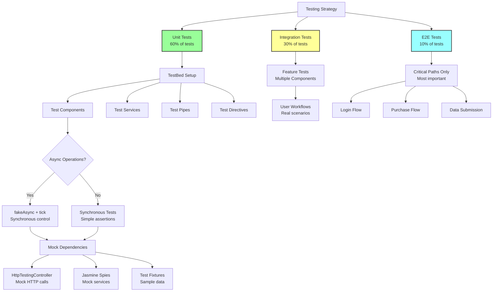

# Angular Testing Strategy - Deep Dive

## Table of Contents
- [TestBed Internal Architecture](#testbed-internal-architecture)
- [Standalone vs Module-Based Testing](#standalone-vs-module-based-testing)
- [Async Testing Patterns](#async-testing-patterns)
- [Mocking Strategies](#mocking-strategies)
- [Flaky Test Prevention](#flaky-test-prevention)
- [Change Detection in Tests](#change-detection-in-tests)
- [Testing OnPush Components](#testing-onpush-components)
- [Real-World Example](#real-world-example)
- [Test Coverage Reality Check](#test-coverage-reality-check)

---

## TestBed Internal Architecture

### Question: Explain Angular testing architecture - how TestBed works internally, async testing patterns, mocking strategies, flaky test prevention, and real-world test design for production code.

**Answer:**

Angular testing isn't just "write specs and run them" - it's a sophisticated framework that creates isolated testing environments, manages dependency injection, and coordinates change detection. Let's explore the internal mechanics.

---

## **Visual Overview: Testing Strategy Pyramid**



**Testing Pyramid Philosophy:**
- ✅ **60% Unit Tests:** Fast, isolated, test single units
- ✅ **30% Integration Tests:** Test component interactions
- ✅ **10% E2E Tests:** Critical user journeys only (slow, brittle)

**Why This Distribution:**
- 🚀 **Unit tests** run in milliseconds (fast feedback)
- 🔄 **Integration tests** catch real bugs in component interactions
- 🎯 **E2E tests** validate critical business flows
- 💰 **Cost**: Unit ($) < Integration ($$) < E2E ($$$)

---

### **How TestBed Actually Works**

```typescript
// When you write this:
beforeEach(() => {
  TestBed.configureTestingModule({
    declarations: [UserComponent],
    imports: [HttpClientTestingModule],
    providers: [UserService]
  });
  
  fixture = TestBed.createComponent(UserComponent);
  component = fixture.componentInstance;
});

// What happens internally?
```

**TestBed Internal Structure:**

```typescript
// Simplified TestBed implementation
class TestBedStatic {
  private _compiler: TestingCompiler;
  private _testModuleRef: NgModuleRef<any> | null = null;
  private _declarations: any[] = [];
  private _imports: any[] = [];
  private _providers: Provider[] = [];
  
  // Step 1: Configure testing module
  configureTestingModule(moduleDef: TestModuleMetadata): typeof TestBed {
    // Store configuration
    this._declarations = moduleDef.declarations || [];
    this._imports = moduleDef.imports || [];
    this._providers = moduleDef.providers || [];
    
    // Mark for compilation
    this._testModuleRef = null;
    
    return this;
  }
  
  // Step 2: Compile and create module
  private compileTestModule(): void {
    if (this._testModuleRef) {
      return;  // Already compiled
    }
    
    // Create dynamic NgModule
    @NgModule({
      declarations: this._declarations,
      imports: this._imports,
      providers: this._providers
    })
    class DynamicTestModule {}
    
    // Compile module
    const moduleFactory = this._compiler.compileModuleSync(DynamicTestModule);
    
    // Create module instance
    this._testModuleRef = moduleFactory.create(TestBed.inject(Injector));
  }
  
  // Step 3: Create component fixture
  createComponent<T>(component: Type<T>): ComponentFixture<T> {
    // Ensure module is compiled
    this.compileTestModule();
    
    // Get component factory from compiler
    const componentFactory = this._compiler
      .getComponentFactory(component);
    
    // Create component instance
    const componentRef = componentFactory.create(
      this._testModuleRef!.injector
    );
    
    // Wrap in fixture
    return new ComponentFixture(componentRef, this._testModuleRef);
  }
  
  // Get service from injector
  inject<T>(token: Type<T> | InjectionToken<T>): T {
    this.compileTestModule();
    return this._testModuleRef!.injector.get(token);
  }
}
```

**ComponentFixture Internal Structure:**

```typescript
// Simplified ComponentFixture
class ComponentFixture<T> {
  componentInstance: T;
  nativeElement: any;
  debugElement: DebugElement;
  
  private _isStable: boolean = true;
  private _autoDetect: boolean = false;
  private _ngZone: NgZone;
  
  constructor(
    public componentRef: ComponentRef<T>,
    private _ngZone: NgZone,
    private _autoDetect: boolean = false
  ) {
    this.componentInstance = componentRef.instance;
    this.nativeElement = componentRef.location.nativeElement;
    this.debugElement = new DebugElement(componentRef);
    
    if (_autoDetect) {
      this.setupAutoChangeDetection();
    }
  }
  
  // Manually trigger change detection
  detectChanges(): void {
    // Run change detection through the zone
    this._ngZone.run(() => {
      this.componentRef.changeDetectorRef.detectChanges();
    });
  }
  
  // Wait for async operations to complete
  whenStable(): Promise<void> {
    return this._ngZone.onStable.pipe(
      take(1),
      timeout(10000)  // 10 second timeout
    ).toPromise();
  }
  
  // Auto change detection setup
  private setupAutoChangeDetection(): void {
    this._ngZone.onMicrotaskEmpty.subscribe(() => {
      this.detectChanges();
    });
  }
  
  // Clean up
  destroy(): void {
    this.componentRef.destroy();
  }
}
```

**Complete Test Flow:**

```
1. TestBed.configureTestingModule()
   ↓
2. Store declarations, imports, providers
   ↓
3. TestBed.createComponent(MyComponent)
   ↓
4. Check if module compiled
   ↓
5. If not, create @NgModule dynamically
   ↓
6. Compile module with TestingCompiler
   ↓
7. Create NgModuleRef instance
   ↓
8. Get ComponentFactory for MyComponent
   ↓
9. Create ComponentRef using module's injector
   ↓
10. Wrap in ComponentFixture
    ↓
11. Return fixture to test
    ↓
12. Test calls fixture.detectChanges()
    ↓
13. NgZone.run() → ChangeDetectorRef.detectChanges()
    ↓
14. Component renders
    ↓
15. Test can query DOM, verify state
```

---

## Standalone vs Module-Based Testing

### **Module-Based Component Testing**

```typescript
// Component
@Component({
  selector: 'app-user-profile',
  template: `
    <div class="profile">
      <h1>{{ user.name }}</h1>
      <p>{{ user.email }}</p>
    </div>
  `
})
export class UserProfileComponent {
  @Input() user!: User;
}

// Module
@NgModule({
  declarations: [UserProfileComponent],
  imports: [CommonModule],
  exports: [UserProfileComponent]
})
export class UserModule {}

// Test (traditional)
describe('UserProfileComponent', () => {
  let component: UserProfileComponent;
  let fixture: ComponentFixture<UserProfileComponent>;
  
  beforeEach(async () => {
    await TestBed.configureTestingModule({
      declarations: [UserProfileComponent],  // Must declare
      imports: [CommonModule]  // Must import dependencies
    }).compileComponents();
    
    fixture = TestBed.createComponent(UserProfileComponent);
    component = fixture.componentInstance;
  });
  
  it('should display user name', () => {
    component.user = { name: 'John', email: 'john@example.com' };
    fixture.detectChanges();
    
    const compiled = fixture.nativeElement;
    expect(compiled.querySelector('h1').textContent).toContain('John');
  });
});
```

### **Standalone Component Testing**

```typescript
// Standalone component
@Component({
  selector: 'app-user-profile',
  standalone: true,  // ← Standalone
  imports: [CommonModule],  // Direct imports
  template: `
    <div class="profile">
      <h1>{{ user.name }}</h1>
      <p>{{ user.email }}</p>
    </div>
  `
})
export class UserProfileComponent {
  @Input() user!: User;
}

// Test (simplified!)
describe('UserProfileComponent (Standalone)', () => {
  let component: UserProfileComponent;
  let fixture: ComponentFixture<UserProfileComponent>;
  
  beforeEach(async () => {
    await TestBed.configureTestingModule({
      imports: [UserProfileComponent]  // Import, not declare!
    }).compileComponents();
    
    fixture = TestBed.createComponent(UserProfileComponent);
    component = fixture.componentInstance;
  });
  
  it('should display user name', () => {
    component.user = { name: 'John', email: 'john@example.com' };
    fixture.detectChanges();
    
    const compiled = fixture.nativeElement;
    expect(compiled.querySelector('h1').textContent).toContain('John');
  });
});
```

**Key Differences:**

| Aspect | Module-Based | Standalone |
|--------|--------------|------------|
| **TestBed Setup** | `declarations: [Component]` | `imports: [Component]` |
| **Dependencies** | Must import modules | Direct imports in component |
| **Boilerplate** | More (module + component) | Less (just component) |
| **Isolation** | Harder (module dependencies) | Easier (explicit imports) |
| **Migration** | Must update module | No module to update |

**Why Standalone is Better for Testing:**

```typescript
// Module-based: Implicit dependencies
@NgModule({
  declarations: [ComponentA, ComponentB, ComponentC],
  imports: [ModuleX, ModuleY, ModuleZ],
  // What does ComponentA actually need? Unclear!
})
export class FeatureModule {}

// Test must import entire module
TestBed.configureTestingModule({
  imports: [FeatureModule]  // Brings in everything
});

// Standalone: Explicit dependencies
@Component({
  standalone: true,
  imports: [CommonModule, ReactiveFormsModule, MatButtonModule],
  // ↑ Exactly what this component needs
})
export class ComponentA {}

// Test imports only what's needed
TestBed.configureTestingModule({
  imports: [ComponentA]  // Self-contained
});
```

---

## Async Testing Patterns

### **The Problem with Async Code**

```typescript
// Component with async operation
@Component({
  template: `<div>{{ data }}</div>`
})
export class AsyncComponent implements OnInit {
  data: string = '';
  
  constructor(private http: HttpClient) {}
  
  ngOnInit(): void {
    this.http.get<string>('/api/data').subscribe(result => {
      this.data = result;
    });
  }
}

// ❌ BAD TEST: Synchronous assertion on async operation
it('should load data', () => {
  fixture.detectChanges();  // Triggers ngOnInit
  expect(component.data).toBe('test data');  // FAILS! Data not loaded yet
});
```

### **Solution 1: async() + whenStable()**

```typescript
// ✅ GOOD: Wait for async operations
it('should load data', async(() => {
  fixture.detectChanges();  // Triggers ngOnInit
  
  fixture.whenStable().then(() => {
    // All async operations complete
    fixture.detectChanges();  // Update view
    expect(component.data).toBe('test data');
  });
}));

// What async() does internally:
function async(fn: Function): Function {
  return function(this: any) {
    return new Promise((resolve, reject) => {
      const testZone = Zone.current.fork({
        name: 'async-test-zone',
        onScheduleTask: (delegate, current, target, task) => {
          // Track async tasks
          tasksRemaining++;
          return delegate.scheduleTask(target, task);
        },
        onInvokeTask: (delegate, current, target, task, applyThis, applyArgs) => {
          const result = delegate.invokeTask(target, task, applyThis, applyArgs);
          tasksRemaining--;
          if (tasksRemaining === 0) {
            resolve(result);  // All tasks complete
          }
          return result;
        }
      });
      
      testZone.run(fn, this);
    });
  };
}
```

### **Solution 2: fakeAsync() + tick()**

```typescript
// ✅ BETTER: Synchronous control of async time
it('should load data', fakeAsync(() => {
  fixture.detectChanges();  // Triggers ngOnInit
  
  tick();  // Advance virtual time until all async tasks complete
  
  fixture.detectChanges();  // Update view
  expect(component.data).toBe('test data');
}));
```

**What fakeAsync() does internally:**

```typescript
function fakeAsync(fn: Function): Function {
  return function(this: any, ...args: any[]) {
    // Create fake async zone
    const fakeAsyncZone = Zone.current.fork({
      name: 'fakeAsync',
      properties: {
        FakeAsyncTestZoneSpec: {
          // Track scheduled tasks
          scheduledTasks: [],
          microtasks: [],
          macrotasks: [],
          
          // Override setTimeout
          onScheduleMacroTask: (delegate, current, target, task) => {
            this.macrotasks.push(task);
            return task;
          },
          
          // Override Promise.then
          onScheduleMicroTask: (delegate, current, target, task) => {
            this.microtasks.push(task);
            return task;
          }
        }
      }
    });
    
    return fakeAsyncZone.run(fn, this, args);
  };
}

function tick(millis: number = 0): void {
  const fakeAsyncZone = Zone.current.get('FakeAsyncTestZoneSpec');
  
  // Execute all pending microtasks (Promises)
  while (fakeAsyncZone.microtasks.length > 0) {
    const task = fakeAsyncZone.microtasks.shift();
    task.invoke();
  }
  
  // Advance virtual time
  fakeAsyncZone.currentTime += millis;
  
  // Execute macrotasks (setTimeout) that are due
  while (fakeAsyncZone.macrotasks.length > 0) {
    const task = fakeAsyncZone.macrotasks[0];
    if (task.scheduledTime <= fakeAsyncZone.currentTime) {
      fakeAsyncZone.macrotasks.shift();
      task.invoke();
    } else {
      break;
    }
  }
}
```

### **tick() vs flush() vs flushMicrotasks()**

```typescript
describe('Async Timing Control', () => {
  it('tick() - advance time by specific amount', fakeAsync(() => {
    let executed = false;
    
    setTimeout(() => {
      executed = true;
    }, 1000);
    
    tick(500);
    expect(executed).toBe(false);  // Only 500ms passed
    
    tick(500);
    expect(executed).toBe(true);   // Now 1000ms passed
  }));
  
  it('flush() - execute all pending timers', fakeAsync(() => {
    let count = 0;
    
    setTimeout(() => count++, 100);
    setTimeout(() => count++, 500);
    setTimeout(() => count++, 1000);
    
    flush();  // Execute all timers regardless of delay
    expect(count).toBe(3);
  }));
  
  it('flushMicrotasks() - execute only microtasks', fakeAsync(() => {
    let promiseResolved = false;
    let timeoutExecuted = false;
    
    Promise.resolve().then(() => {
      promiseResolved = true;
    });
    
    setTimeout(() => {
      timeoutExecuted = true;
    }, 0);
    
    flushMicrotasks();  // Only executes Promise
    expect(promiseResolved).toBe(true);
    expect(timeoutExecuted).toBe(false);  // setTimeout not executed
    
    flush();  // Now execute setTimeout
    expect(timeoutExecuted).toBe(true);
  }));
});
```

### **When Each Approach Fails**

```typescript
describe('fakeAsync Limitations', () => {
  // ❌ FAILS: fakeAsync doesn't support real HTTP
  it('cannot use real HTTP', fakeAsync(() => {
    // This will throw: "Error: Cannot use real HTTP in fakeAsync"
    http.get('/api/data').subscribe();
    tick();
  }));
  
  // ✅ WORKS: Use HttpTestingController
  it('must use HttpTestingController', fakeAsync(() => {
    http.get('/api/data').subscribe();
    
    const req = httpMock.expectOne('/api/data');
    req.flush('test data');
    
    tick();
  }));
  
  // ❌ FAILS: fakeAsync doesn't support intervals that continue
  it('cannot use infinite intervals', fakeAsync(() => {
    setInterval(() => {
      console.log('tick');
    }, 1000);
    
    // This will hang forever!
    flush();
  }));
  
  // ✅ WORKS: Use tick() with specific time
  it('must use tick() for intervals', fakeAsync(() => {
    let count = 0;
    const intervalId = setInterval(() => {
      count++;
    }, 1000);
    
    tick(3000);  // Advance 3 seconds
    expect(count).toBe(3);
    
    clearInterval(intervalId);  // Must clear!
    flush();  // Now safe
  }));
  
  // ❌ FAILS: fakeAsync doesn't work with Zone.js patches
  it('cannot use requestAnimationFrame', fakeAsync(() => {
    let executed = false;
    requestAnimationFrame(() => {
      executed = true;
    });
    
    tick();  // Won't execute RAF
    expect(executed).toBe(false);  // Still false!
  }));
});
```

### **Observable Testing Patterns**

```typescript
describe('Observable Testing', () => {
  it('test synchronous observable', () => {
    const values: number[] = [];
    
    of(1, 2, 3).subscribe(value => values.push(value));
    
    // No async needed - synchronous observable
    expect(values).toEqual([1, 2, 3]);
  });
  
  it('test async observable with fakeAsync', fakeAsync(() => {
    const values: number[] = [];
    
    interval(1000).pipe(
      take(3)
    ).subscribe(value => values.push(value));
    
    tick(1000);
    expect(values).toEqual([0]);
    
    tick(1000);
    expect(values).toEqual([0, 1]);
    
    tick(1000);
    expect(values).toEqual([0, 1, 2]);
  }));
  
  it('test observable with done callback', (done) => {
    const values: number[] = [];
    
    of(1, 2, 3).pipe(
      delay(100)
    ).subscribe({
      next: value => values.push(value),
      complete: () => {
        expect(values).toEqual([1, 2, 3]);
        done();  // Signal completion
      }
    });
  });
  
  it('test observable with marble testing', () => {
    const scheduler = new TestScheduler((actual, expected) => {
      expect(actual).toEqual(expected);
    });
    
    scheduler.run(({ cold, expectObservable }) => {
      const source$ = cold('--a-b-c|', { a: 1, b: 2, c: 3 });
      const expected = '--a-b-c|';
      
      expectObservable(source$).toBe(expected, { a: 1, b: 2, c: 3 });
    });
  });
});
```

---

## Mocking Strategies

### **Mocking Services**

```typescript
// Real service
@Injectable({ providedIn: 'root' })
export class UserService {
  constructor(private http: HttpClient) {}
  
  getUser(id: number): Observable<User> {
    return this.http.get<User>(`/api/users/${id}`);
  }
  
  updateUser(user: User): Observable<User> {
    return this.http.put<User>(`/api/users/${user.id}`, user);
  }
}

// Component using service
@Component({
  selector: 'app-user-detail',
  template: `
    <div *ngIf="user">
      <h1>{{ user.name }}</h1>
      <button (click)="save()">Save</button>
    </div>
  `
})
export class UserDetailComponent implements OnInit {
  user: User | null = null;
  
  constructor(private userService: UserService) {}
  
  ngOnInit(): void {
    this.userService.getUser(1).subscribe(user => {
      this.user = user;
    });
  }
  
  save(): void {
    if (this.user) {
      this.userService.updateUser(this.user).subscribe();
    }
  }
}
```

**Strategy 1: Mock with Jasmine Spy**

```typescript
describe('UserDetailComponent - Jasmine Spy', () => {
  let component: UserDetailComponent;
  let fixture: ComponentFixture<UserDetailComponent>;
  let userService: jasmine.SpyObj<UserService>;
  
  beforeEach(() => {
    // Create spy object with method stubs
    const userServiceSpy = jasmine.createSpyObj('UserService', [
      'getUser',
      'updateUser'
    ]);
    
    TestBed.configureTestingModule({
      declarations: [UserDetailComponent],
      providers: [
        { provide: UserService, useValue: userServiceSpy }
      ]
    });
    
    fixture = TestBed.createComponent(UserDetailComponent);
    component = fixture.componentInstance;
    userService = TestBed.inject(UserService) as jasmine.SpyObj<UserService>;
  });
  
  it('should load user on init', fakeAsync(() => {
    const mockUser = { id: 1, name: 'John' };
    userService.getUser.and.returnValue(of(mockUser));
    
    fixture.detectChanges();  // Triggers ngOnInit
    tick();
    
    expect(component.user).toEqual(mockUser);
    expect(userService.getUser).toHaveBeenCalledWith(1);
  }));
  
  it('should save user', fakeAsync(() => {
    const mockUser = { id: 1, name: 'John' };
    component.user = mockUser;
    userService.updateUser.and.returnValue(of(mockUser));
    
    component.save();
    tick();
    
    expect(userService.updateUser).toHaveBeenCalledWith(mockUser);
  }));
});
```

**Strategy 2: Mock Class**

```typescript
// Mock implementation
class MockUserService {
  getUser(id: number): Observable<User> {
    return of({ id, name: 'Mock User' });
  }
  
  updateUser(user: User): Observable<User> {
    return of(user);
  }
}

describe('UserDetailComponent - Mock Class', () => {
  let component: UserDetailComponent;
  let fixture: ComponentFixture<UserDetailComponent>;
  let userService: UserService;
  
  beforeEach(() => {
    TestBed.configureTestingModule({
      declarations: [UserDetailComponent],
      providers: [
        { provide: UserService, useClass: MockUserService }
      ]
    });
    
    fixture = TestBed.createComponent(UserDetailComponent);
    component = fixture.componentInstance;
    userService = TestBed.inject(UserService);
  });
  
  it('should load user on init', fakeAsync(() => {
    spyOn(userService, 'getUser').and.returnValue(
      of({ id: 1, name: 'John' })
    );
    
    fixture.detectChanges();
    tick();
    
    expect(component.user?.name).toBe('John');
  }));
});
```

**Strategy 3: HttpTestingController (Best for HTTP)**

```typescript
describe('UserDetailComponent - HttpTestingController', () => {
  let component: UserDetailComponent;
  let fixture: ComponentFixture<UserDetailComponent>;
  let httpMock: HttpTestingController;
  
  beforeEach(() => {
    TestBed.configureTestingModule({
      declarations: [UserDetailComponent],
      imports: [HttpClientTestingModule],
      providers: [UserService]  // Real service!
    });
    
    fixture = TestBed.createComponent(UserDetailComponent);
    component = fixture.componentInstance;
    httpMock = TestBed.inject(HttpTestingController);
  });
  
  afterEach(() => {
    // Verify no outstanding requests
    httpMock.verify();
  });
  
  it('should load user on init', fakeAsync(() => {
    fixture.detectChanges();  // Triggers ngOnInit
    
    // Expect HTTP request
    const req = httpMock.expectOne('/api/users/1');
    expect(req.request.method).toBe('GET');
    
    // Respond with mock data
    req.flush({ id: 1, name: 'John' });
    
    tick();
    
    expect(component.user?.name).toBe('John');
  }));
  
  it('should handle HTTP error', fakeAsync(() => {
    fixture.detectChanges();
    
    const req = httpMock.expectOne('/api/users/1');
    
    // Simulate error
    req.flush('Error', { status: 404, statusText: 'Not Found' });
    
    tick();
    
    expect(component.user).toBeNull();
  }));
});
```

### **Mocking Child Components**

```typescript
// Parent component
@Component({
  selector: 'app-user-dashboard',
  template: `
    <app-user-header [user]="user"></app-user-header>
    <app-user-stats [userId]="user?.id"></app-user-stats>
  `
})
export class UserDashboardComponent {
  @Input() user: User | null = null;
}

// ❌ BAD: Test real child components (slow, complex)
describe('UserDashboardComponent - Real Children', () => {
  beforeEach(() => {
    TestBed.configureTestingModule({
      declarations: [
        UserDashboardComponent,
        UserHeaderComponent,  // Real component
        UserStatsComponent    // Real component
      ],
      imports: [
        HttpClientTestingModule,  // For stats component
        // ... more dependencies
      ]
    });
  });
  // Tests are slow and fragile
});

// ✅ GOOD: Mock child components
@Component({
  selector: 'app-user-header',
  template: ''
})
class MockUserHeaderComponent {
  @Input() user: User | null = null;
}

@Component({
  selector: 'app-user-stats',
  template: ''
})
class MockUserStatsComponent {
  @Input() userId: number | null = null;
}

describe('UserDashboardComponent - Mock Children', () => {
  let component: UserDashboardComponent;
  let fixture: ComponentFixture<UserDashboardComponent>;
  
  beforeEach(() => {
    TestBed.configureTestingModule({
      declarations: [
        UserDashboardComponent,
        MockUserHeaderComponent,
        MockUserStatsComponent
      ]
    });
    
    fixture = TestBed.createComponent(UserDashboardComponent);
    component = fixture.componentInstance;
  });
  
  it('should pass user to header', () => {
    const user = { id: 1, name: 'John' };
    component.user = user;
    fixture.detectChanges();
    
    const header = fixture.debugElement.query(
      By.directive(MockUserHeaderComponent)
    );
    expect(header.componentInstance.user).toBe(user);
  });
});
```

### **When NOT to Mock**

```typescript
// ❌ DON'T mock: Simple utilities
describe('DateUtils', () => {
  // Don't mock - test the real thing
  it('should format date', () => {
    const result = DateUtils.format(new Date(2024, 0, 1));
    expect(result).toBe('2024-01-01');
  });
});

// ❌ DON'T mock: Pure pipes
describe('CurrencyPipe', () => {
  // Don't mock - test the real pipe
  it('should format currency', () => {
    const pipe = new CurrencyPipe();
    expect(pipe.transform(1234.56)).toBe('$1,234.56');
  });
});

// ✅ DO mock: External dependencies
describe('Component with external API', () => {
  // Mock HTTP - don't hit real API
  // Mock WebSocket - don't connect to real server
  // Mock localStorage - don't pollute browser storage
});

// ✅ DO mock: Complex child components
describe('Parent component', () => {
  // Mock children to isolate parent logic
  // Focus on parent's behavior, not children's
});

// ✅ DO mock: Time-dependent code
describe('Component with setInterval', () => {
  // Use fakeAsync + tick instead of waiting real time
});
```

---

## Flaky Test Prevention

### **Common Causes of Flaky Tests**

**Cause 1: Timing Issues**

```typescript
// ❌ FLAKY: Race condition
it('flaky - timing dependent', (done) => {
  component.loadData();
  
  setTimeout(() => {
    expect(component.data).toBeDefined();
    done();
  }, 100);  // What if it takes 101ms?
});

// ✅ STABLE: Use fakeAsync
it('stable - controlled timing', fakeAsync(() => {
  component.loadData();
  tick();  // Wait for all async operations
  expect(component.data).toBeDefined();
}));
```

**Cause 2: Uncontrolled Change Detection**

```typescript
// ❌ FLAKY: Implicit change detection
it('flaky - uncontrolled CD', async () => {
  component.value = 10;
  // Change detection might or might not run
  await fixture.whenStable();
  const element = fixture.nativeElement.querySelector('.value');
  expect(element.textContent).toBe('10');  // Sometimes fails
});

// ✅ STABLE: Explicit change detection
it('stable - explicit CD', () => {
  component.value = 10;
  fixture.detectChanges();  // Explicit!
  const element = fixture.nativeElement.querySelector('.value');
  expect(element.textContent).toBe('10');
});
```

**Cause 3: Shared State Between Tests**

```typescript
// ❌ FLAKY: Tests affect each other
describe('Flaky suite', () => {
  let sharedData: any[];
  
  beforeEach(() => {
    sharedData = [];  // Reset, but...
  });
  
  it('test 1', () => {
    sharedData.push(1);
    localStorage.setItem('key', 'value');  // Side effect!
    expect(sharedData.length).toBe(1);
  });
  
  it('test 2', () => {
    // localStorage still has 'key' from test 1!
    const stored = localStorage.getItem('key');
    expect(stored).toBeNull();  // FAILS if test 1 ran first
  });
});

// ✅ STABLE: Clean up side effects
describe('Stable suite', () => {
  let data: any[];
  
  beforeEach(() => {
    data = [];
    localStorage.clear();  // Clean slate
  });
  
  afterEach(() => {
    localStorage.clear();  // Clean up
  });
  
  it('test 1', () => {
    data.push(1);
    localStorage.setItem('key', 'value');
    expect(data.length).toBe(1);
  });
  
  it('test 2', () => {
    const stored = localStorage.getItem('key');
    expect(stored).toBeNull();  // Always passes
  });
});
```

**Cause 4: Non-Deterministic Test Data**

```typescript
// ❌ FLAKY: Random data
it('flaky - random data', () => {
  const user = {
    id: Math.floor(Math.random() * 1000),
    createdAt: new Date()  // Changes every test run!
  };
  
  service.save(user);
  const saved = service.get(user.id);
  expect(saved.createdAt.getTime()).toBe(user.createdAt.getTime());
  // Fails if milliseconds differ!
});

// ✅ STABLE: Deterministic data
it('stable - fixed data', () => {
  const user = {
    id: 1,
    createdAt: new Date('2024-01-01T00:00:00Z')
  };
  
  service.save(user);
  const saved = service.get(user.id);
  expect(saved.createdAt.getTime()).toBe(user.createdAt.getTime());
});
```

**Cause 5: Unverified HTTP Requests**

```typescript
// ❌ FLAKY: Missing httpMock.verify()
describe('Flaky HTTP test', () => {
  let httpMock: HttpTestingController;
  
  beforeEach(() => {
    // Setup...
  });
  
  // Missing afterEach with verify()!
  
  it('test 1', fakeAsync(() => {
    service.getData().subscribe();
    const req = httpMock.expectOne('/api/data');
    req.flush('data');
    tick();
  }));
  
  it('test 2', fakeAsync(() => {
    // If test 1 had an extra request, this test might fail
    service.getData().subscribe();
    const req = httpMock.expectOne('/api/data');
    req.flush('data');
    tick();
  }));
});

// ✅ STABLE: Always verify
describe('Stable HTTP test', () => {
  let httpMock: HttpTestingController;
  
  beforeEach(() => {
    // Setup...
  });
  
  afterEach(() => {
    httpMock.verify();  // Fails if unexpected requests
  });
  
  it('test 1', fakeAsync(() => {
    service.getData().subscribe();
    const req = httpMock.expectOne('/api/data');
    req.flush('data');
    tick();
  }));
});
```

### **Flaky Test Checklist**

```typescript
// ✅ Checklist for stable tests:

1. // Use fakeAsync/tick instead of real timers
   fakeAsync(() => {
     tick();
   })

2. // Explicit change detection
   fixture.detectChanges();

3. // Clean up side effects
   afterEach(() => {
     localStorage.clear();
     sessionStorage.clear();
   });

4. // Verify HTTP requests
   afterEach(() => {
     httpMock.verify();
   });

5. // Deterministic test data
   const testDate = new Date('2024-01-01T00:00:00Z');

6. // Isolate tests
   beforeEach(() => {
     TestBed.resetTestingModule();
   });

7. // Don't rely on test order
   it('should work independently', () => {
     // Each test stands alone
   });

8. // Wait for stability
   await fixture.whenStable();

9. // No global state
   // Use TestBed.inject(), not global variables

10. // Mock external dependencies
    // Don't hit real APIs, databases, etc.
```

---

## Change Detection in Tests

### **Manual vs Automatic Change Detection**

```typescript
describe('Change Detection Modes', () => {
  // Manual change detection (default)
  it('manual CD - must call detectChanges()', () => {
    const fixture = TestBed.createComponent(MyComponent);
    const component = fixture.componentInstance;
    
    component.value = 10;
    // Template not updated yet!
    
    let element = fixture.nativeElement.querySelector('.value');
    expect(element.textContent).toBe('');  // Still empty
    
    fixture.detectChanges();  // Now update
    
    element = fixture.nativeElement.querySelector('.value');
    expect(element.textContent).toBe('10');  // Updated!
  });
  
  // Automatic change detection
  it('auto CD - updates automatically', async () => {
    TestBed.configureTestingModule({
      declarations: [MyComponent]
    });
    
    const fixture = TestBed.createComponent(MyComponent);
    fixture.autoDetectChanges();  // Enable auto CD
    
    const component = fixture.componentInstance;
    component.value = 10;
    
    await fixture.whenStable();
    
    const element = fixture.nativeElement.querySelector('.value');
    expect(element.textContent).toBe('10');  // Auto updated!
  });
});
```

**When to Use Each:**

```typescript
// ✅ Use manual CD for:
// 1. Precise control over when CD runs
it('should update in specific order', () => {
  component.value = 10;
  // Don't update yet - verify internal state first
  expect(component.computedValue).toBe(20);
  
  fixture.detectChanges();
  // Now verify DOM
  expect(element.textContent).toBe('10');
});

// 2. Testing change detection itself
it('should not trigger CD for OnPush', () => {
  component.value = 10;  // OnPush won't detect
  fixture.detectChanges();
  expect(element.textContent).toBe('0');  // Not updated
  
  component.onPushInput = { value: 10 };  // New reference
  fixture.detectChanges();
  expect(element.textContent).toBe('10');  // Now updated
});

// ✅ Use auto CD for:
// 1. Integration tests (more realistic)
it('should handle user interaction', async () => {
  fixture.autoDetectChanges();
  
  button.click();  // Triggers CD automatically
  await fixture.whenStable();
  
  expect(component.clickCount).toBe(1);
});

// 2. Complex async flows
it('should handle multiple async operations', async () => {
  fixture.autoDetectChanges();
  
  component.loadData();
  await fixture.whenStable();
  
  expect(component.data).toBeDefined();
});
```

---

## Testing OnPush Components

### **The Challenge**

```typescript
@Component({
  selector: 'app-onpush',
  template: `
    <div class="value">{{ value }}</div>
    <div class="input-value">{{ inputValue }}</div>
    <button (click)="increment()">Increment</button>
  `,
  changeDetection: ChangeDetectionStrategy.OnPush  // OnPush!
})
export class OnPushComponent {
  @Input() inputValue = 0;
  value = 0;
  
  increment(): void {
    this.value++;
  }
}
```

**Test Strategies:**

```typescript
describe('OnPushComponent', () => {
  let component: OnPushComponent;
  let fixture: ComponentFixture<OnPushComponent>;
  
  beforeEach(() => {
    TestBed.configureTestingModule({
      declarations: [OnPushComponent]
    });
    
    fixture = TestBed.createComponent(OnPushComponent);
    component = fixture.componentInstance;
  });
  
  // ❌ This might not work as expected
  it('might not update - OnPush blocks CD', () => {
    component.value = 10;
    fixture.detectChanges();
    
    // OnPush might not update because:
    // - No @Input changed
    // - No event in component
    // - No async pipe emission
    
    const element = fixture.nativeElement.querySelector('.value');
    expect(element.textContent).toBe('0');  // Might still be 0!
  });
  
  // ✅ Solution 1: Change @Input (new reference)
  it('updates when input changes', () => {
    component.inputValue = 10;  // Input changed
    fixture.detectChanges();    // OnPush will check
    
    const element = fixture.nativeElement.querySelector('.input-value');
    expect(element.textContent).toBe('10');  // Works!
  });
  
  // ✅ Solution 2: Trigger event in component
  it('updates when event fires', () => {
    const button = fixture.nativeElement.querySelector('button');
    button.click();  // Event in component
    fixture.detectChanges();
    
    const element = fixture.nativeElement.querySelector('.value');
    expect(element.textContent).toBe('1');  // Works!
  });
  
  // ✅ Solution 3: Use ComponentRef.markForCheck()
  it('updates with markForCheck', () => {
    component.value = 10;
    
    // Force OnPush to check
    fixture.componentRef.markForCheck();
    fixture.detectChanges();
    
    const element = fixture.nativeElement.querySelector('.value');
    expect(element.textContent).toBe('10');  // Works!
  });
  
  // ✅ Solution 4: Test with parent component
  it('updates in integration with parent', () => {
    @Component({
      template: `<app-onpush [inputValue]="value"></app-onpush>`,
      changeDetection: ChangeDetectionStrategy.Default
    })
    class ParentComponent {
      value = 0;
    }
    
    TestBed.configureTestingModule({
      declarations: [OnPushComponent, ParentComponent]
    });
    
    const parentFixture = TestBed.createComponent(ParentComponent);
    const parent = parentFixture.componentInstance;
    
    parent.value = 10;
    parentFixture.detectChanges();  // Parent checks, child updates
    
    const child = parentFixture.debugElement.query(
      By.directive(OnPushComponent)
    );
    const element = child.nativeElement.querySelector('.input-value');
    expect(element.textContent).toBe('10');
  });
});
```

---

## Real-World Example

### **Component with HTTP + RxJS + View Updates**

```typescript
// Component to test
@Component({
  selector: 'app-user-search',
  template: `
    <div class="search-container">
      <input
        [formControl]="searchControl"
        placeholder="Search users..."
        class="search-input"
      />
      
      <div *ngIf="loading$ | async" class="loading">
        Loading...
      </div>
      
      <div *ngIf="error$ | async as error" class="error">
        {{ error }}
      </div>
      
      <ul class="results" *ngIf="results$ | async as results">
        <li *ngFor="let user of results" class="result-item">
          {{ user.name }} ({{ user.email }})
        </li>
      </ul>
      
      <div *ngIf="(results$ | async)?.length === 0" class="no-results">
        No users found
      </div>
    </div>
  `,
  changeDetection: ChangeDetectionStrategy.OnPush
})
export class UserSearchComponent implements OnInit, OnDestroy {
  searchControl = new FormControl('');
  
  loading$ = new BehaviorSubject<boolean>(false);
  error$ = new BehaviorSubject<string | null>(null);
  results$ = new BehaviorSubject<User[]>([]);
  
  private destroy$ = new Subject<void>();
  
  constructor(private userService: UserService) {}
  
  ngOnInit(): void {
    this.searchControl.valueChanges.pipe(
      debounceTime(300),
      distinctUntilChanged(),
      filter(query => query !== null && query.length > 2),
      tap(() => {
        this.loading$.next(true);
        this.error$.next(null);
      }),
      switchMap(query =>
        this.userService.searchUsers(query).pipe(
          map(users => ({ users, error: null })),
          catchError(error => of({ users: [], error: error.message }))
        )
      ),
      takeUntil(this.destroy$)
    ).subscribe(({ users, error }) => {
      this.loading$.next(false);
      this.error$.next(error);
      this.results$.next(users);
    });
  }
  
  ngOnDestroy(): void {
    this.destroy$.next();
    this.destroy$.complete();
  }
}

// Service
@Injectable({ providedIn: 'root' })
export class UserService {
  constructor(private http: HttpClient) {}
  
  searchUsers(query: string): Observable<User[]> {
    return this.http.get<User[]>(`/api/users/search?q=${query}`);
  }
}

interface User {
  id: number;
  name: string;
  email: string;
}
```

### **Complete Test Suite**

```typescript
describe('UserSearchComponent - Complete Test Suite', () => {
  let component: UserSearchComponent;
  let fixture: ComponentFixture<UserSearchComponent>;
  let httpMock: HttpTestingController;
  let compiled: HTMLElement;
  
  beforeEach(async () => {
    await TestBed.configureTestingModule({
      declarations: [UserSearchComponent],
      imports: [
        ReactiveFormsModule,
        HttpClientTestingModule,
        CommonModule
      ],
      providers: [UserService]
    }).compileComponents();
    
    fixture = TestBed.createComponent(UserSearchComponent);
    component = fixture.componentInstance;
    httpMock = TestBed.inject(HttpTestingController);
    compiled = fixture.nativeElement;
  });
  
  afterEach(() => {
    httpMock.verify();  // Ensure no outstanding requests
  });
  
  describe('Setup', () => {
    it('should create component', () => {
      expect(component).toBeTruthy();
    });
    
    it('should initialize with empty state', () => {
      fixture.detectChanges();
      
      expect(component.searchControl.value).toBe('');
      expect(component.loading$.value).toBe(false);
      expect(component.error$.value).toBeNull();
      expect(component.results$.value).toEqual([]);
    });
    
    it('should render search input', () => {
      fixture.detectChanges();
      
      const input = compiled.querySelector('.search-input');
      expect(input).toBeTruthy();
      expect(input?.getAttribute('placeholder')).toBe('Search users...');
    });
  });
  
  describe('Search Functionality', () => {
    it('should debounce search input', fakeAsync(() => {
      fixture.detectChanges();
      
      // Type quickly
      component.searchControl.setValue('j');
      tick(100);
      component.searchControl.setValue('jo');
      tick(100);
      component.searchControl.setValue('joh');
      tick(100);
      
      // No HTTP request yet (debounced)
      httpMock.expectNone(/\/api\/users\/search/);
      
      // Wait for debounce
      tick(300);
      
      // Now request is made
      const req = httpMock.expectOne('/api/users/search?q=joh');
      expect(req.request.method).toBe('GET');
      
      req.flush([]);
    }));
    
    it('should filter queries < 3 characters', fakeAsync(() => {
      fixture.detectChanges();
      
      // Type 1 character
      component.searchControl.setValue('j');
      tick(300);
      
      // No HTTP request
      httpMock.expectNone(/\/api\/users\/search/);
      
      // Type 2 characters
      component.searchControl.setValue('jo');
      tick(300);
      
      // Still no request
      httpMock.expectNone(/\/api\/users\/search/);
      
      // Type 3 characters
      component.searchControl.setValue('joh');
      tick(300);
      
      // Now request is made
      const req = httpMock.expectOne('/api/users/search?q=joh');
      req.flush([]);
    }));
    
    it('should skip duplicate queries', fakeAsync(() => {
      fixture.detectChanges();
      
      // First query
      component.searchControl.setValue('john');
      tick(300);
      
      let req = httpMock.expectOne('/api/users/search?q=john');
      req.flush([]);
      
      // Same query again
      component.searchControl.setValue('john');
      tick(300);
      
      // No second request (distinctUntilChanged)
      httpMock.expectNone('/api/users/search?q=john');
    }));
    
    it('should cancel previous request with switchMap', fakeAsync(() => {
      fixture.detectChanges();
      
      // First query
      component.searchControl.setValue('john');
      tick(300);
      
      const req1 = httpMock.expectOne('/api/users/search?q=john');
      
      // Second query before first completes
      component.searchControl.setValue('jane');
      tick(300);
      
      const req2 = httpMock.expectOne('/api/users/search?q=jane');
      
      // First request canceled (switchMap)
      // Respond to second
      req2.flush([
        { id: 2, name: 'Jane Doe', email: 'jane@example.com' }
      ]);
      
      tick();
      
      expect(component.results$.value).toEqual([
        { id: 2, name: 'Jane Doe', email: 'jane@example.com' }
      ]);
    }));
  });
  
  describe('Loading State', () => {
    it('should show loading indicator during request', fakeAsync(() => {
      fixture.detectChanges();
      
      // No loading initially
      expect(compiled.querySelector('.loading')).toBeNull();
      
      // Trigger search
      component.searchControl.setValue('john');
      tick(300);
      
      // Loading starts
      fixture.detectChanges();
      expect(compiled.querySelector('.loading')).toBeTruthy();
      
      // Complete request
      const req = httpMock.expectOne('/api/users/search?q=john');
      req.flush([]);
      tick();
      
      // Loading stops
      fixture.detectChanges();
      expect(compiled.querySelector('.loading')).toBeNull();
    }));
    
    it('should set loading to false after error', fakeAsync(() => {
      fixture.detectChanges();
      
      component.searchControl.setValue('john');
      tick(300);
      
      fixture.detectChanges();
      expect(component.loading$.value).toBe(true);
      
      const req = httpMock.expectOne('/api/users/search?q=john');
      req.flush('Error', { status: 500, statusText: 'Server Error' });
      tick();
      
      expect(component.loading$.value).toBe(false);
    }));
  });
  
  describe('Error Handling', () => {
    it('should display error message on HTTP error', fakeAsync(() => {
      fixture.detectChanges();
      
      component.searchControl.setValue('john');
      tick(300);
      
      const req = httpMock.expectOne('/api/users/search?q=john');
      req.flush('Error', { status: 500, statusText: 'Server Error' });
      tick();
      
      fixture.detectChanges();
      
      const errorElement = compiled.querySelector('.error');
      expect(errorElement).toBeTruthy();
      expect(errorElement?.textContent).toContain('Http failure response');
    }));
    
    it('should clear error on new search', fakeAsync(() => {
      fixture.detectChanges();
      
      // First search with error
      component.searchControl.setValue('john');
      tick(300);
      
      let req = httpMock.expectOne('/api/users/search?q=john');
      req.flush('Error', { status: 500, statusText: 'Server Error' });
      tick();
      
      expect(component.error$.value).toBeTruthy();
      
      // New search
      component.searchControl.setValue('jane');
      tick(300);
      
      // Error cleared
      expect(component.error$.value).toBeNull();
      
      req = httpMock.expectOne('/api/users/search?q=jane');
      req.flush([]);
      tick();
    }));
  });
  
  describe('Results Display', () => {
    it('should display search results', fakeAsync(() => {
      fixture.detectChanges();
      
      component.searchControl.setValue('john');
      tick(300);
      
      const req = httpMock.expectOne('/api/users/search?q=john');
      req.flush([
        { id: 1, name: 'John Doe', email: 'john@example.com' },
        { id: 2, name: 'John Smith', email: 'jsmith@example.com' }
      ]);
      tick();
      
      fixture.detectChanges();
      
      const resultItems = compiled.querySelectorAll('.result-item');
      expect(resultItems.length).toBe(2);
      expect(resultItems[0].textContent).toContain('John Doe');
      expect(resultItems[0].textContent).toContain('john@example.com');
      expect(resultItems[1].textContent).toContain('John Smith');
    }));
    
    it('should display "no results" message', fakeAsync(() => {
      fixture.detectChanges();
      
      component.searchControl.setValue('xyz');
      tick(300);
      
      const req = httpMock.expectOne('/api/users/search?q=xyz');
      req.flush([]);
      tick();
      
      fixture.detectChanges();
      
      const noResults = compiled.querySelector('.no-results');
      expect(noResults).toBeTruthy();
      expect(noResults?.textContent).toContain('No users found');
    }));
    
    it('should update results on new search', fakeAsync(() => {
      fixture.detectChanges();
      
      // First search
      component.searchControl.setValue('john');
      tick(300);
      
      let req = httpMock.expectOne('/api/users/search?q=john');
      req.flush([
        { id: 1, name: 'John Doe', email: 'john@example.com' }
      ]);
      tick();
      
      fixture.detectChanges();
      
      let resultItems = compiled.querySelectorAll('.result-item');
      expect(resultItems.length).toBe(1);
      
      // Second search
      component.searchControl.setValue('jane');
      tick(300);
      
      req = httpMock.expectOne('/api/users/search?q=jane');
      req.flush([
        { id: 2, name: 'Jane Doe', email: 'jane@example.com' },
        { id: 3, name: 'Jane Smith', email: 'jsmith@example.com' }
      ]);
      tick();
      
      fixture.detectChanges();
      
      resultItems = compiled.querySelectorAll('.result-item');
      expect(resultItems.length).toBe(2);
      expect(resultItems[0].textContent).toContain('Jane Doe');
    }));
  });
  
  describe('Memory Leaks', () => {
    it('should unsubscribe on destroy', fakeAsync(() => {
      fixture.detectChanges();
      
      spyOn(component['destroy$'], 'next');
      spyOn(component['destroy$'], 'complete');
      
      component.ngOnDestroy();
      
      expect(component['destroy$'].next).toHaveBeenCalled();
      expect(component['destroy$'].complete).toHaveBeenCalled();
    }));
    
    it('should not make requests after destroy', fakeAsync(() => {
      fixture.detectChanges();
      
      // Trigger search
      component.searchControl.setValue('john');
      tick(150);  // Partial debounce
      
      // Destroy component
      component.ngOnDestroy();
      fixture.destroy();
      
      tick(300);  // Complete debounce
      
      // No HTTP request (subscription canceled)
      httpMock.expectNone('/api/users/search?q=john');
    }));
  });
  
  describe('Integration', () => {
    it('should handle complete user flow', fakeAsync(() => {
      fixture.detectChanges();
      
      // Initial state
      expect(compiled.querySelector('.loading')).toBeNull();
      expect(compiled.querySelector('.results')).toBeNull();
      
      // User types
      const input = compiled.querySelector('.search-input') as HTMLInputElement;
      input.value = 'john';
      input.dispatchEvent(new Event('input'));
      
      tick(300);
      
      // Loading appears
      fixture.detectChanges();
      expect(compiled.querySelector('.loading')).toBeTruthy();
      
      // HTTP responds
      const req = httpMock.expectOne('/api/users/search?q=john');
      req.flush([
        { id: 1, name: 'John Doe', email: 'john@example.com' }
      ]);
      tick();
      
      // Results appear
      fixture.detectChanges();
      expect(compiled.querySelector('.loading')).toBeNull();
      expect(compiled.querySelectorAll('.result-item').length).toBe(1);
    }));
  });
});
```

---

## Test Coverage Reality Check

### **Would I Trust 100% Test Coverage? NO.**

**Here's why:**

**Reason 1: Coverage ≠ Quality**

```typescript
// 100% coverage, but terrible test
it('has 100% coverage', () => {
  component.complexMethod(input);
  expect(true).toBe(true);  // Meaningless assertion
});

// The method executed (coverage ✅)
// But we verified nothing (quality ❌)
```

**Reason 2: Missing Edge Cases**

```typescript
function divide(a: number, b: number): number {
  return a / b;
}

// ✅ 100% coverage
it('should divide numbers', () => {
  expect(divide(10, 2)).toBe(5);
});

// ❌ But didn't test:
// - divide by zero
// - negative numbers
// - decimals
// - infinity
// - NaN
```

**Reason 3: Integration Gaps**

```typescript
// Unit tests: 100% coverage
it('service method works', () => {
  expect(service.getData()).toBeDefined();
});

it('component uses service', () => {
  expect(component.service).toBeDefined();
});

// ❌ But didn't test:
// - Do they actually work together?
// - What if service returns unexpected data?
// - What if service throws error?
```

**Reason 4: Can't Test Everything**

```typescript
// Cannot test with code coverage:
// - User experience
// - Performance
// - Accessibility
// - Security vulnerabilities
// - Browser compatibility
// - Network conditions
// - Real user behavior
```

### **What WOULD Make Me Confident?**

**1. Test Pyramid**

```
         /\
        /  \  E2E (10%)
       /----\
      /      \  Integration (30%)
     /--------\
    /__________\ Unit (60%)
```

**2. Critical Path Coverage**

```typescript
// Must test:
✅ Authentication flow
✅ Payment processing
✅ Data submission
✅ Error handling
✅ Security boundaries

// Less critical:
⚠️ UI animations
⚠️ Tooltip positioning
⚠️ Rare edge cases
```

**3. Mutation Testing**

```typescript
// Original code
function isEligible(age: number): boolean {
  return age >= 18;
}

// Test
it('should check eligibility', () => {
  expect(isEligible(18)).toBe(true);
});

// Mutation: Change >= to >
function isEligible(age: number): boolean {
  return age > 18;  // Mutated!
}

// Test still passes? ❌ Weak test!
// Mutation testing catches this
```

**4. Production Monitoring**

```typescript
// Tests prove code works in isolation
// Monitoring proves code works in production

@Injectable()
export class MonitoringService {
  trackError(error: Error): void {
    // Send to error tracking (Sentry, DataDog)
  }
  
  trackPerformance(metric: string, value: number): void {
    // Track real user metrics
  }
  
  trackUserFlow(step: string): void {
    // Track actual user behavior
  }
}

// Production readiness = Tests + Monitoring + Observability
```

**5. Real Metrics**

```typescript
// Production readiness indicators:

✅ Low error rate (<0.1%)
✅ Fast response times (p95 < 200ms)
✅ High uptime (>99.9%)
✅ Good user satisfaction (NPS > 30)
✅ Low support tickets

// Not just:
❌ 100% test coverage
```

### **My Testing Strategy**

```typescript
// 1. Unit tests (60% of tests)
// - Fast, focused, isolated
// - Test business logic
// - Test pure functions
// - Mock dependencies

// 2. Integration tests (30% of tests)
// - Test component + service
// - Test HTTP flows
// - Test state management
// - Minimal mocking

// 3. E2E tests (10% of tests)
// - Critical user flows
// - Authentication
// - Payment
// - Core features
// - No mocking

// Target: 80-90% coverage
// With focus on:
// - Critical paths: 100%
// - Business logic: 95%
// - UI components: 80%
// - Utilities: 90%
```

---

## Summary

**Testing Architecture:**

1. **TestBed** creates isolated testing modules with DI
2. **ComponentFixture** wraps components with change detection control
3. **Standalone components** simplify test setup
4. **Async testing** requires fakeAsync/tick for control
5. **Mocking** isolates units but don't over-mock
6. **Flaky tests** stem from timing, state, non-determinism
7. **Change detection** must be explicit in tests
8. **OnPush** requires input changes or markForCheck()

**Real-World Testing:**
- Write tests for critical paths
- Use test pyramid (60% unit, 30% integration, 10% E2E)
- Focus on behavior, not implementation
- Keep tests maintainable
- Don't trust 100% coverage
- Monitor production

**Key Insight:** Tests prove code works in isolation. Production monitoring proves code works for real users. You need both for true confidence.

