# Visual Diagrams Library

> **All diagrams use Mermaid syntax for GitHub native rendering**

## 📚 Available Diagrams

### Angular Architecture
1. [Angular Architecture Overview](#1-angular-architecture-overview)
2. [Change Detection Flow](#2-change-detection-flow)
3. [DI Hierarchy](#3-dependency-injection-hierarchy)
4. [Component Lifecycle](#4-component-lifecycle)
5. [OnPush vs Default](#5-onpush-vs-default-strategy)
6. [NgRx Data Flow](#6-ngrx-data-flow)
7. [RxJS Operator Decision Tree](#7-rxjs-operator-decision-tree)
8. [Memory Leak Patterns](#8-memory-leak-patterns)
9. [Routing Flow](#9-routing-flow)
10. [Testing Strategy](#10-testing-strategy)

---

## 1. Angular Architecture Overview

```mermaid
graph TB
    subgraph "Angular Application"
        Root[Root Module<br/>AppModule]
        
        subgraph "Core Layer"
            Services[Services<br/>Business Logic]
            Guards[Route Guards]
            Interceptors[HTTP Interceptors]
        end
        
        subgraph "Feature Modules"
            Feature1[Feature Module 1]
            Feature2[Feature Module 2]
            Feature3[Feature Module 3]
        end
        
        subgraph "Shared"
            Components[Reusable Components]
            Directives[Custom Directives]
            Pipes[Custom Pipes]
        end
        
        subgraph "Component Tree"
            RootComp[Root Component]
            Parent1[Parent Component]
            Child1[Child Component 1]
            Child2[Child Component 2]
        end
    end
    
    Root --> Core Layer
    Root --> Feature Modules
    Root --> Shared
    Root --> RootComp
    
    RootComp --> Parent1
    Parent1 --> Child1
    Parent1 --> Child2
    
    Feature1 -.-> Services
    Feature2 -.-> Services
    Feature3 -.-> Services
    
    style Root fill:#f9f,stroke:#333,stroke-width:4px
    style Services fill:#bbf,stroke:#333,stroke-width:2px
    style RootComp fill:#bfb,stroke:#333,stroke-width:2px
```

**Usage in:** `angular/fundamentals.md`

---

## 2. Change Detection Flow


**Usage in:** `angular/change-detection.md`

---

## 3. Dependency Injection Hierarchy


**Usage in:** `angular/dependency-injection.md`

---

## 4. Component Lifecycle


**Usage in:** `angular/lifecycle-hooks.md`

---

## 5. OnPush vs Default Strategy

```mermaid
graph LR
    subgraph "Default Strategy"
        Event1[Any Event] --> CD1[Check Entire Tree]
        CD1 --> All1[Check ALL Components]
        All1 --> Update1[Update DOM]
    end
    
    subgraph "OnPush Strategy"
        Event2[Event] --> Check2{Conditions}
        Check2 -->|Input Ref Changed| CD2[Check Component]
        Check2 -->|Event in Component| CD2
        Check2 -->|Async Pipe Emitted| CD2
        Check2 -->|markForCheck Called| CD2
        Check2 -->|None| Skip2[Skip Component]
        CD2 --> Update2[Update DOM]
    end
    
    Comparison[Performance Impact]
    Default Strategy --> Comparison
    OnPush Strategy --> Comparison
    
    Comparison --> Result1[Default: 100% CD calls]
    Comparison --> Result2[OnPush: ~10% CD calls]
    Comparison --> Result3[Result: 90% faster!]
    
    style CD1 fill:#f99,stroke:#333,stroke-width:2px
    style CD2 fill:#9f9,stroke:#333,stroke-width:2px
    style Result3 fill:#9f9,stroke:#333,stroke-width:3px
```

**Usage in:** `angular/change-detection.md`, `angular/performance-optimization.md`

---

## 6. NgRx Data Flow


**Usage in:** `angular/ngrx-state-management.md`

---

## 7. RxJS Operator Decision Tree


**Usage in:** `angular/rxjs-operators.md`

---

## 8. Memory Leak Patterns

```mermaid
graph TD
    Component[Component Created]
    
    Component --> Sub1[Create Subscription]
    Component --> Timer1[Create Timer]
    Component --> Event1[Add Event Listener]
    Component --> WS1[Open WebSocket]
    Component --> Lib1[Initialize Library]
    
    Sub1 --> Use[Component Used]
    Timer1 --> Use
    Event1 --> Use
    WS1 --> Use
    Lib1 --> Use
    
    Use --> Destroy{Component Destroyed}
    
    Destroy -->|❌ No Cleanup| Leak1[Subscription Still Active]
    Destroy -->|❌ No Cleanup| Leak2[Timer Still Running]
    Destroy -->|❌ No Cleanup| Leak3[Listener Still Attached]
    Destroy -->|❌ No Cleanup| Leak4[WebSocket Still Open]
    Destroy -->|❌ No Cleanup| Leak5[Library Not Destroyed]
    
    Leak1 --> Memory[Memory Leak!<br/>Component Can't be GC'd]
    Leak2 --> Memory
    Leak3 --> Memory
    Leak4 --> Memory
    Leak5 --> Memory
    
    Destroy -->|✅ Cleanup| Clean1[Unsubscribe]
    Destroy -->|✅ Cleanup| Clean2[Clear Timer]
    Destroy -->|✅ Cleanup| Clean3[Remove Listener]
    Destroy -->|✅ Cleanup| Clean4[Close WebSocket]
    Destroy -->|✅ Cleanup| Clean5[Destroy Library]
    
    Clean1 --> GC[Garbage Collected ✅]
    Clean2 --> GC
    Clean3 --> GC
    Clean4 --> GC
    Clean5 --> GC
    
    style Memory fill:#f66,stroke:#333,stroke-width:3px
    style GC fill:#9f9,stroke:#333,stroke-width:3px
```



**Usage in:** `angular/debugging-memory-leaks.md`

---

## 9. Routing Flow


**Usage in:** `angular/routing.md`

---

## 10. Testing Strategy


**Usage in:** `angular/testing-strategy.md`

---

## 🎨 Diagram Style Guide

### Color Coding
- 🟢 **Green (#9f9):** Success states, optimal paths
- 🟡 **Yellow (#ff9):** Warning, medium priority
- 🔵 **Blue (#9ff):** Info, alternative paths
- 🔴 **Red (#f66):** Errors, problems, anti-patterns
- 🟣 **Purple (#f9f):** Entry points, important nodes

### When to Use Each Diagram Type

**Flowcharts (`graph TD/LR`):**
- Decision trees
- Process flows
- Conditional logic

**Sequence Diagrams (`sequenceDiagram`):**
- Component interactions
- Lifecycle sequences
- API call flows

**Subgraphs:**
- Grouped concepts
- Layered architecture
- Module organization

---

## 📝 Adding Diagrams to Documentation

### Template for Markdown Files

```markdown
## Visual Explanation

### [Topic] Flow

```mermaid
[diagram code here]
```

**Key Points:**
- Point 1
- Point 2
- Point 3

**Related Topics:**
- [Link to related topic]
```

---

## 🔧 Tools & Resources

### Creating Diagrams
- **[Mermaid Live Editor](https://mermaid.live/)** - Test and preview diagrams
- **[Mermaid Documentation](https://mermaid-js.github.io/mermaid/)** - Full syntax reference
- **[GitHub Mermaid Support](https://github.blog/2022-02-14-include-diagrams-markdown-files-mermaid/)** - Native GitHub rendering

### Exporting
- PNG/SVG export from Mermaid Live
- GitHub renders natively (no export needed)
- For presentations: Use Mermaid CLI

---

**Last Updated:** January 9, 2025  
**Total Diagrams:** 10  
**Format:** Mermaid (GitHub Native)

